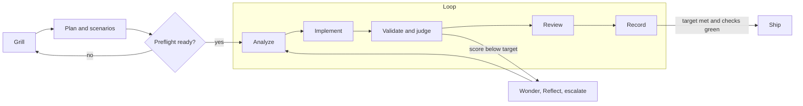

# wgm

**An Agent Skill that turns a rough request into working software.**

`wgm` is a portable [Agent Skill](https://agentskills.io) any compatible coding agent (GitHub
Copilot, Claude Code, OpenAI Codex, VS Code agent mode) can load. Point it at a half-formed idea
and it runs a disciplined lifecycle:

```
Triage → Grill → Plan → Loop(Analyze → Implement → Validate → Review → Record) → Ship/Handoff
```

It fuses two proven ideas:

- **Grill** — interview you relentlessly, one question at a time, until the plan is unambiguous
  (after [`grill-me`](https://github.com/mattpocock/skills)).
- **Ralph loop** — one task per iteration, a persistent plan as shared state, steered by a
  deterministic pass/fail signal (after the
  [Ralph playbook](https://github.com/ghuntley/how-to-ralph-wiggum)).

The result is an agent that aligns first, plans on disk, and then builds in small, test-validated
steps instead of one hopeful mega-edit.

## Install

A skill is just a folder containing `SKILL.md`. Install it **once for your user** (global — the
default) or **per project**, on Linux, macOS, Windows, or WSL.

### One-line install

```bash
# Linux / macOS / WSL
curl -fsSL https://raw.githubusercontent.com/agent-frontier/wgm/main/scripts/install.sh | bash
```

```powershell
# Windows (PowerShell)
irm https://raw.githubusercontent.com/agent-frontier/wgm/main/scripts/install.ps1 | iex
```

Both default to a **user-level** install into the cross-client `~/.agents/skills/wgm`, plus any
client dirs they detect (`~/.claude`, `~/.copilot`). The piped script self-fetches the repo (so it
must be **public**); pin a branch/tag with `WGM_REF` / `--ref`. For all flags, clone the repo and
run the script.

### From a clone (full control)

```bash
git clone https://github.com/agent-frontier/wgm && cd wgm
./scripts/install.sh                 # user-level, auto-detect clients (default)
./scripts/install.sh --project       # into ./.agents/skills (+ ./.claude)
./scripts/install.sh --client all    # agents + claude + copilot
./scripts/install.sh --dry-run       # preview; change nothing
./scripts/install.sh --uninstall     # remove it again
```

```powershell
pwsh scripts/install.ps1 -Client all
powershell -File scripts\install.ps1 -Project
pwsh scripts/install.ps1 -Uninstall
```

### Where it lands

| Scope | Cross-client (default) | Claude | Copilot CLI |
|---|---|---|---|
| **User** (`~` / `%USERPROFILE%`) | `~/.agents/skills/wgm` | `~/.claude/skills/wgm` | `~/.copilot/skills/wgm` |
| **Project** (`./`) | `./.agents/skills/wgm` | `./.claude/skills/wgm` | via `.agents/skills` |

> **WSL vs Windows** have separate home dirs — run the installer in each environment you use.

Then confirm it's discoverable in your agent (e.g. `/skills`) and invoke `/wgm`. To install by hand,
just copy the `wgm/` folder into any skills dir your client scans.

## Use it

Invoke as a slash command with an optional **mode** and a request:

```
/wgm <request>           # full lifecycle on the request
/wgm <mode> [only] ...   # scope to a phase
```

| Invocation | What happens |
|---|---|
| `/wgm add a dark-mode toggle` | Full lifecycle: grill → plan → build |
| `/wgm grill only` | Just the alignment interview, then stop |
| `/wgm analyze only` | Explore code + requirements and report; no implementation |
| `/wgm plan: add OAuth login` | Write specs + `IMPLEMENTATION_PLAN.md`, then stop |
| `/wgm build` | Continue the build loop from the existing plan |
| `/wgm review` | Review the current diff against acceptance criteria |

**Modes:** `grill`, `analyze`, `plan`, `build` (alias `loop`), `review`.
A trailing `only` runs that single phase and stops; without `only`, a mode starts at that phase and
continues forward. A leading word counts as a mode only if it's a known keyword followed by `only`,
`:`, or end of input — so `/wgm build the auth module` is treated as a request, not `build` mode.

## What it writes (and how it stays safe)

`wgm` keeps durable state on disk so any fresh agent can resume:

- `specs/*` — what to build and why (incl. the "magic moment" and smallest end-to-end slice)
- `IMPLEMENTATION_PLAN.md` — the prioritized task list (the loop's memory)
- `AGENTS.md` — a lean "how to build & validate" guide

**Safety:** `wgm` never overwrites an existing `AGENTS.md`. If your repo already has any of these
files, it writes its own under `.wgm/` instead (`.wgm/IMPLEMENTATION_PLAN.md`, `.wgm/specs/`,
`.wgm/AGENTS.md`). Greenfield repos use the root directly.

## Capabilities

wgm fuses grilling + the Ralph loop with **holdout-scenario judging** (after
[octopusgarden](https://github.com/foundatron/octopusgarden)), so a build converges on genuinely
correct software instead of teaching to the test.



- **Holdout scenarios** — YAML user-journeys graded blind; the build never reads them
  (`references/scenarios.md`).
- **Satisfaction scoring** — an LLM judge scores 0–100; converge to a threshold (default 95)
  (`references/scoring.md`).
- **Preflight** — a readiness gate (≥ 80) before any code is written.
- **Stratified validation** — converge tier 1 → 2 → 3 so easy passes can't hide hard failures.
- **Wonder / reflect + model escalation** — structured stall recovery; start frugal, escalate on a
  stall (`references/stall-recovery.md`).
- **Gene transfusion** — seed the build from an exemplar codebase (`references/gene-transfusion.md`).
- **OCI validation** — run scenarios against the app in a **Podman**-first (Docker-fallback)
  container (`references/validation-env.md`).

Full design docs live in [`docs/`](docs/), split by **operator** and **agent** concerns.

## Optional: the real Ralph loop (`scripts/loop.sh`)

In a single agent session, context accumulates — the opposite of what makes Ralph strong. For
large or ambiguous builds, run the loop with a genuinely **fresh context per iteration** using the
bundled adapter. It's host-agnostic: you tell it how to invoke your agent.

```bash
# Tell it how to run your agent — either a shell-evaluated command…
export WGM_AGENT='claude --dangerously-skip-permissions -p'   # prompt appended as last arg
./scripts/loop.sh plan --request "build a small CLI todo app"  # one planning pass
./scripts/loop.sh build 20            # up to 20 build iterations, fresh context each time
./scripts/loop.sh build 20 --threshold 95 --stratified --container podman
export WGM_FRUGAL_AGENT='claude -p'   # cheap model; escalates to $WGM_AGENT on a stall
./scripts/loop.sh extract --source ../exemplar  # gene transfusion from an exemplar repo
./scripts/loop.sh build only          # exactly one iteration
./scripts/loop.sh build --dry-run     # preview the prompt/command; run nothing
# …or pass the agent argv after `--` (invoked without eval — safest):
./scripts/loop.sh build -- claude -p
```

- Modes match the skill: `grill | analyze | plan | preflight | build | review | extract` (plus
  `only` for a single pass).
- `build`/`review` refuse to run without an `IMPLEMENTATION_PLAN.md`.
- No automatic commits or pushes unless you pass `--commit` — but the agent **does** edit files
  during a normal (non-dry) run.
- In `build` mode the agent is told to drop a `STOP` sentinel when no must-have task remains, so the
  loop self-terminates. Stop anytime with `Ctrl+C` or by creating `STOP` / `.wgm/STOP`. See
  `./scripts/loop.sh --help`.

> Run the loop only in an environment you're comfortable letting an agent operate in autonomously
> (a sandbox or disposable workspace). Autonomous loops bypass per-step approvals by design.

## Repository layout

```
wgm/
├── SKILL.md          # the protocol the agent follows
├── README.md         # this file
├── references/       # grilling · ralph-loop · artifacts · scenarios · scoring · stall-recovery · gene-transfusion · validation-env
├── assets/           # spec · scenario · IMPLEMENTATION_PLAN · AGENTS · genes templates
├── scripts/          # loop.sh (Ralph loop) · install.sh · install.ps1
└── docs/             # operator/ and agent/ guides (Mermaid diagrams)
```

## Credits & license

Inspired by Matt Pocock's [`grill-me`](https://github.com/mattpocock/skills) and Geoffrey
Huntley's Ralph methodology as distilled in
[how-to-ralph-wiggum](https://github.com/ghuntley/how-to-ralph-wiggum). Licensed under MIT — see
[LICENSE](LICENSE).
