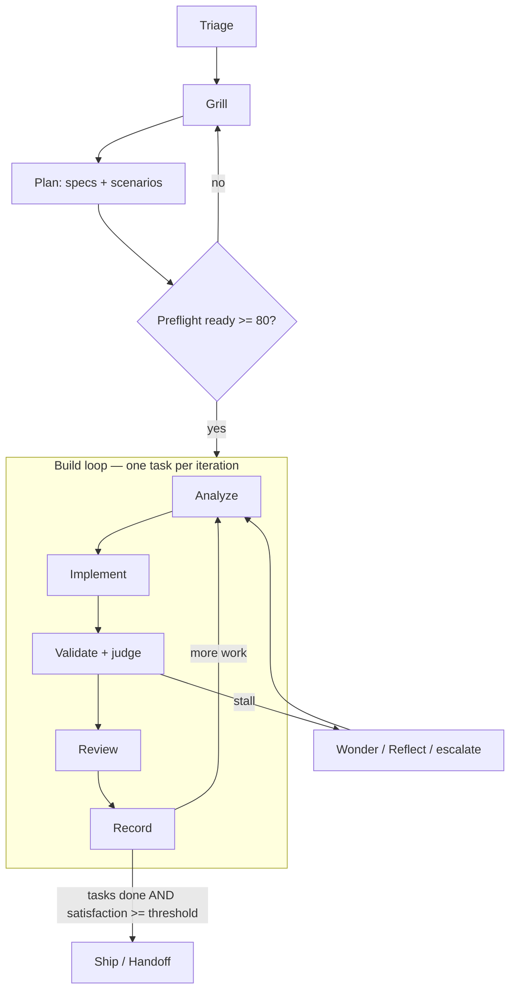

# wgm documentation

Deep docs for **wgm** — the skill that turns a rough request into working software. They are split
by concern:

- **[operator/](operator/README.md)** — for the human running wgm: start at the operator overview,
  then install, drive the loop, validation containers, troubleshooting.
- **[agent/](agent/)** — for the agent following the skill: the lifecycle state machine, the
  convergence loop, scenarios & scoring, stall recovery, gene transfusion.

For the quickstart, see the top-level [README](../README.md). The authoritative protocol is
[`SKILL.md`](../SKILL.md); these docs explain the *why* and the *how* behind it. The terse,
load-every-iteration rules live in [`references/`](../references/) — docs here link to them rather
than duplicating.

## The lifecycle at a glance

## Map

| Audience | Doc | What it covers |
|---|---|---|
| Operator | [operator/README.md](operator/README.md) | Operator overview: the journey and where to start |
| Operator | [installation.md](operator/installation.md) | Install on Linux/macOS/Windows/WSL, user vs project |
| Operator | [running-the-loop.md](operator/running-the-loop.md) | `loop.sh`, Ralph-lite vs full, thresholds, escalation |
| Operator | [containers.md](operator/containers.md) | Podman/OCI validation environment |
| Operator | [troubleshooting.md](operator/troubleshooting.md) | Common failures and fixes |
| Agent | [lifecycle.md](agent/lifecycle.md) | The phase/gate state machine |
| Agent | [attractor-loop.md](agent/attractor-loop.md) | Convergence: generate → test → score → feedback |
| Agent | [scenarios-and-scoring.md](agent/scenarios-and-scoring.md) | Holdout scenarios, judging, satisfaction, tiers |
| Agent | [stall-recovery.md](agent/stall-recovery.md) | Wonder/reflect + model escalation |
| Agent | [gene-transfusion.md](agent/gene-transfusion.md) | Seeding the build from an exemplar |

## Plans & roadmap

- [2026-06-16 — competitive analysis & improvement roadmap](plans/2026-06-16_PLAN.md) — how wgm
  compares to Spec Kit, BMAD, Superpowers, Ralph Orchestrator, agent-os, and grill-me, with a
  prioritized improvement roadmap (Tiers 1–2 shipped; Tier 3 underway).
- [2026-06-16 — wgm vs the Ralph ecosystem](plans/2026-06-16_RALPH_LANDSCAPE.md) — tracking wgm
  against the loop runners and orchestrators catalogued in awesome-ralph ("wgm vs the world").

## Provenance

wgm fuses [grill-me](https://github.com/mattpocock/skills), the
[Ralph](https://github.com/ghuntley/how-to-ralph-wiggum) loop, and holdout-scenario judging after
[octopusgarden](https://github.com/foundatron/octopusgarden).
