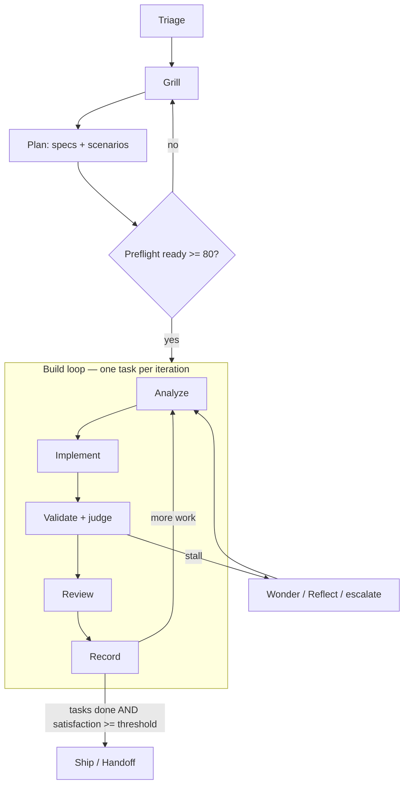

# wgm documentation

Deep docs for **wgm** — the skill that turns a rough request into working software. They are split
by concern:

- **[operator/](operator/README.md)** — for the human running wgm: start at the operator overview,
  then install, drive the loop, validation containers, troubleshooting.
- **[agent/](agent/)** — for the agent following the skill: the lifecycle state machine, the
  convergence loop, scenarios & scoring, stall recovery, gene transfusion. The deeper mechanics — the
  role swarm (twelve subagents, including the five-role **docs-audit swarm** and the hive courier
  `wgm-hermes`) and the **Hive Growth Loop self-improvement flywheel** (run at handoff, and standing
  after every swarm) — live in [`references/`](../references/).

For the quickstart, see the top-level [README](../README.md). The authoritative protocol is
[`SKILL.md`](../SKILL.md); these docs explain the *why* and the *how* behind it. The terse,
load-every-iteration rules live in [`references/`](../references/) — docs here link to them rather
than duplicating.

## The lifecycle at a glance

```mermaid
flowchart TD
  T[Triage] --> G[Grill]
  G --> P[Plan: specs + scenarios]
  P --> F{Preflight ready >= 80?}
  F -- no --> G
  F -- yes --> L
  subgraph L [Build loop — one task per iteration]
    direction TB
    A[Analyze] --> I[Implement]
    I --> V[Validate + judge]
    V --> R[Review]
    R --> Rec[Record]
  end
  V -- stall --> WR[Wonder / Reflect / escalate]
  WR --> A
  Rec -->|tasks done AND satisfaction >= threshold| S[Ship / Handoff]
  Rec -->|more work| A
```

## Map

| Audience | Doc | What it covers |
|---|---|---|
| Operator | [operator/README.md](operator/README.md) | Operator overview: the journey and where to start |
| Operator | [playbook.md](operator/playbook.md) | The operator SOP/checklist: per-build steps, per-gate PASS/FAIL cheat-sheet, how to read a docs-audit report |
| Operator | [installation.md](operator/installation.md) | Install on Linux/macOS/Windows/WSL, user vs project |
| Operator | [running-the-loop.md](operator/running-the-loop.md) | `loop.sh` + the **swarm** (parallel worktrees), limits, retry/circuit-breaker, the metrics ledger, thresholds, escalation |
| Operator | [containers.md](operator/containers.md) | Podman/OCI validation environment |
| Operator | [devcontainers.md](operator/devcontainers.md) | Disk-conscious local devcontainer sandbox for running the loop *itself* (`loop.sh --devcontainer`), distinct from `containers.md`'s app-under-test validation |
| Operator | [troubleshooting.md](operator/troubleshooting.md) | Common failures and fixes |
| Agent | [lifecycle.md](agent/lifecycle.md) | The phase/gate state machine |
| Agent | [attractor-loop.md](agent/attractor-loop.md) | Convergence: generate → test → score → feedback |
| Agent | [scenarios-and-scoring.md](agent/scenarios-and-scoring.md) | Holdout scenarios, judging, satisfaction, tiers |
| Agent | [stall-recovery.md](agent/stall-recovery.md) | Wonder/reflect + model escalation |
| Agent | [gene-transfusion.md](agent/gene-transfusion.md) | Seeding the build from an exemplar |
| Agent | [references/subagents.md](../references/subagents.md) | The twelve role-specialized subagents (the swarm) + dissent-preserving review |
| Agent | [references/docs-audit.md](../references/docs-audit.md) | The docs-audit swarm: four dev/PM personas + a technical-writer consolidator; the paper-trail artifact |
| Agent | [references/trigger-eval.md](../references/trigger-eval.md) | Should-trigger / should-not-trigger fixture that catches drift in the mode-parsing rule and the Use/Don't-use boundary |
| Agent | [references/evals.md](../references/evals.md) | The companion output-quality fixture (`evals/evals.json`): given wgm triggers, is the result actually good? |
| Agent | [references/self-improvement.md](../references/self-improvement.md) | The Hive Growth Loop: harvest lessons from every source (memories, swarm streams, this project's own Issues, cross-pollinated research), always anonymize, report upstream automatically once consented |
| Agent | [references/issue-intake.md](../references/issue-intake.md) | Backlog discovery from a project's own GitHub Issues, tracker-reference traceability, and the `Closes #N` linking convention |
| Agent | [references/devcontainers.md](../references/devcontainers.md) | Sandboxing the loop itself in a disk-conscious local devcontainer — mechanics, permission-parity gotcha, `scripts/devcontainer.sh` |

## Plans & roadmap

- [2026-06-16 — competitive analysis & improvement roadmap](plans/2026-06-16_PLAN.md) — how wgm
  compares to Spec Kit, BMAD, Superpowers, Ralph Orchestrator, agent-os, and grill-me, with a
  prioritized improvement roadmap (**all tiers shipped**).
- [2026-06-16 — wgm vs the Ralph ecosystem](plans/2026-06-16_RALPH_LANDSCAPE.md) — tracking wgm
  against the loop runners and orchestrators catalogued in awesome-ralph ("wgm vs the world").
- [2026-06-16 — the growth flywheel](plans/2026-06-16_GROWTH_LOOP.md) — how wgm harvests lessons
  from every codebase, reports them upstream, and promotes the durable ones back into the skill.
- [2026-07-05 — prefer true Ralph + a disk-conscious local devcontainer sandbox](plans/2026-07-05_TRUE_RALPH_AND_DEVCONTAINERS_PLAN.md) —
  biasing the Triage default toward Ralph-full, plus `scripts/devcontainer.sh` for sandboxing the
  loop itself without inflating disk usage across projects.
- [2026-07-05 — growth health check: are we at a good point, or an echo chamber?](plans/2026-07-05_GROWTH_HEALTH_CHECK.md) —
  an honest, evidence-based self-assessment that recent growth had become mostly self-referential,
  feeding the "real-dogfood cadence" guardrail in `references/self-improvement.md`.
- [2026-07-06 — the Hive Growth Loop](plans/2026-07-06_HIVE_GROWTH_LOOP.md) — unifying swarm-stream
  memories, this project's own GitHub Issues, and cross-pollinated research into one funnel, with
  mandatory anonymization and a one-time, committed consent gate (`.github/wgm-hive.yml`) for fully
  automatic upstream reporting.
- [2026-07-08 — SkillOpt's grading discipline: adopt the idea, not the package](plans/2026-07-08_SKILLOPT_ADOPTION.md) —
  why wgm built a dependency-free `scripts/grade-evals.sh` gate for `evals/evals.json` instead of
  taking a runtime dependency on `microsoft/SkillOpt`'s own package.

## Provenance

wgm fuses [grill-me](https://github.com/mattpocock/skills), the
[Ralph](https://github.com/ghuntley/how-to-ralph-wiggum) loop, and holdout-scenario judging after
[octopusgarden](https://github.com/foundatron/octopusgarden).
