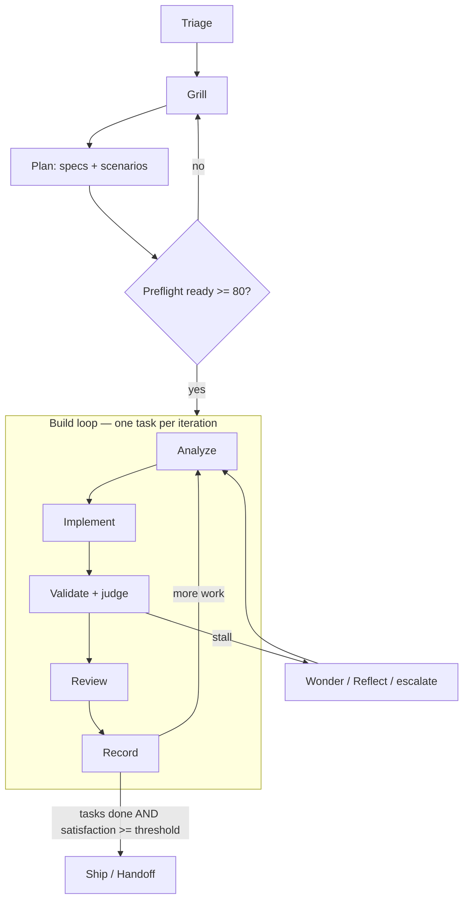

# wgm documentation

**wgm** turns a rough request into working software: a relentless requirements interview, a
persistent plan, and a build loop steered by deterministic pass/fail checks.

New here? Start with **[Get started](get-started/README.md)**.

## Local development first

If you are changing **wgm itself**, start with the [local-development SOP](../CONTRIBUTING.md). It lists the contributor prerequisites and the canonical repository gate:

```bash
make validate
```

This index covers wgm's public engine and contributor workflow. Challenge-specific material belongs in the separate project repository that uses wgm, not in this repository's documentation set.

## Find your path

| I want to… | Go to |
|---|---|
| Install wgm and run my first build | [Get started](get-started/README.md) |
| See a complete worked example | [Your first build](get-started/first-build.md) |
| Check what I need installed | [Requirements](get-started/requirements.md) |
| Drive the loop myself, autonomously | [Run the loop](operator/running-the-loop.md) |
| Understand a repository wgm built me | [Companion skills](companions/README.md) |
| Look up an exact flag or file path | [Reference](reference/README.md) |
| Fix something that went wrong | [Troubleshooting](operator/troubleshooting.md) |
| Understand *why* wgm works this way | [Concepts](#concepts-how-wgm-thinks) |
| Track wgm's maturity and growth | [Stage 8+ growth record](plans/2026-08-20_WGM_STAGE_8_PLUS_GROWTH.md) |
| Contribute to wgm itself | [Contributing](../CONTRIBUTING.md) · [Style guide](style-guide.md) |

## Documentation sections

| Section | Type | For |
|---|---|---|
| **[Get started](get-started/README.md)** | Journey | First-time setup, end to end |
| **[Operator guide](operator/README.md)** | Tasks | Running, validating, and troubleshooting wgm |
| **[Companion skills](companions/README.md)** | Tasks | `teach-me`, `quiz-me`, and `rugged` |
| **[Concepts](agent/lifecycle.md)** | Concepts | How the protocol thinks — written for the agent, readable by you |
| **[Reference](reference/README.md)** | Reference | Exact flags, defaults, paths, exit codes |

The authoritative protocol is [`SKILL.md`](../SKILL.md). These docs explain the *why* and the *how*
behind it. The terse, load-every-iteration rules live in [`references/`](../references/); the pages
here link to them rather than duplicating them.

## The lifecycle at a glance


```mermaid
flowchart TD
  T[Triage] --> G[Grill]
  G --> P[Plan: specs + scenarios]
  P --> F{Preflight ready >= 80?}
  F -- no --> G
  F -- yes --> L
  subgraph L [Build loop — one task per iteration]
    direction TB
    A[Analyze] --> I[Implement]
    I --> V[Validate + judge]
    V --> R[Review]
    R --> Rec[Record]
  end
  V -- stall --> WR[Wonder / Reflect / escalate]
  WR --> A
  Rec -->|tasks done AND satisfaction >= threshold| S[Ship / Handoff]
  Rec -->|more work| A
```

Every phase ends at a gate that prints PASS or FAIL per item. Gates are not advisory — a FAIL stops
the lifecycle rather than degrading it.

## Get started

| Page | Covers |
|---|---|
| [Get started](get-started/README.md) | The eight-step journey from nothing installed to a shipped build |
| [Requirements](get-started/requirements.md) | Required, optional, and per-platform prerequisites |
| [Your first build](get-started/first-build.md) | A complete worked example with every gate shown |

## Operator guide

| Page | Covers |
|---|---|
| [Overview](operator/README.md) | The operator journey and where to start |
| [Playbook](operator/playbook.md) | The per-build SOP, a per-gate PASS/FAIL cheat sheet, reading a docs-audit report |
| [Installation](operator/installation.md) | Linux, macOS, Windows, WSL; user versus project scope |
| [Run the loop](operator/running-the-loop.md) | `loop.sh` and the worktree swarm, limits, retries, thresholds, escalation |
| [Containers](operator/containers.md) | Podman and OCI validation for scenarios needing a live service |
| [Devcontainers](operator/devcontainers.md) | Sandboxing the loop *itself*, disk-consciously |
| [Troubleshooting](operator/troubleshooting.md) | Symptom, cause, and resolution by stage |

## Concepts: how wgm thinks

| Page | Covers |
|---|---|
| [Lifecycle](agent/lifecycle.md) | The phase and gate state machine |
| [Attractor loop](agent/attractor-loop.md) | Convergence: generate, test, score, feed back |
| [Scenarios and scoring](agent/scenarios-and-scoring.md) | Holdout scenarios, judging, satisfaction, tiers |
| [Stall recovery](agent/stall-recovery.md) | Wonder and reflect, then model escalation |
| [Gene transfusion](agent/gene-transfusion.md) | Seeding a build from an exemplar codebase |

Deeper mechanics live in `references/`, written for the agent:
[subagents](../references/subagents.md) (the twelve role-specialized roles and dissent-preserving
review) ·
[telemetry](../references/telemetry.md) (three clocks, and why parked lane time is never
"agent-hours") ·
[docs-audit](../references/docs-audit.md) (four personas plus a consolidating writer) ·
[self-improvement](../references/self-improvement.md) (the Hive Growth Loop and its consent gate) ·
[issue-intake](../references/issue-intake.md) (backlog discovery and tracker traceability) ·
[heuristics](../references/heuristics.md) (the curated ledger of landed lessons) ·
[trigger-eval](../references/trigger-eval.md) and [evals](../references/evals.md) (wgm's own
self-tests).

## Reference

| Page | Covers |
|---|---|
| [Reference index](reference/README.md) | Quick answers and the full lookup map |
| [loop.sh](reference/cli-loop.md) | Modes, every flag, environment variables, exit codes |
| [swarm.sh](reference/cli-swarm.md) | Parallel streams, partitioning rules, telemetry output |
| [Installers](reference/cli-install.md) | `install.sh` and `install.ps1`, targets, verification |
| [Gates](reference/gates.md) | Every check and harness, and what each proves |
| [Artifacts](reference/artifacts.md) | Every file wgm reads and writes |

## Contributing to the docs

[Style guide](style-guide.md) — page types, the executive-overview block, admonitions, and the rules
`scripts/check-docs.sh` enforces automatically.

## Plans and roadmap

Design records, kept for provenance rather than as current instructions:

- [Complete plans index](plans/README.md) — the full dated inventory and status policy.
- [2026-08-20 — Stage 8+ growth record](plans/2026-08-20_WGM_STAGE_8_PLUS_GROWTH.md) — why wgm is
  assessed as Stage 9 emerging/supervised, what is already orchestrated, and what full self-improvement
  autonomy still requires.
- [2026-06-16 — competitive analysis and improvement roadmap](plans/2026-06-16_PLAN.md) — how wgm
  compares to Spec Kit, BMAD, Superpowers, Ralph Orchestrator, agent-os, and grill-me (**all tiers
  shipped**).
- [2026-06-16 — wgm vs the Ralph ecosystem](plans/2026-06-16_RALPH_LANDSCAPE.md) — tracking wgm
  against the loop runners catalogued in awesome-ralph.
- [2026-06-16 — the growth flywheel](plans/2026-06-16_GROWTH_LOOP.md) — harvesting lessons from every
  codebase and promoting the durable ones back into the skill.
- [2026-07-05 — prefer true Ralph, plus a disk-conscious sandbox](plans/2026-07-05_TRUE_RALPH_AND_DEVCONTAINERS_PLAN.md) —
  biasing Triage toward Ralph-full, and `scripts/devcontainer.sh`.
- [2026-07-05 — growth health check](plans/2026-07-05_GROWTH_HEALTH_CHECK.md) — an honest assessment
  that recent growth had become self-referential, feeding the real-dogfood cadence guardrail.
- [2026-07-06 — the Hive Growth Loop](plans/2026-07-06_HIVE_GROWTH_LOOP.md) — one funnel, mandatory
  anonymization, and a one-time committed consent gate.
- [2026-07-08 — SkillOpt's grading discipline](plans/2026-07-08_SKILLOPT_ADOPTION.md) — why wgm built
  a dependency-free grading gate instead of taking a runtime dependency.

Post-merge audit reports live in [`audit/`](audit/README.md).

## Provenance

wgm fuses [grill-me](https://github.com/mattpocock/skills), the
[Ralph](https://github.com/ghuntley/how-to-ralph-wiggum) loop, and holdout-scenario judging after
[octopusgarden](https://github.com/foundatron/octopusgarden).
