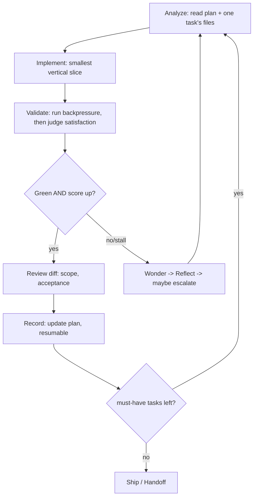
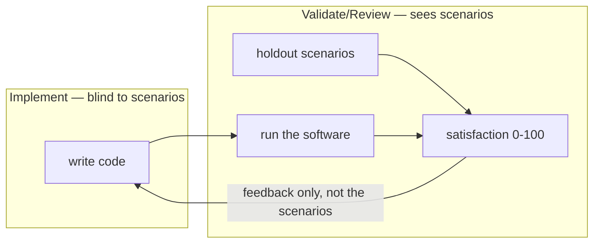

# The attractor loop (agent)

The build phase is a **convergence loop**: generate a change, test it, score it against holdout
scenarios, feed failures back, and repeat until the work settles at a high satisfaction score. The
name "attractor" (from octopusgarden) captures the idea — the loop pulls the implementation toward a
fixed point where the scenarios are satisfied.

## One iteration

## The two forces that steer it

1. **Patterns / signs** — specs, `AGENTS.md`, existing utilities, extracted genes. The agent
   discovers and follows them. When it drifts, the operator adds a sign rather than micromanaging.
2. **Backpressure** — a deterministic pass/fail signal (test, type-check, build, lint, HTTP probe)
   plus the holdout **satisfaction score**. No signal → no real loop.

See [`references/ralph-loop.md`](../../references/ralph-loop.md) for the mechanics and
[scenarios-and-scoring.md](scenarios-and-scoring.md) for how the score is produced.

## Holdout discipline inside the loop

The generator (Implement) must **never read the scenarios**. Only Validate/Review consults them, via
the judge. This is the anti-reward-hacking core: if the code were written against the same checks
that grade it, the agent would learn to game them and the score would mean nothing.

The feedback that crosses back to the generator is the *score and a diagnosis* — never the scenario
text itself.

## Convergence, not completion

A task is "done" only when its deterministic check exits 0. The **run** is done when every must-have
task is done **and** overall satisfaction ≥ the threshold (default 95), validated by ascending tier
(stratified). A plateau triggers [stall recovery](stall-recovery.md) before the loop gives up.

## Context hygiene

Advance exactly one task per iteration; read the minimum set of files; end by writing handoff-quality
state into the plan. In Ralph-full mode the context is cleared between passes, so the plan file is the
only memory — keep it resumable by a fresh agent.

See also: [lifecycle.md](lifecycle.md) · [stall-recovery.md](stall-recovery.md).
