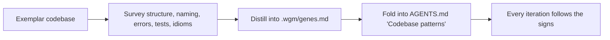

# Gene transfusion (agent)

**Gene transfusion** extracts proven coding patterns — "genes" — from an exemplar codebase so wgm
builds in the house style instead of reinventing conventions. It is octopusgarden's `extract` idea,
adapted as an optional wgm step. The terse rules are in
[`references/gene-transfusion.md`](../../references/gene-transfusion.md).

## The flow

## When to use it

Use it in Triage/Plan when a high-quality exemplar exists — a reference repo, a sibling service, an
existing module, or a design system. Skip it for pure greenfield with no exemplar: there are no genes
to transfuse.

Drive it with `loop.sh extract --source DIR` (see
[running-the-loop.md](../operator/running-the-loop.md)).

## What to extract

Distill patterns across: project/directory structure, naming conventions, error handling, testing
patterns, key utilities/idioms to reuse, dependency/stack choices, and API/UX conventions. Write them
to the [`genes` template](../../assets/genes.template.md) shape.

## How genes steer the build

Genes become durable **signs** the agent follows every iteration (see
[attractor-loop.md](attractor-loop.md)): fold them into `AGENTS.md`'s "Codebase patterns" (or
`.wgm/AGENTS.md`) and reference them from specs. A later iteration reading `AGENTS.md` inherits the
house style for free.

## Guardrails

- Extract **patterns, not wholesale code.** Respect the exemplar's licence and copyright; cite source
  file paths so a human can verify.
- Keep the genes artifact **lean** — it loads into every iteration's context like `AGENTS.md`; bloat
  pollutes the loop.
- Honor the root-vs-`.wgm/` placement rule from
  [`references/artifacts.md`](../../references/artifacts.md).

See also: [lifecycle.md](lifecycle.md) · [attractor-loop.md](attractor-loop.md).
