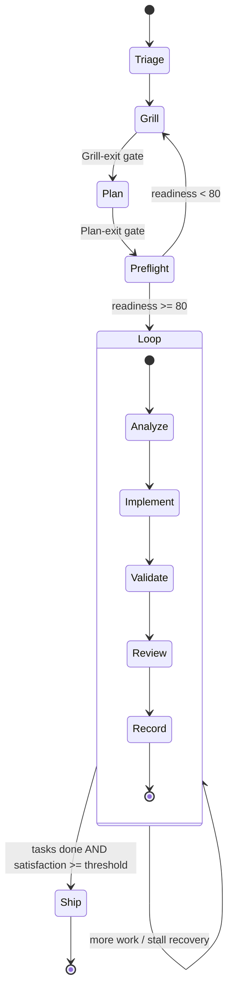

# Lifecycle (agent)

This is the state machine the agent follows when running wgm. The authoritative, terse version is
[`SKILL.md`](../../SKILL.md); this doc explains the shape and the gates.

wgm is deliberately a **state machine, not a checklist**. Each phase ends in a gate that prints every
item as PASS or FAIL. If any item is FAIL you do not advance — you ask one question, fix the
artifact, or stop with a recorded blocker.

## The phases

## Phase responsibilities

| Phase | Goal | Exit gate (abridged) |
|---|---|---|
| **Triage** | Parse mode; confirm the skill applies; choose Ralph-lite/full; set root vs `.wgm/` | Working dir decided |
| **Grill** | Interview to alignment, one question at a time | Goal, success criteria, constraints known or assumed |
| **Plan** | Write specs + scenarios + `IMPLEMENTATION_PLAN.md` | Every task has validation + acceptance; demo path covered by a tier-1 scenario |
| **Preflight** | Score readiness 0–100 | Readiness ≥ 80 |
| **Loop** | One task per iteration | Validation exited 0; satisfaction judged; plan updated |
| **Ship** | Summarize, leave repo resumable | Demo path green; threshold met |

Details per phase live in the references: [grilling](../../references/grilling.md),
[artifacts](../../references/artifacts.md), [scoring](../../references/scoring.md), and
[ralph-loop](../../references/ralph-loop.md).

## Modes are entry points

Invocations like `/wgm grill only` or `/wgm plan: …` enter the machine at one phase and (with `only`)
hard-stop at its gate. `build` resumes the Loop from an existing plan. The single-phase modes never
roll forward past their gate — that is what makes wgm safe to drive incrementally.

## Why gates, not vibes

A loop without a deterministic pass/fail signal is just hoping. The gates force the agent to make
"done" observable at every step: a known goal, a runnable validation command, a satisfied judge. When
in doubt, the gate fails closed.

See also: [attractor-loop.md](attractor-loop.md) ·
[scenarios-and-scoring.md](scenarios-and-scoring.md).
