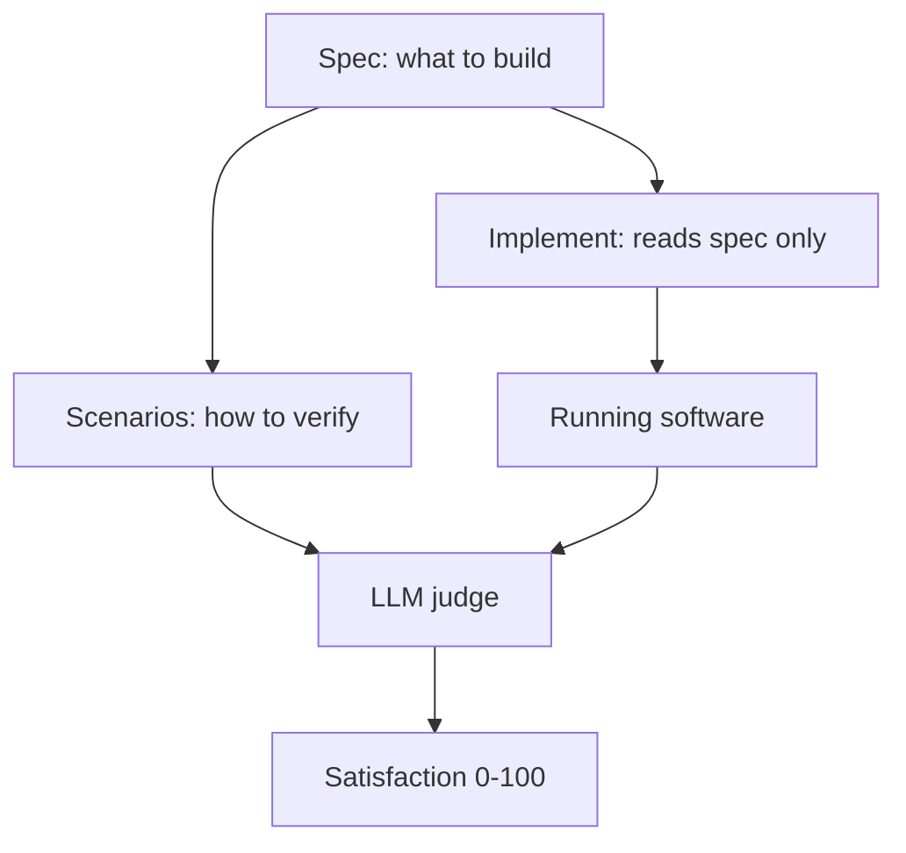
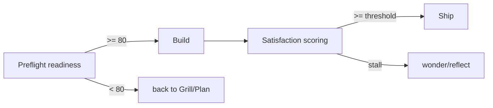
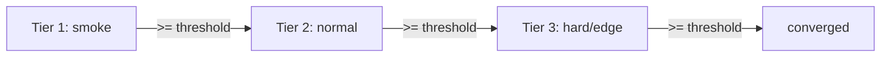

# Scenarios & scoring (agent)

wgm grades work with two LLM-as-judge mechanisms layered on top of deterministic backpressure:
**holdout scenarios** (what to verify) and **satisfaction scoring** (how well it's met). The terse
rules are in [`references/scenarios.md`](../../references/scenarios.md) and
[`references/scoring.md`](../../references/scoring.md); this doc ties them together.

## Scenarios are a holdout set

A scenario is a user-journey acceptance spec in YAML, authored during Grill/Plan. The build never
reads it; only the judge does. Each carries a difficulty `tier` (1 = smoke, 2 = normal, 3 = hard).

The split is the whole point: the generator optimizes against the spec, and the judge — holding the
scenarios out — tells us whether that actually produced the user-visible behavior.

## Probabilistic, not boolean

The judge scores each scenario step **0–100** (a satisfaction probability), not pass/fail. Boolean
grading invites gaming and hides partial progress; a gradient gives the loop something to climb.
Scores are aggregated step → scenario → overall, and the run converges when overall ≥ threshold
(default 95) **and** deterministic checks are green.

## Two rubrics

- **Preflight readiness** — before the loop, score goal clarity, observable success criteria,
  scenario coverage of the demo path, acceptance→backpressure mapping, and scope edges. Below ~80,
  return to Grill/Plan and fix the weakest dimension.
- **Satisfaction** — during Validate/Review, score the running software against each holdout step.

## Stratified validation

Grade by ascending tier: bring tier-1 to threshold before admitting tier-2, then tier-3. This stops a
pile of easy passes from masking a broken edge case and focuses each phase of the loop on the next
real gap.

## Running the judge

Keep the judge prompt tight and separate from the generator: give it the step's expectation and the
observed evidence (HTTP response, CLI output, terminal state — captured from a real or containerized
run, see [containers](../operator/containers.md)) and ask for `{score, one-line why}`. Record the
prompt, score, and justification in `IMPLEMENTATION_PLAN.md` (or an append-only `.wgm/scores.md`), and
accept that scores vary run to run.

## When the score stalls

A flat or falling score across ~2 iterations is a stall — switch to
[stall recovery](stall-recovery.md) before adding more code.

See also: [attractor-loop.md](attractor-loop.md) · [lifecycle.md](lifecycle.md).
