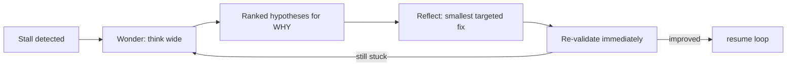
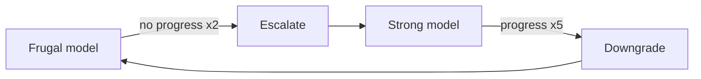

# Stall recovery (agent)

When the loop stops making progress, wgm runs a structured recovery before giving up — **wonder**
(diagnose wide), then **reflect** (fix narrow) — and escalates the model only when cheap effort
plateaus. The terse rules are in
[`references/stall-recovery.md`](../../references/stall-recovery.md).

## Detecting a stall

A stall is any of: the satisfaction score doesn't improve for ~2 consecutive iterations; the same
task fails its backpressure ~2–3 times; or the diff churns (edit → revert → edit) without moving a
signal. On a stall, **stop generating** and recover.

## Wonder → Reflect

- **Wonder (diagnose, divergent):** stop coding. Enumerate hypotheses for *why* it's stuck — wrong
  abstraction, missing dependency, misread requirement or scenario, flaky/wrong validation signal,
  environment issue, task too big — and rank them. Output the most likely cause and the cheapest way
  to test it.
- **Reflect (fix, convergent):** take the top hypothesis and make the **smallest** change that
  addresses it — one surgical edit, or one corrected signal/scenario reading — then re-validate. Do
  not broaden scope during reflect.

## Model escalation

Start on a cheap model for routine iterations. After ~2 consecutive non-improving iterations,
escalate to a stronger model (and/or run wonder/reflect there). After ~5 consecutive improving
iterations, downgrade back to frugal to save cost. The operator wires this via `loop.sh`'s
`--frugal-agent` / `--agent` (see [running-the-loop.md](../operator/running-the-loop.md)); the loop
uses plan-file changes as its progress proxy.

## Where it slots in

Recovery happens after a failing Validate/Review on a stall, before you Record or stop:
`Analyze → Implement → Validate → (stall? Wonder → Reflect → re-Validate) → Review → Record`.

## Hard stop

If wonder/reflect plus escalation still don't improve the signal after ~3 recovery cycles, stop:
record the blocker in `IMPLEMENTATION_PLAN.md` and regenerate the plan or ask the human. Regenerating
the plan is cheap; a loop going in circles is not. Capture the lesson — what stalled and the cause —
in `.wgm/memories.md` so the next run starts ahead of it.

See also: [attractor-loop.md](attractor-loop.md) ·
[scenarios-and-scoring.md](scenarios-and-scoring.md).
