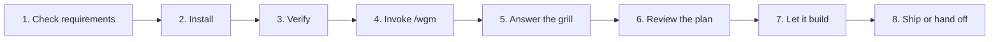

# Get started with wgm

This is the fastest supported path from nothing installed to a working, validated build. Budget
about 20 minutes.

## Executive overview

- **For:** anyone using wgm for the first time.
- **You'll get:** wgm installed, one real feature built and validated, and a clear idea of which
  knobs matter.
- **The workflow:** check requirements → install → invoke `/wgm` → review the plan → let it build.
- **The one mental model:** wgm steers on **backpressure** — a deterministic pass/fail check. Your
  job is to sit *on* the loop, not *in* it.
- **Watch out:** wgm asks a consent question on its very first run in a new project. Answer it once;
  it is recorded and never asked again.
- **Next:** [Your first build](first-build.md) walks the whole thing with a worked example.

## The journey



## Step 1: Check requirements

You need a skills-compatible agent client. Everything else is optional.

See [Requirements](requirements.md) for the full matrix, including what the optional scripts need.

**Executable prerequisite rule:** if a page says to "provide", "ensure", or "have" a capability,
follow its command or exact linked page before continuing. A capability name alone is not a setup
step. For this repository, contributors can prove the documented path with `make validate`; a target
project should use its own test/build/probe command rather than treating a prose prerequisite as
evidence.

## Step 2: Install wgm

**Before you begin:** decide whether you want wgm available in every project (user scope, the
default) or only in one (project scope).

To install at user scope on Linux, macOS, or WSL:

```bash
curl -fsSL https://raw.githubusercontent.com/agent-frontier/wgm/main/scripts/install.sh | bash
```

To install from a clone instead:

```bash
git clone https://github.com/agent-frontier/wgm.git
cd wgm
./scripts/install.sh
```

On native Windows PowerShell:

```powershell
irm https://raw.githubusercontent.com/agent-frontier/wgm/main/scripts/install.ps1 | iex
```

The installer also places three **companion skills** beside wgm: `teach-me` and `quiz-me` for
learning and testing on a repo, plus `rugged`, a read-only reviewer. Skip all three with
`--no-companions` if you prefer.

**Note:** Full flag list in the [installers reference](../reference/cli-install.md); scope choice and
platform detail in [Installation](../operator/installation.md).

## Step 3: Verify the install

To confirm your agent can see wgm:

1. Restart your agent session so it re-scans its skills directory.
2. Ask the client to list skills — for example, `/skills` in VS Code or Copilot CLI.
3. Confirm `wgm`, `teach-me`, `quiz-me`, and `rugged` all appear.

If wgm is missing, see [Troubleshooting](../operator/troubleshooting.md#the-agent-does-not-list-wgm).

## Step 4: Invoke wgm

Open your agent in the project you want to build in, and state your request:

```
/wgm add a dark-mode toggle
```

That is the whole interface. wgm parses the request, sizes the ceremony to the work, and starts.

**Note:** A leading word counts as a *mode* only when it is a known keyword followed by `only`, `:`,
or end of input. So `/wgm build the auth module` is a request, not `build` mode. Modes are listed in
[Use it](../../README.md#use-it).

## Step 5: Answer the consent question, then the grill

On its **first run in a new project**, wgm asks one question before anything else: may it anonymize
durable lessons and report them upstream? Your answer is written to `.github/wgm-hive.yml` either
way and never asked again.

Then the alignment interview begins. wgm asks **one question at a time**, and every question comes
with a recommended answer, so you can often just reply "yes."

**Tip:** wgm only asks what would materially change the architecture, UX, data model, security,
deployment, or acceptance criteria. Anything it can answer by reading your code, it answers itself.
If the questions feel excessive, say "proceed with defaults."

## Step 6: Review the plan before any code is written

wgm writes its plan to disk and stops at a gate. Read these before letting it build:

| File | What to check |
|---|---|
| `IMPLEMENTATION_PLAN.md` | Is the first task small enough for one sitting? Does every task name a validation command? |
| `specs/*.md` | Does the "magic moment" match what you actually want? |
| `specs/CONSTITUTION.md` | Are the non-negotiables yours, not invented? |
| `scenarios/*.yaml` | Do these describe success from a user's seat? |

**Caution:** Do not skip this step. The plan is the shared state for every later iteration, and a
wrong assumption here is repeated by every one of them.

**Note:** If your project root already has `AGENTS.md`, `IMPLEMENTATION_PLAN.md`, or `specs/`, wgm
writes under `.wgm/` instead so it never clobbers your files. See
[Artifacts](../reference/artifacts.md).

## Step 7: Let it build

wgm advances **one task per iteration**, running your project's own checks after each, until the
plan is done and the holdout scenarios score above threshold.

When a non-interactive agent invocation is available, drive the build with the external loop so each
iteration gets genuinely fresh context. Ralph-lite remains the fallback for interactive-only hosts
and Quick-track work:

```bash
export WGM_AGENT='copilot -p --allow-all-tools'
~/.agents/skills/wgm/scripts/loop.sh build 1 --agent-timeout-seconds 900
```

The first run is intentionally bounded and non-committing. Add `--commit` only after reviewing the
clean-baseline and ownership rules in [Run the loop](../operator/running-the-loop.md). To stop it at
any point, press Ctrl+C or run `touch .wgm/STOP`.

See [Run the loop](../operator/running-the-loop.md) and the
[loop.sh reference](../reference/cli-loop.md).

## Step 8: Ship or hand off

At the end wgm summarizes what was built, how to validate it, what the demo path is, and what
remains. The repository is left clean and buildable so a later `/wgm build` can resume.

**Tip:** If wgm built more than you can comfortably explain, run `/teach-me` and then `/quiz-me`.
That is precisely what the companions are for — see [Companion skills](../companions/README.md).

## Execute the journey once

Do not validate this page by reading it only. In a clean checkout, run the commands exactly as
written, restart the client where the journey says to, and follow the links through to the first
validated build. If a command needs a project-specific service or credential, the owning page must
provide the setup command or a link that does; "make PostgreSQL available" or "provide an ID" is not
an executable prerequisite.

## What to do next

| Goal | Go to |
|---|---|
| Walk a complete worked example | [Your first build](first-build.md) |
| Understand the phases and gates | [Lifecycle](../agent/lifecycle.md) |
| Drive the loop yourself | [Run the loop](../operator/running-the-loop.md) |
| Fix something that went wrong | [Troubleshooting](../operator/troubleshooting.md) |
| Look up an exact flag | [Reference](../reference/README.md) |
