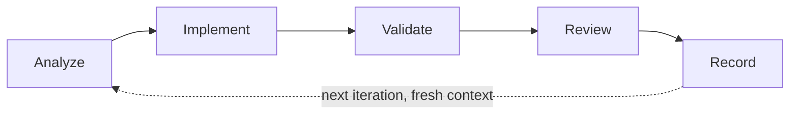

# Your first build

A complete worked example, from an empty request to a validated feature. Follow it end to end and
you will have seen every gate wgm enforces and why each one exists.

## Executive overview

- **For:** a first-time operator who wants to see the whole lifecycle once, concretely.
- **You'll get:** a feature built, a real test proving it, and a plan file you can resume from.
- **Time:** roughly 20 minutes for a small feature.
- **Watch out:** the two places people get surprised are the Plan-exit gate (wgm stops and waits)
  and the demo-validation task (wgm refuses to call a build done without one).
- **Next:** [Run the loop](../operator/running-the-loop.md) for the autonomous version.

## Before you begin

- wgm is installed and your agent lists it. See [Get started](README.md), steps 1–3.
- You have a project open. A small existing repository is ideal; a greenfield directory also works.
- Your project has a test or build command. If it does not, that is fine — wgm's first task will be
  to create one, and you will see that happen.

## Step 1: State the request

Invoke wgm with a deliberately rough request. You do not need to be precise; being pinned down is
the point of the next phase.

```
/wgm add a --json output flag to the CLI
```

wgm begins at **Triage**, where it states the track it chose:

```
Track: Standard — a normal feature, full lifecycle.
```

| Track | Chosen when | What changes |
|---|---|---|
| Quick | A 1–5 file change with an obvious check | Skips holdout scenarios and Preflight |
| Standard | A normal feature | The full lifecycle |
| Full | Large, multi-slice, greenfield, or high risk | Adds stratified scoring and a baseline docs audit |

**Note:** The deterministic gate is never skipped on any track. Only the surrounding ceremony flexes.

## Step 2: Answer the grill

wgm asks one question at a time, each with its recommendation:

```
Should --json suppress the existing human-readable output entirely,
or print both? Recommend: suppress — mixing them breaks piping.
```

Reply "yes" to accept, or correct it. wgm explores your code to answer what it can, so expect fewer
questions than you would guess.

The phase ends with a gate you will see printed:

```
Gate check:
  Goal is known ......................... PASS
  Success criteria are known ............ PASS
  Major constraints are known ........... PASS
  Ambiguity resolved or recorded ........ PASS
```

**Tip:** If you would rather not be interviewed at all, say "proceed with defaults." wgm records its
assumptions in the spec instead of asking.

## Step 3: Read the plan before any code exists

wgm writes its artifacts and **stops**. This is the Plan-exit gate, and it is deliberate.

Open `IMPLEMENTATION_PLAN.md`. Each task should name four things:

| Field | Example |
|---|---|
| Objective | Add `--json` to the argument parser |
| Files or areas | `src/cli.py` |
| Validation command | `pytest tests/test_cli.py -k json` |
| Acceptance criteria | `--json` emits parseable JSON; human output suppressed |

**Caution:** A task with no runnable validation command cannot be honestly marked done. If you see
one, say so now — it is far cheaper to fix here than after five iterations have built on it.

Check the holdout scenario too. `scenarios/` describes success from a user's seat, and **the build
never reads it** — that is what stops the agent from writing code shaped to pass its own grader.

## Step 4: Approve, and let one iteration run

Tell wgm to proceed. Each iteration does exactly five things:



1. **Analyze** — read the plan, the relevant spec, and only the files this task needs.
2. **Implement** — the smallest change that completes the task.
3. **Validate** — run the task's own validation command. **Exit 0 or it is not done.**
4. **Review** — check the diff for scope creep, and verify claims against the code.
5. **Record** — update the plan so a fresh agent could continue from the file alone.

The iteration ends with its own gate:

```
Gate check:
  Implementation done ................... PASS
  Validation command exited 0 ........... PASS
  Result recorded ....................... PASS
  Diff reviewed for scope creep ......... PASS
  Plan updated .......................... PASS
  Exactly one task advanced ............. PASS
```

**Note:** A task is marked `done` **only** if its validation command exited 0. Otherwise it becomes
`blocked` with a note, or stays `pending`. There is no third option and no partial credit.

## Step 5: Watch what happens when a check fails

Let a failure happen, or introduce one. wgm does not paper over it.

If the same task fails repeatedly, or the diff churns without moving a signal, wgm treats it as a
**stall** and stops generating. It runs a wonder-then-reflect pass and considers escalating to a
more capable model before recording a blocker. See [Stall recovery](../agent/stall-recovery.md).

**Tip:** A stall is information. If wgm records a blocker, read it — it usually names something
genuinely ambiguous in your project that no amount of retrying would resolve.

## Step 6: Reach the demo-validation task

The last must-have task in every plan runs the spec's smallest end-to-end demo path. wgm will not
declare a build finished until it passes.

```bash
mycli status --json | jq .
```

This is the difference between "the tests pass" and "the thing works."

## Step 7: Read the handoff

wgm summarizes:

- what was built and how to run it,
- the demo path,
- remaining follow-up tasks, already recorded in the plan,
- telemetry, with wall time and active agent time reported separately,
- a docs-audit report under `docs/audit/`, on Standard and Full tracks.

## Verify the result yourself

Do not take the summary's word for it. Two checks take a minute:

1. Run the demo path yourself, exactly as written.
2. Pick one task marked `done` and confirm the artifact it claims exists:

   ```bash
   git log --oneline -5
   grep -rn "the symbol the task claimed to add" src/
   ```

**Caution:** A plan entry marked done is an *assertion*. In one measured run, four of five tasks
marked done by parallel lanes carried at least one false claim, and every one of them read
plausibly. Grep, do not skim.

## What to do next

| Goal | Go to |
|---|---|
| Run it autonomously, fresh context per iteration | [Run the loop](../operator/running-the-loop.md) |
| Understand each phase in depth | [Lifecycle](../agent/lifecycle.md) |
| Learn the codebase wgm just built you | [Companion skills](../companions/README.md) |
| Something went wrong | [Troubleshooting](../operator/troubleshooting.md) |
