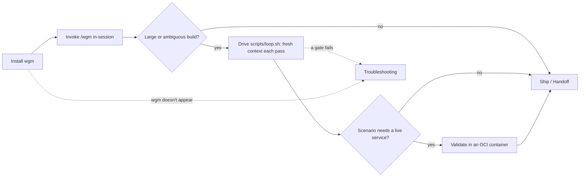

# Operator guide

How to **install, run, and validate** wgm. This is the human-facing half of the docs — the
[agent/](../agent/) half is for the agent following the protocol. Start here, then jump to the
detail page you need.

## Executive overview

- **Who this is for:** the human *operating* wgm — installing it, driving the build loop, and
  troubleshooting — not the agent that follows the protocol.
- **What wgm is:** an [Agent Skill](https://agentskills.io) (a `SKILL.md` folder) that turns a rough
  request into working software through a grilled plan and a test-validated build loop.
- **The operator journey:** install once → invoke `/wgm` (or drive `scripts/loop.sh`) → reach for a
  container only when a scenario needs a live service → consult troubleshooting when a gate fails.
- **The one mental model:** wgm steers on **backpressure** — a deterministic pass/fail check. Your
  job is to sit *on* the loop (add validation checks, set thresholds), not *in* it.
- **Least you need to start:** run the installer, then invoke `/wgm` with your request. Everything
  below is optional depth.

## The operator journey

## Where to go next

| Page | What it covers | Reach for it when |
|---|---|---|
| [installation.md](installation.md) | Install on Linux / macOS / Windows / WSL; user vs project scope | Setting wgm up the first time |
| [running-the-loop.md](running-the-loop.md) | `loop.sh` + the **swarm** (parallel worktrees), limits, retry/circuit-breaker, the metrics ledger, thresholds, model escalation | Driving a large, parallel, or autonomous build |
| [containers.md](containers.md) | Podman / OCI validation environment | A scenario needs the app actually running |
| [troubleshooting.md](troubleshooting.md) | Common failures and their fixes | Something doesn't work |

## See also

- [Documentation index](../README.md) — the full map, including the [agent/](../agent/) docs.
- [`SKILL.md`](../../SKILL.md) — the authoritative protocol the agent follows.
- [Quickstart README](../../README.md) — install and invoke wgm.
