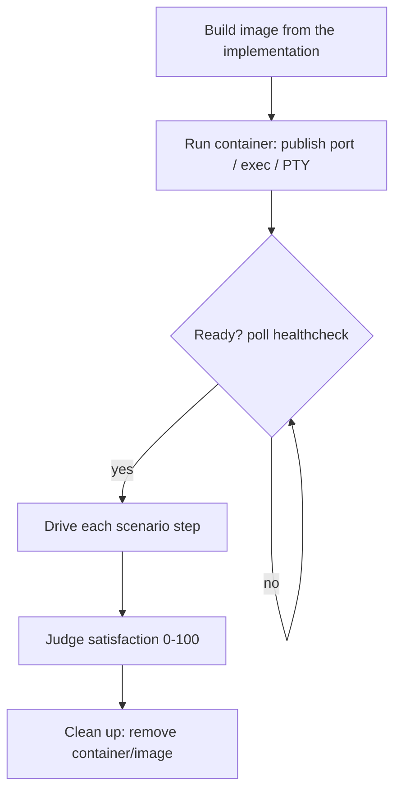

# Validation containers (operator)

## Executive overview

- **For:** operators whose acceptance scenarios need the software **actually running** — an HTTP
  API, a CLI, or a TUI.
- **What it is:** throwaway OCI containers, **Podman-first** with a Docker fallback.
- **When to reach for it:** only when a scenario needs a live service; if a fast local test or HTTP
  probe suffices, skip the container.
- **Golden rules:** run rootless, bind localhost on a free port, never bake in secrets, always
  clean up.
- **Next:** [running-the-loop.md](running-the-loop.md) (`--container`) ·
  [scenarios-and-scoring.md](../agent/scenarios-and-scoring.md).

Some acceptance scenarios can only be judged against the software **actually running** — an HTTP
API, a CLI, or a TUI. wgm runs those in a throwaway **OCI container**, **Podman-first** (Docker is a
drop-in fallback). Containers are optional: reach for one only when a scenario needs a live service.

The terse rules live in [`references/validation-env.md`](../../references/validation-env.md); this is
the operator-facing version.

## The validation flow

## Podman-first, Docker fallback

Prefer rootless **Podman** with OCI images and a **`Containerfile`** (fall back to `Dockerfile`).
The commands are argument-compatible, so the same flow works under either engine:

| Action | Podman | Docker |
|---|---|---|
| Build | `podman build -t wgm-app -f Containerfile .` | `docker build -t wgm-app -f Dockerfile .` |
| Run | `podman run --rm -d -p 8080:8080 --name wgm-app wgm-app` | `docker run --rm -d -p 8080:8080 --name wgm-app wgm-app` |
| Exec | `podman exec wgm-app COMMAND` | `docker exec wgm-app COMMAND` |
| Logs | `podman logs wgm-app` | `docker logs wgm-app` |
| Stop/rm | `podman rm -f wgm-app` | `docker rm -f wgm-app` |

Force one explicitly with `loop.sh --container podman|docker`; otherwise wgm uses Podman when it is
available and falls back to Docker.

## When to skip the container

If a fast local deterministic check suffices — a unit test, a type-check, a local HTTP probe — skip
the container entirely. Don't make Podman/Docker a hard dependency of every wgm run; it is only for
scenarios that need a running service.

## Safety

- Run **rootless** and as a non-root user inside the image.
- Bind to **localhost** and pick a free port; parameterize it so iterations don't collide.
- **Never** bake secrets into the image or mount credential files — pass throwaway test config only.
- Always clean up (`--rm`, prune dangling images) so iterations don't leak containers.

See also: [running-the-loop.md](running-the-loop.md) ·
[scenarios-and-scoring.md](../agent/scenarios-and-scoring.md).
