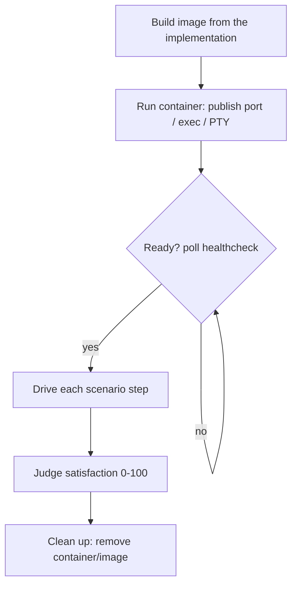

# Validation containers (operator)

## Executive overview

- **For:** operators whose acceptance scenarios need the software **actually running** — an HTTP
  API, a CLI, or a TUI.
- **What it is:** throwaway OCI containers, **Podman-first** with a Docker fallback.
- **When to reach for it:** only when a scenario needs a live service; if a fast local test or HTTP
  probe suffices, skip the container.
- **Golden rules:** run rootless, bind localhost on a free port, never bake in secrets, always
  clean up — with one scoped exception when the consumer is on the *other side* of a virtualization
  boundary (see [Reaching a service across an OS boundary](#reaching-a-service-across-an-os-boundary)).
- **Not what you want if:** you're trying to sandbox the *agent loop itself* (not the app under
  test) — see [devcontainers.md](devcontainers.md) instead.
- **Next:** [running-the-loop.md](running-the-loop.md) (`--container`) ·
  [devcontainers.md](devcontainers.md) (sandbox the loop itself) ·
  [scenarios-and-scoring.md](../agent/scenarios-and-scoring.md).

Some acceptance scenarios can only be judged against the software **actually running** — an HTTP
API, a CLI, or a TUI. wgm selects a throwaway **OCI container engine**, **Podman-first** (Docker is a
drop-in fallback), and reports the choice to the validating host/agent. The runner does not pretend
that selecting an engine proves the host adapter built, started, waited for, and cleaned up the app.
Containers are optional: reach for one only when a scenario needs a live service.

The terse rules live in [`references/validation-env.md`](../../references/validation-env.md); this is
the operator-facing version.

## The validation flow


```mermaid
flowchart TD
  B[Build image from the implementation] --> R[Run container: publish port / exec / PTY]
  R --> H{Ready? poll healthcheck}
  H -- no --> H
  H -- yes --> D[Drive each scenario step]
  D --> J[Judge satisfaction 0-100]
  J --> C[Clean up: remove container/image]
```

## Podman-first, Docker fallback

Prefer rootless **Podman** with OCI images and a **`Containerfile`** (fall back to `Dockerfile`).
The commands are argument-compatible, so the same flow works under either engine:

| Action | Podman | Docker |
|---|---|---|
| Build | `podman build -t wgm-app -f Containerfile .` | `docker build -t wgm-app -f Dockerfile .` |
| Run | `podman run --rm -d -p 8080:8080 --name wgm-app wgm-app` | `docker run --rm -d -p 8080:8080 --name wgm-app wgm-app` |
| Exec | `podman exec wgm-app COMMAND` | `docker exec wgm-app COMMAND` |
| Logs | `podman logs wgm-app` | `docker logs wgm-app` |
| Stop/rm | `podman rm -f wgm-app` | `docker rm -f wgm-app` |

Force one explicitly with `loop.sh --container podman|docker`; otherwise `--container auto` uses
Podman when it is available and falls back to Docker. If neither is available, the runner reports
that scenario container validation is unavailable instead of claiming it ran.

## When to skip the container

If a fast local deterministic check suffices — a unit test, a type-check, a local HTTP probe — skip
the container entirely. Don't make Podman/Docker a hard dependency of every wgm run; it is only for
scenarios that need a running service.

## Safety

- Run **rootless** and as a non-root user inside the image.
- Bind to **localhost** and pick a free port; parameterize it so iterations don't collide.
- **Never** bake secrets into the image or mount credential files — pass throwaway test config only.
- Always clean up (`--rm`, prune dangling images) so iterations don't leak containers.

## Reaching a service across an OS boundary

`localhost` stays the **secure default** for same-side probes: if the thing calling your service runs
on the same OS instance, bind loopback and stop there.

It is the wrong default when the consumer sits across a virtualization boundary — a **Windows**
browser, editor, or CLI calling a service running **inside WSL**, or a host tool calling into a VM
guest. The guest's `127.0.0.1` is not the host's, so a loopback-only bind is invisible from the other
side even though the service is perfectly healthy.

| | |
|---|---|
| **Same-side consumer** | Bind `127.0.0.1` on a free port. Probe with a local `curl`. |
| **Cross-boundary consumer** | Publish on all interfaces (`0.0.0.0`, or `-p` / a port forward), and have the consumer connect to the **guest's routable address** — for WSL, the distro's IPv4 (`ip -4 -o addr show scope global`). |

**Verify from the consumer's own OS.** A `curl` inside WSL never crosses the boundary, so it cannot
tell you whether Windows can connect. On a Windows+WSL machine, run:

```bash
bash scripts/test-wsl-windows-boundary.sh
```

It publishes a disposable service on loopback and then on all interfaces, drives
`scripts/test-wsl-reachability.ps1` as a **real Windows process** (page + generated client asset +
WebSocket), and prints the observed result per endpoint. On any other host it exits **3** with the
reason instead of pretending to pass. The portable half —
`bash scripts/test-wsl-boundary-harness.sh` — runs anywhere and covers the harness's own failure
paths. Source of this caveat: `[learn]` issue
[`agent-frontier/wgm#101`](https://github.com/agent-frontier/wgm/issues/101).

See also: [running-the-loop.md](running-the-loop.md) ·
[scenarios-and-scoring.md](../agent/scenarios-and-scoring.md).
