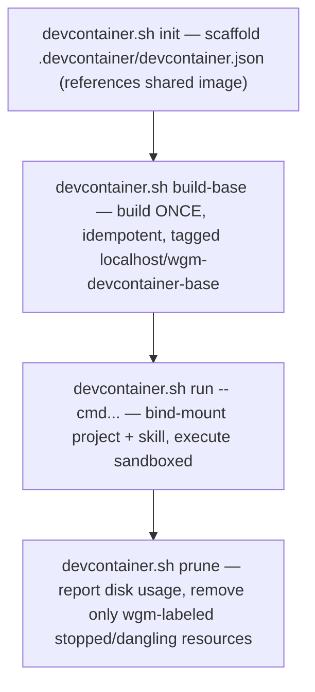

# Local devcontainer sandbox (operator)

## Executive overview

- **For:** operators who want an autonomous Ralph-full run (`scripts/loop.sh`) isolated from the
  host filesystem beyond the one project it's working on.
- **What it is:** a throwaway OCI sandbox, **Podman-first** with a Docker fallback, built around
  **one shared, prebuilt base image reused across every project** — not a new multi-GB image per
  project.
- **When to reach for it:** an autonomous/unattended loop run, or any time you want the agent's
  file access capped at the mounted project (plus anything you explicitly `--mount` in).
- **Golden rules:** one shared image (never a per-project build), bind-mount don't copy, run as
  your own UID (not the image's), label everything so `prune` is safely scoped, never mount your
  whole `$HOME`.
- **Fastest path:** `scripts/devcontainer.sh build-base` once, then
  `scripts/loop.sh build --devcontainer -- copilot -p`.
- **Next:** [running-the-loop.md](running-the-loop.md) · [containers.md](containers.md) (the
  *other* container use case — validating the app under test, not the loop itself).

## Two different container use cases — don't confuse them

| | `loop.sh --container` (`containers.md`) | `loop.sh --devcontainer` (this doc) |
|---|---|---|
| Runs | the **app under test** | the **agent loop itself** |
| Purpose | let the judge grade real running behavior | isolate an autonomous run from the host |
| Lifespan | one scenario | the whole loop invocation |
| Optional? | yes — only when a scenario needs a live service | yes — only when you want the isolation |

## The flow



`init` and `prune` are optional housekeeping; the common path is just `build-base` once, then
`run` (or `loop.sh --devcontainer`) repeatedly — `run` auto-builds the base image on first use if
it's missing, so even `build-base` is skippable for a quick start.

## Podman-first, Docker fallback

Same convention as `--container` (`containers.md`). Talks to `podman`/`docker` directly — no
dependency on the separate `@devcontainers/cli` — though the scaffolded `devcontainer.json` is a
standards-compliant [containers.dev](https://containers.dev) artifact any devcontainer CLI or
VS Code can also open for interactive work.

| Action | Podman | Docker |
|---|---|---|
| Build base | `scripts/devcontainer.sh build-base` | `scripts/devcontainer.sh build-base --container docker` |
| Run | `scripts/devcontainer.sh run -- CMD` | `scripts/devcontainer.sh run --container docker -- CMD` |
| Prune | `scripts/devcontainer.sh prune` | `scripts/devcontainer.sh prune --container docker` |

## Subcommands & flags

```bash
./scripts/devcontainer.sh init                          # scaffold .devcontainer/devcontainer.json
./scripts/devcontainer.sh build-base                     # build the shared image once
./scripts/devcontainer.sh build-base --force             # rebuild it anyway
./scripts/devcontainer.sh run -- echo hello              # execute one command sandboxed
./scripts/devcontainer.sh run --mount ~/.copilot -- copilot -p "hi"   # + an agent's auth dir
./scripts/devcontainer.sh prune                          # disk hygiene report + scoped cleanup
./scripts/devcontainer.sh run --dry-run -- CMD            # preview the exact command; run nothing
```

| Flag | Where | Effect |
|---|---|---|
| `--container podman\|docker` | all | force an engine (default: auto-detect podman, then docker) |
| `--tag TAG` | all | image tag (default: `localhost/wgm-devcontainer-base:latest`) |
| `--dir DIR` | `init` | target project dir to scaffold into (default: `.`) |
| `--force` | `build-base` | rebuild even if the tag already exists locally |
| `--skill-dir DIR` | `run` | also bind-mount DIR read-only at `/opt/wgm-skill` — used by `loop.sh --devcontainer`'s own re-exec |
| `--mount HOST[:CONTAINER]` | `run` | **opt-in** extra bind mount (repeatable) — e.g. an agent CLI's auth dir |
| `--name NAME` | `run` | container name (default: engine auto-generates one) |
| `--env VAR` | `run` | forward the host's `$VAR` into the container by name (repeatable) |
| `--dry-run` | all | print the command(s) that would run; do nothing |

## Running the loop itself sandboxed

```bash
export WGM_AGENT='copilot -p'
./scripts/loop.sh build 20 --devcontainer
```

`--devcontainer` re-execs the *entire* `loop.sh` invocation inside the sandbox via
`devcontainer.sh run` — same argv (minus the flag itself), plus the wgm skill bind-mounted
read-only at `/opt/wgm-skill` so the re-invoked `loop.sh` can find its sibling files. `$WGM_AGENT` /
`$WGM_FRUGAL_AGENT` / `$WGM_PROMPT_STDIN` are forwarded automatically when set. It's a no-op with
`--dry-run` — you'll see `devcontainer=1 (would re-exec...)` in the preview instead of a container
actually launching.

## Disk hygiene — why this doesn't inflate your disk

- **One image, not N.** `devcontainer.json` always references `"image"` (the shared tag), never
  `"build"`. Ten projects using this sandbox still cost one ~400MB image, not ten.
- **`build-base` is idempotent.** A second call is a no-op ("already built... use --force to
  rebuild") — it never silently re-downloads/rebuilds on every `run`.
- **Bind-mount, never copy.** The project's files live on the host disk exactly once; the
  container only ever sees them through the mount.
- **`prune` is label-scoped.** It only ever touches containers/images carrying
  `wgm.devcontainer=1` — run `scripts/devcontainer.sh prune` periodically (or after a long swarm
  session) to reclaim stopped-container cruft; it reports `system df` before and after so you can
  see what it actually reclaimed.
- **Need a project-specific extra dependency?** Don't scaffold a per-project build — extend the
  shared base explicitly in your own `Containerfile` (`FROM localhost/wgm-devcontainer-base:latest`)
  and switch that one project's `devcontainer.json` to `"build"`. That keeps the shared image the
  default and a bigger per-project image a visible, deliberate exception, not the norm.

## Safety

- Rootless by default: `run` executes as **your own UID:GID**, plus Podman's `--userns=keep-id`
  (rootless Podman otherwise remaps your UID inside its own user namespace; Docker needs no such
  flag). This is also what makes a bind-mounted project directory that isn't world-readable (a
  `mktemp -d`-style `0700` dir is the classic trap) actually readable/writable inside the sandbox.
- **Never** mount your whole `$HOME` — use `--mount` for the one specific config/auth directory an
  agent CLI actually needs. The default mount surface is the project directory (+ the skill dir,
  for the `loop.sh` integration) and nothing else.
- Never bakes secrets into the shared image — `--env`/`--mount` are run-time only.
- Every container is labeled and removed on exit (`--rm`) by default; `prune` exists for the case
  where a run was killed before it could clean up after itself.

See also: [containers.md](containers.md) (the other container use case) ·
[running-the-loop.md](running-the-loop.md) · [`references/devcontainers.md`](../../references/devcontainers.md).
