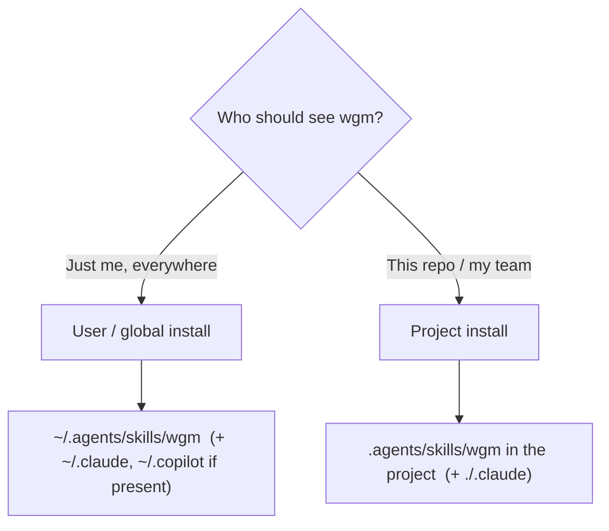
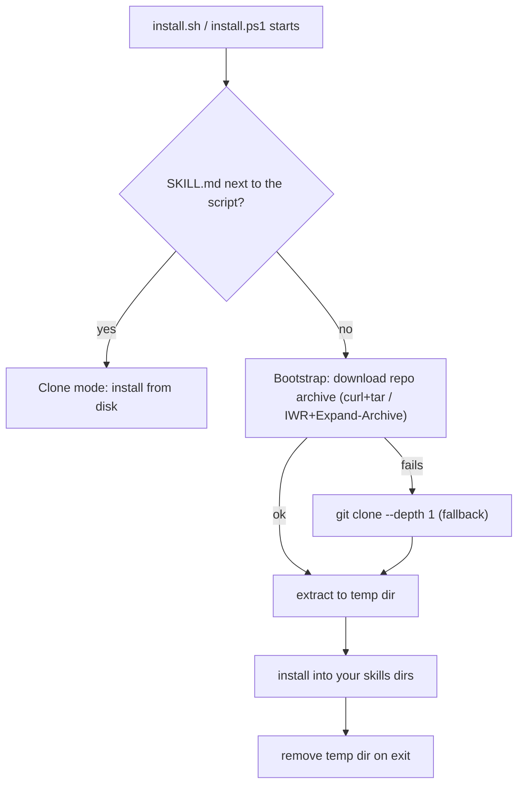

# Installation (operator)

## Executive overview

- **For:** anyone setting up wgm for the first time on Linux, macOS, Windows, or WSL.
- **You'll get:** wgm placed where your agent scans for skills — user-level (global) by default.
- **Fastest path:** the one-line installer (`curl … | bash`, or `irm … | iex` on Windows).
- **Mental model:** a skill is just a `wgm/` folder containing `SKILL.md`; "installing" only copies
  that folder into a skills directory your client reads.
- **Watch out:** WSL and Windows have separate homes (install in each); the piped one-liner needs the
  repo to be public.
- **Next:** [running-the-loop.md](running-the-loop.md) to drive it ·
  [troubleshooting.md](troubleshooting.md) if it doesn't appear.

wgm is an [Agent Skill](https://agentskills.io): a folder containing `SKILL.md` that a
skills-compatible agent loads on demand. "Installing" it just means placing the `wgm/` folder into a
skills directory your client scans. The bundled installers do this for you — **user-level (global)
by default**, on Linux, macOS, Windows, and WSL.

## Pick a scope



- **User (default):** available in every project you open. Best for personal use.
- **Project:** committed with a repo so collaborators share it. Use `--project`.

## One-line install

```bash
# Linux / macOS / WSL
curl -fsSL https://raw.githubusercontent.com/agent-frontier/wgm/main/scripts/install.sh | bash
```

```powershell
# Windows (PowerShell)
irm https://raw.githubusercontent.com/agent-frontier/wgm/main/scripts/install.ps1 | iex
```

The one-liner needs the repo to be **public** (it's an unauthenticated fetch). The piped script has
no local checkout, so it **self-fetches**: it downloads the repo into a temp dir, installs from
there, then cleans up. No `git` needed — it uses the same `curl`/tarball the one-liner already
implies (Windows uses `Invoke-WebRequest` + `Expand-Archive`), falling back to a shallow `git clone`.



Pin a branch, tag, or commit with `--ref` / `-Ref` (or `WGM_REF`); point at a fork with `WGM_REPO`:

```bash
curl -fsSL https://raw.githubusercontent.com/agent-frontier/wgm/main/scripts/install.sh \
  | WGM_REF=v1.0 bash
```

## From a clone (full control)

```bash
git clone https://github.com/agent-frontier/wgm && cd wgm
./scripts/install.sh                    # user scope, auto-detect clients (default)
./scripts/install.sh --project          # into ./.agents/skills (+ ./.claude)
./scripts/install.sh --client all       # agents + claude + copilot
./scripts/install.sh --method symlink    # symlink instead of copy (dev-friendly)
./scripts/install.sh --dry-run          # preview only
./scripts/install.sh --uninstall        # remove again
```

On native Windows use the PowerShell script with the same options:

```powershell
pwsh scripts/install.ps1 -Client all
powershell -File scripts\install.ps1 -Project
pwsh scripts/install.ps1 -Uninstall
```

## Flags

| Flag (sh / ps1) | Meaning |
|---|---|
| `--user` / `-User` | Install into your home dir (default). |
| `--project` / `-Project` | Install into the current working directory. |
| `--client NAME` / `-Client NAME` | `agents`, `claude`, `copilot`, `all`, or `auto` (default). |
| `--dir PATH` / `-Dir PATH` | Install into `PATH/wgm` explicitly. |
| `--method copy\|symlink` / `-Method` | Copy (default) or symlink/junction. |
| `--dry-run` / `-DryRun` | Print actions; change nothing. |
| `--uninstall` / `-Uninstall` | Remove the installed skill. |
| `--force` / `-Force` | Overwrite an existing install. |
| `--ref REF` / `-Ref REF` | Git ref (branch/tag/sha) to self-fetch when piped (default `main`). |

`auto` always includes the cross-client `.agents/skills` location and adds `~/.claude` or
`~/.copilot` when those client homes already exist.

**Self-fetch overrides** (for piped installs): `WGM_REF` (branch/tag/sha, same as `--ref`/`-Ref`),
`WGM_REPO` (`owner/name` of a fork), and `WGM_TARBALL_URL` (an explicit `.zip`/`.tar.gz` URL, e.g. a
`file://` path for offline installs).

## Where it lands

| Scope | Cross-client (default) | Claude | Copilot CLI |
|---|---|---|---|
| **User** (`~` / `%USERPROFILE%`) | `~/.agents/skills/wgm` | `~/.claude/skills/wgm` | `~/.copilot/skills/wgm` |
| **Project** (`./`) | `./.agents/skills/wgm` | `./.claude/skills/wgm` | via `.agents/skills` |

The `.agents/skills/` path is the cross-client convention: skills installed there are visible to any
compliant client, so it is the safest default.

## A note on WSL

WSL and Windows have **separate home directories and separate client installs**. Run the bash
installer inside WSL and the PowerShell installer on Windows if you use agents in both. The bash
installer prints a reminder when it detects WSL.

## Verify & uninstall

After installing, open your agent and confirm wgm is listed (e.g. `/skills` in VS Code or Copilot
CLI), then invoke `/wgm`. To remove it, re-run the installer with `--uninstall` / `-Uninstall` and
the same scope/client flags you installed with.

See also: [running-the-loop.md](running-the-loop.md) · [troubleshooting.md](troubleshooting.md).
