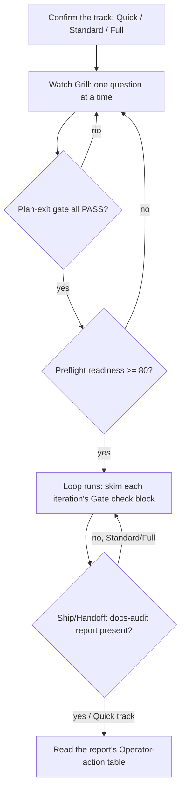

# Operator playbook / SOP

## Executive overview

- **For:** the operator who runs wgm day to day — this is the checklist, not the concepts (those
  live in [README.md](README.md) and the rest of this folder).
- **How it's organized:** a Day-1 setup checklist → a per-build checklist → a per-gate PASS/FAIL
  cheat-sheet → how to read a docs-audit paper trail → when to escalate.
- **First move:** if you've never run wgm before, do the Day-1 checklist once. Every run after that,
  use the per-build checklist.
- **The one thing to remember:** wgm always prints a `Gate check:` block at every phase boundary. If
  you read nothing else while a build runs, read those blocks.
- **Next:** [troubleshooting.md](troubleshooting.md) the moment something doesn't match this page.

This is the minimum an operator needs to memorize to run wgm correctly, without re-deriving it from
`SKILL.md` each time. Treat it as a runbook: work top to bottom, check each box, stop where told.

## Day-1 checklist (first time operating wgm)

- [ ] Install it — [installation.md](installation.md) — then confirm your agent lists `wgm` (e.g.
      `/skills`). Restart the agent session if it doesn't appear yet.
- [ ] Read `SKILL.md` once, end to end. It is intentionally short (~≤500 lines) — this is the whole
      protocol you're operating.
- [ ] Know the artifact placement rule before your first build: a greenfield project gets
      `IMPLEMENTATION_PLAN.md` / `specs/` / `scenarios/` / `docs/audit/` at the root; an existing
      project gets them under `.wgm/` instead, so wgm never clobbers your files
      ([`references/artifacts.md`](../../references/artifacts.md)).
- [ ] Decide up front whether this build needs **Ralph-lite** (in-session, default) or **Ralph-full**
      (`scripts/loop.sh`, fresh context per iteration — for large/ambiguous builds). See
      [running-the-loop.md](running-the-loop.md).
- [ ] If you'll validate against a live service, confirm Podman or Docker is available
      ([containers.md](containers.md)).

## Per-build checklist (every time you run `/wgm`)

1. **Confirm the track.** wgm states it at Triage ("Track: Quick/Standard/Full — …"). If it picked
   wrong for the risk/size of the change, say so before Grill goes further.
2. **If this is the project's first `/wgm` run, expect the consent question first.** Before any
   other Triage or Grill prompt, wgm asks whether it may automatically report anonymized lessons
   upstream to `agent-frontier/wgm`. Your yes/no answer is written to `.github/wgm-hive.yml` and
   won't be asked again unless that file is deleted. Full discipline:
   [`references/self-improvement.md`](../../references/self-improvement.md).
3. **Watch the Grill.** Each question should come with wgm's own recommended answer — replying "yes"
   should usually be enough. If you're being asked something wgm could have found in the code, say so.
4. **Check the Plan-exit gate.** Every item should print PASS. On any FAIL, wgm should fix the
   artifact or ask — it should not silently roll forward.
5. **Check the Preflight score.** Standard/Full need readiness ≥ 80 before any code is written. Below
   that, expect wgm to go back to Grill/Plan, not start building anyway.
6. **Let the Loop run, skim each iteration.** You don't need to review every diff live, but the
   `Gate check:` block at the end of each iteration should be all PASS. A task is `done` only if its
   validation command exited 0 — anything else should read `blocked` or `pending`, never `done`.
7. **At Ship/Handoff, look for the docs-audit report first.** On Standard/Full tracks this is
   mandatory — wgm should not declare Ship complete without one. See the next section for how to
   read it.
8. **Confirm the repo is left resumable.** `IMPLEMENTATION_PLAN.md` should be current enough that a
   fresh `/wgm build` could pick up where this run left off.

## Per-gate PASS/FAIL cheat-sheet

| Gate | What PASS means | What to do on FAIL |
|---|---|---|
| Grill-exit | Goal, success criteria, and constraints are known or explicitly assumed | Answer the open question, or say "proceed with defaults" |
| Plan-exit | Plan/specs/scenarios exist, every task has a validation command, no placeholders, constitution conformance | Point wgm at the specific missing piece; don't let it skip ahead |
| Preflight | Readiness score ≥ 80 (Standard/Full) | Ask wgm which dimension is weakest (goal clarity, scenario coverage, scope edges) and fix that one first |
| Iteration-exit | Validation command ran and exited 0; plan updated; exactly one task advanced | Do not accept the task as `done` — send it back |
| Ship/Handoff | Demo path green, satisfaction ≥ threshold, **docs-audit report exists** (Standard/Full) | Ask wgm to dispatch the docs-audit swarm before you accept the handoff |

> **Why Triage/consent isn't a row above:** the `.github/wgm-hive.yml` consent check (Triage step 2,
> `references/self-improvement.md`) is a one-time recorded answer, not a PASS/FAIL gate — "yes" and
> "no" are both valid, terminal states once the file is written, so there's nothing for an operator
> to send back. If you want to change your project's answer later, edit or delete that file directly;
> wgm re-asks only when it's absent.

## Reading a docs-audit paper trail

The docs-audit report is wgm's automatic evidence of work done — you should never have to ask for
it on a Standard/Full-track build. Full mechanics: [`references/docs-audit.md`](../../references/docs-audit.md).

- **Where it lives:** `docs/audit/`, one timestamped file per run (e.g.
  `docs/audit/2026-07-04T1830Z_docs-audit-core.md`), indexed newest-first in
  `docs/audit/README.md` (or under `.wgm/docs/audit/` if this project uses the `.wgm/` placement rule).
- **What's in it, top to bottom:** four persona sections (junior dev → clarity, senior dev →
  correctness, principal dev → architecture, PM → status/risk), then one consolidated section from
  the technical-writer role.
- **What you actually act on:** the consolidated **Operator action** table — these are the items that
  need your decision, confirmation, or access. The **Agent action** table is informational: those
  items were either already fixed in this run or are queued as a follow-up task the agent will do
  itself — you don't need to do them.
- **Check the Dissent section.** If two personas disagreed, it's recorded there rather than
  smoothed over. A recorded dissent is not a failure — it's the signal working as intended; use your
  judgment to resolve it or leave it open.
- **If the report is missing** on a Standard/Full-track build that reached Ship — that's a bug in the
  run, not an acceptable outcome. Treat it like a failed gate: send the build back rather than
  accepting the handoff.

## Escalation & troubleshooting

- Something not matching this page → [troubleshooting.md](troubleshooting.md).
- A gate keeps failing the same way across iterations (a **stall**) → wgm should run wonder/reflect
  and consider model escalation on its own
  ([`references/stall-recovery.md`](../../references/stall-recovery.md)); if it doesn't, prompt it to.
- You disagree with a recorded assumption or a Dissent entry → resolve it directly with wgm; these
  are meant to be revisited, not treated as final verdicts.
- Everything green but you're still unsure it's actually done → re-read the demo path in the spec and
  walk it yourself; a passing score never overrides your own read of the magic moment.

## See also

- [README.md](README.md) — the operator overview and the mental model.
- [installation.md](installation.md) · [running-the-loop.md](running-the-loop.md) ·
  [containers.md](containers.md) · [troubleshooting.md](troubleshooting.md).
- [`references/docs-audit.md`](../../references/docs-audit.md) — the docs-audit swarm's full discipline.
- [`SKILL.md`](../../SKILL.md) — the authoritative protocol.
