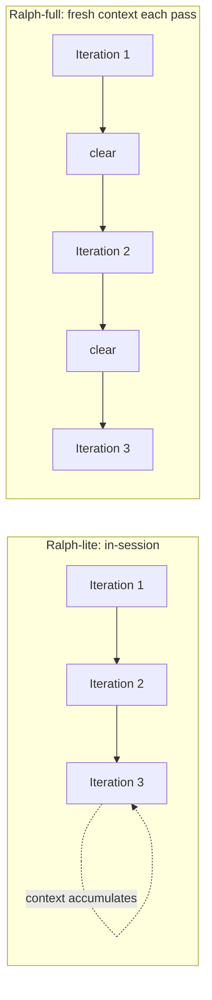
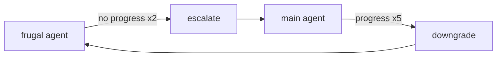

# Running the loop (operator)

## Executive overview

- **For:** operators running large or ambiguous builds who want Ralph's strongest mode.
- **The choice:** `/wgm` runs in-session (Ralph-lite); `scripts/loop.sh` gives the agent a fresh
  context every iteration (Ralph-full).
- **Fastest path:** set `WGM_AGENT`, then `./scripts/loop.sh build 20`.
- **Key knobs:** `--threshold` (satisfaction target), `--stratified` (converge tier 1 → 2 → 3),
  `--container`, plus frugal ↔ powerful model escalation.
- **Safety:** non-destructive by default — no commits or pushes without `--commit`; stop anytime
  with `Ctrl+C` or a `STOP` sentinel.
- **Next:** [containers.md](containers.md) for live-service scenarios ·
  [troubleshooting.md](troubleshooting.md).

wgm runs in-session when you invoke `/wgm`, but its strongest mode gives the agent a **fresh context
every iteration** via [`scripts/loop.sh`](../../scripts/loop.sh). This is the operator's guide to
driving that loop.

## Ralph-lite vs Ralph-full



- **Ralph-lite** — run the loop inside one agent session. Fine for small/medium work; compensate for
  accumulating context with strict persistence to `IMPLEMENTATION_PLAN.md`.
- **Ralph-full** — `loop.sh` invokes your agent once per iteration with a clean context. Use it for
  large or ambiguous builds. The plan file is the only memory between passes.

See [`references/ralph-loop.md`](../../references/ralph-loop.md) for the underlying mechanics.

## Wiring up your agent

`loop.sh` is host-agnostic — tell it how to call your agent:

```bash
# A shell-evaluated command (prompt appended as the last arg):
export WGM_AGENT='copilot -p'
# …or pass argv after `--` (invoked without eval — safest):
./scripts/loop.sh build -- copilot -p
```

If your agent reads the prompt from stdin, set `WGM_PROMPT_STDIN=1`.

## Run it from another project

`loop.sh` ships **inside the installed skill** and operates on your **current working directory**, so
one installed copy drives any project — run the skill's copy from your project's root:

```bash
# from your project's root — the path depends on where wgm installed (see installation.md):
~/.agents/skills/wgm/scripts/loop.sh build -- copilot -p
# a handy alias makes it one word from anywhere:
alias wgm-loop="$HOME/.agents/skills/wgm/scripts/loop.sh"
wgm-loop build 20 --max-runtime-seconds 3600
```

It reads and writes `IMPLEMENTATION_PLAN.md` and `.wgm/` **in the directory you launch it from**, never
in the skill folder, so one install serves every project. The `./scripts/loop.sh` shorthand used
elsewhere in this guide just means "the loop runner" — substitute your install path when you are not
inside the wgm repo.

## Modes

```bash
./scripts/loop.sh plan --request "build a small CLI todo app"  # one planning pass
./scripts/loop.sh preflight        # score readiness before building
./scripts/loop.sh build 20         # up to 20 build iterations
./scripts/loop.sh build only       # exactly one iteration
./scripts/loop.sh extract --source ../exemplar   # gene transfusion
./scripts/loop.sh review           # assess the diff vs acceptance criteria
./scripts/loop.sh build --dry-run  # print the prompt/command, run nothing
```

Modes mirror the skill: `grill | analyze | plan | preflight | build | review | extract` (`loop` is
an alias of `build`). `build`/`review`/`preflight` refuse to run without an `IMPLEMENTATION_PLAN.md`.

## Convergence & escalation knobs

| Flag | Default | Effect |
|---|---|---|
| `--threshold N` | 95 | Satisfaction target the build converges to. |
| `--scenarios DIR` | `scenarios/` or `.wgm/scenarios/` | Where holdout scenarios live. |
| `--stratified` | off | Validate scenarios by ascending tier (1→2→3). |
| `--container podman\|docker` | podman | Engine for containerized scenario validation. |
| `--frugal-agent "CMD"` | — | Cheap model for routine iterations. |
| `--escalate-after N` | 2 | No-progress iterations before escalating to `--agent`. |
| `--downgrade-after N` | 5 | Progressing iterations before downgrading to frugal. |

Model escalation engages only when **both** a frugal and a main agent are set. The loop uses changes
to the plan file as its progress proxy:



See [stall-recovery.md](../agent/stall-recovery.md) for what the agent does inside an escalation.

## Operational limits & lifecycle hooks

Guardrails for long autonomous runs — all **off by default**, so existing behavior is unchanged:

| Flag | Default | Effect |
|---|---|---|
| `--max-runtime-seconds N` | 0 (off) | Hard wall-clock cap; the loop stops before the iteration that would exceed it. |
| `--idle-timeout N` | 0 (off) | Stop if the plan file makes no progress for N seconds — a stuck-loop circuit breaker. |
| `--checkpoint-interval N` | 0 (off) | `git add -A && commit` every N build iterations, so a crash never loses work. |
| `--notify "CMD"` | — | Run `CMD` on lifecycle events with `$WGM_EVENT` (`start`/`complete`/`error`) and `$WGM_ITER` set. |

`--notify` is shell-evaluated like `--agent`, so set it only to a command you trust; its own failure
never fails the loop. Example completion ping: `--notify 'notify-send "wgm $WGM_EVENT @ $WGM_ITER"'`.

### Resilience — retries & circuit breaker

Unlike the limits above, these default **on**, so a long unattended run survives a transient blip
(a rate-limit, a network hiccup) instead of dying on the first non-zero agent exit.

| Flag | Default | Effect |
|---|---|---|
| `--max-retries N` | 2 | Retry a failed agent invocation up to N times in the same iteration, with exponential backoff + full jitter. |
| `--retry-base-delay N` | 5 | Base seconds for the backoff (each wait is a random `0..min(base·2^k, cap)`); 0 = no wait. |
| `--retry-max-delay N` | 60 | Cap for any single backoff wait, in seconds. |
| `--max-consecutive-failures N` | 3 | Circuit breaker: stop the build loop after N iterations that exhaust their retries in a row; 0 = never trip. |

The breaker counts only **consecutive** failures — any successful iteration resets it. To **fail
fast** on the first error (the pre-resilience behavior), set `--max-retries 0 --max-consecutive-failures 1`.
Each retry and the breaker trip emit `--notify` events (`retry` / `error`).

## Project gates (wgm.yml)

A `wgm.yml` (or `.wgm/gates.yml`) at your project root defines **project-wide gates** — commands
**every build iteration** must drive to exit 0 before a task is `done`. They are a quality *floor*
independent of any single task's own check. `loop.sh` auto-detects the file (override with
`--gates FILE`) and injects the list into each build prompt.

```yaml
# wgm.yml
gates:
  - npm run typecheck
  - npm test --silent
  - npm run lint
```

```bash
./scripts/loop.sh build --dry-run        # shows: gates=wgm.yml (3) + the injected line
./scripts/loop.sh build --gates ci/gates.yml
```

Gates are **shell commands** — use only a file you trust. A starter lives in
[`assets/wgm.example.yml`](../../assets/wgm.example.yml). Today the loop injects the gates as
mandatory backpressure into the prompt; having `loop.sh` also run them itself is a planned follow-up.

## Stopping the loop

- `Ctrl+C` at any time.
- Create a `STOP` (or `.wgm/STOP`) sentinel to end after the current iteration.
- Cap the run up front with `--max-runtime-seconds` or `--idle-timeout` (see above).
- In `build` mode the agent drops that sentinel itself when no must-have task remains, so the loop
  self-terminates.

## Commits

`loop.sh` is non-destructive by default (no commits, no pushes). Pass `--commit` to
`git add -A && git commit` after each build iteration. The agent still edits files during a normal
run, so only run the loop in a workspace you trust it in.

See also: [containers.md](containers.md) · [troubleshooting.md](troubleshooting.md).
