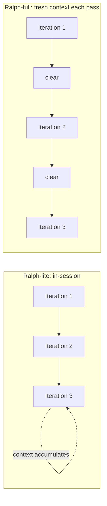
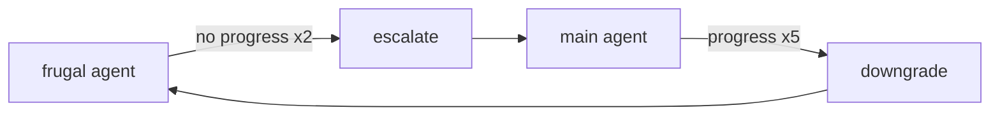

# Running the loop (operator)

## Executive overview

- **For:** operators who want Ralph's strongest, truest mode — reach for it whenever a headless
  agent invocation is available, not just for large or ambiguous builds.
- **The choice:** `/wgm` runs in-session (Ralph-lite, the fallback); `scripts/loop.sh` gives the
  agent a fresh context every iteration (Ralph-full, the preferred default whenever invocable).
- **Fastest path:** set `WGM_AGENT`, then `./scripts/loop.sh build 20`.
- **Key knobs:** `--threshold` (satisfaction target), `--stratified` (converge tier 1 → 2 → 3),
  `--container`, `--devcontainer` (sandbox the loop itself, disk-conscious), plus frugal ↔ powerful
  model escalation.
- **Safety:** non-destructive by default — no commits or pushes without `--commit`; stop anytime
  with `Ctrl+C` or a `STOP` sentinel.
- **Next:** [containers.md](containers.md) for live-service scenarios ·
  [devcontainers.md](devcontainers.md) for sandboxing the loop itself ·
  [troubleshooting.md](troubleshooting.md).

wgm runs in-session when you invoke `/wgm`, but its strongest mode gives the agent a **fresh context
every iteration** via [`scripts/loop.sh`](../../scripts/loop.sh). This is the operator's guide to
driving that loop.

## Ralph-lite vs Ralph-full


```mermaid
flowchart LR
  subgraph Lite [Ralph-lite: in-session]
    L1[Iteration 1] --> L2[Iteration 2] --> L3[Iteration 3]
    L3 -. context accumulates .-> L3
  end
  subgraph Full [Ralph-full: fresh context each pass]
    F1[Iteration 1] --> X1[clear]
    X1 --> F2[Iteration 2] --> X2[clear] --> F3[Iteration 3]
  end
```

- **Ralph-lite** — run the loop inside one agent session. The fallback: use when no headless agent
  invocation is available (a purely interactive host) or the work is Quick-track; compensate for
  accumulating context with strict persistence to `IMPLEMENTATION_PLAN.md`.
- **Ralph-full** — `loop.sh` invokes your agent once per iteration with a clean context. **The
  preferred default whenever it's invocable** — not reserved for large/ambiguous builds only. The
  plan file is the only memory between passes. Add `--devcontainer` to run it sandboxed without
  inflating disk usage per project (one shared base image; see [devcontainers.md](devcontainers.md)).

See [`references/ralph-loop.md`](../../references/ralph-loop.md) for the underlying mechanics.

## Wiring up your agent

`loop.sh` is host-agnostic — tell it how to call your agent:

```bash
# A shell-evaluated command (prompt appended as the last arg):
export WGM_AGENT='copilot -p'
# …or pass argv after `--` (invoked without eval — safest):
./scripts/loop.sh build -- copilot -p
```

If your agent reads the prompt from stdin, set `WGM_PROMPT_STDIN=1`.

## Run it from another project

`loop.sh` ships **inside the installed skill** and operates on your **current working directory**, so
one installed copy drives any project — run the skill's copy from your project's root:

```bash
# from your project's root — the path depends on where wgm installed (see installation.md):
~/.agents/skills/wgm/scripts/loop.sh build -- copilot -p
# a handy alias makes it one word from anywhere:
alias wgm-loop="$HOME/.agents/skills/wgm/scripts/loop.sh"
wgm-loop build 20 --max-runtime-seconds 3600
```

It reads and writes `IMPLEMENTATION_PLAN.md` and `.wgm/` **in the directory you launch it from**, never
in the skill folder, so one install serves every project. The `./scripts/loop.sh` shorthand used
elsewhere in this guide just means "the loop runner" — substitute your install path when you are not
inside the wgm repo.

## Modes

```bash
./scripts/loop.sh plan --request "build a small CLI todo app"  # one planning pass
./scripts/loop.sh preflight        # score readiness before building
./scripts/loop.sh build 20         # up to 20 build iterations
./scripts/loop.sh build only       # exactly one iteration
./scripts/loop.sh extract --source ../exemplar   # gene transfusion
./scripts/loop.sh review           # assess the diff vs acceptance criteria
./scripts/loop.sh build --dry-run  # print the prompt/command, run nothing
```

Modes mirror the skill: `grill | analyze | plan | preflight | build | review | extract` (`loop` is
an alias of `build`). `build`/`review`/`preflight` refuse to run without an `IMPLEMENTATION_PLAN.md`.

## Convergence & escalation knobs

| Flag | Default | Effect |
|---|---|---|
| `--threshold N` | 95 | Satisfaction target the build converges to. |
| `--scenarios DIR` | `scenarios/` or `.wgm/scenarios/` | Where holdout scenarios live. |
| `--stratified` | off | Validate scenarios by ascending tier (1→2→3). |
| `--container podman\|docker` | podman | Engine for containerized scenario validation. |
| `--frugal-agent "CMD"` | — | Cheap model for routine iterations. |
| `--escalate-after N` | 2 | No-progress iterations before escalating to `--agent`. |
| `--downgrade-after N` | 5 | Progressing iterations before downgrading to frugal. |

Model escalation engages only when **both** a frugal and a main agent are set. The loop uses changes
to the plan file as its progress proxy:


```mermaid
flowchart LR
  Fr[frugal agent] -- no progress x2 --> Esc[escalate]
  Esc --> Mn[main agent]
  Mn -- progress x5 --> Dn[downgrade]
  Dn --> Fr
```

See [stall-recovery.md](../agent/stall-recovery.md) for what the agent does inside an escalation.

## Operational limits & lifecycle hooks

Guardrails for long autonomous runs — all **off by default**, so existing behavior is unchanged:

| Flag | Default | Effect |
|---|---|---|
| `--max-runtime-seconds N` | 0 (off) | Hard wall-clock cap; the loop stops before the iteration that would exceed it. |
| `--idle-timeout N` | 0 (off) | Stop if the plan file makes no progress for N seconds — a stuck-loop circuit breaker. |
| `--checkpoint-interval N` | 0 (off) | `git add -A && commit` every N build iterations, so a crash never loses work. |
| `--max-cost N` | 0 (off) | Stop once cumulative cost from `--cost-cmd` reaches N — the spend equivalent of `--max-runtime-seconds`. See [Cost ceiling](#cost-ceiling) below. |
| `--notify "CMD"` | — | Run `CMD` on lifecycle events with `$WGM_EVENT` (`start`/`complete`/`error`) and `$WGM_ITER` set. |

`--notify` is shell-evaluated like `--agent`, so set it only to a command you trust; its own failure
never fails the loop. Example completion ping: `--notify 'notify-send "wgm $WGM_EVENT @ $WGM_ITER"'`.

### Resilience — retries & circuit breaker

Unlike the limits above, these default **on**, so a long unattended run survives a transient blip
(a rate-limit, a network hiccup) instead of dying on the first non-zero agent exit.

| Flag | Default | Effect |
|---|---|---|
| `--max-retries N` | 2 | Retry a failed agent invocation up to N times in the same iteration, with exponential backoff + full jitter. |
| `--retry-base-delay N` | 5 | Base seconds for the backoff (each wait is a random `0..min(base·2^k, cap)`); 0 = no wait. |
| `--retry-max-delay N` | 60 | Cap for any single backoff wait, in seconds. |
| `--max-consecutive-failures N` | 3 | Circuit breaker: stop the build loop after N iterations that exhaust their retries in a row; 0 = never trip. |

The breaker counts only **consecutive** failures — any successful iteration resets it. To **fail
fast** on the first error (the pre-resilience behavior), set `--max-retries 0 --max-consecutive-failures 1`.
Each retry and the breaker trip emit `--notify` events (`retry` / `error`).

### Metrics ledger (data-driven runs)

`--metrics FILE` appends a TSV row per iteration, so you can reason about a run's cost and behavior:

| Columns | Meaning |
|---|---|
| `timestamp` · `iter` · `mode` · `agent` | when, which iteration, the mode, and frugal/main |
| `duration_s` · `plan_changed` · `result` | wall-clock seconds, whether the plan advanced (1/0), `ok`/`fail` |
| `cost` | token/cost figure from `--cost-cmd` (empty if unset) |

A host-agnostic loop can't read a black-box agent's token usage, so plug your own: `--cost-cmd "CMD"`
runs after each iteration (with `$WGM_ITER` set) and its stdout fills the `cost` column — best-effort,
its failure never breaks the loop. Example:
`--metrics .wgm/metrics.tsv --cost-cmd 'tail -1 .wgm/usage.log'`.

### Cost ceiling

`--max-cost N` stops the **build** loop once the cumulative total from `--cost-cmd` reaches `N` —
the spend equivalent of `--max-runtime-seconds`, so an unattended run can't silently blow through an
unbounded budget. It works independently of `--metrics` (you don't need a ledger file to get the
ceiling) but **requires `--cost-cmd`** to have anything to sum — set both, or you'll get a startup
warning that the ceiling can never trigger. The unit is whatever `--cost-cmd` emits (dollars, cents,
tokens); wgm never interprets it, only sums it.

```bash
./scripts/loop.sh build --cost-cmd 'tail -1 .wgm/usage.log' --max-cost 20   # stop at spend >= 20
```

Default `0` = unlimited (unchanged behavior). This closes the "API spend/cost ceiling" follow-up
noted in [`docs/plans/2026-06-16_PLAN.md`](../plans/2026-06-16_PLAN.md).

## Optional external tooling: dashboards and cost views

wgm ships the **loop runner and its output files**, not a bundled operator UI. If you want a live
dashboard, build it **externally** against the files and hooks `loop.sh` already exposes — the same
"runner emits durable state; a separate tool renders it" pattern noted for
[`ralph-orchestrator`](https://github.com/mikeyobrien/ralph-orchestrator) and
[`codeburn`](https://github.com/getagentseal/codeburn) in the
[landscape survey](../plans/2026-06-16_RALPH_LANDSCAPE.md).

### Pattern: a ledger-backed TUI/dashboard (ralph-orchestrator style)

In the `wgm vs representative projects` table, `ralph-orchestrator` is the reference for a terminal
dashboard/TUI. The equivalent wgm pattern is: **leave `loop.sh` alone, and point an external reader
at its existing artifacts**.

- **Primary data source:** the `--metrics FILE` TSV ledger (`timestamp`, `iter`, `mode`, `agent`,
  `duration_s`, `plan_changed`, `result`, `cost`).
- **Event stream:** `--notify "CMD"` lifecycle events (`start`, `retry`, `error`, `complete`) plus
  any checkpoint commits you asked `--checkpoint-interval` to create.
- **Optional score input:** if you want a satisfaction trend line as well as iteration timing, read
  the existing `.wgm/scores.md` trajectory (or the score notes written into the plan) alongside the
  ledger; the TUI is still only *reading* wgm's durable outputs.

That gives an operator enough to tail or poll for:

- current iteration number, mode, and active frugal/main agent
- per-iteration elapsed time and success/failure history
- whether the plan advanced this pass (`plan_changed`)
- checkpoint boundaries and loop lifecycle notifications
- satisfaction trend, if you also ingest the score log

In other words: you **could** build a `ralph-orchestrator`-style terminal board on top of
`.wgm/metrics.tsv`, `.wgm/scores.md`, and `--notify`; wgm itself does **not** ship that board.

### Pattern: a token/cost TUI (codeburn style)

The landscape survey's *Adjacent ecosystems* section calls out `codeburn` as a **token TUI
dashboard**. wgm's matching integration point is already here: `--cost-cmd` fills the ledger's
per-iteration `cost` column, and `--max-cost` can stop the loop once that running total crosses a
ceiling.

- Keep your own token/spend collector outside wgm (for example, a host-specific usage log or API
  meter).
- Have `--cost-cmd` print one numeric figure per iteration in whatever unit you care about
  (tokens, cents, dollars).
- Enable `--metrics FILE` so the figure lands in the ledger as a durable time series.
- Let an external TUI tail that ledger and render live per-iteration cost, cumulative spend, and
  "distance to `--max-cost`" progress.

This is intentionally **host-agnostic**: wgm does not know how your agent exposes usage, and it does
not bundle a token dashboard. It only gives you the hook and the ledger so an operator can attach a
`codeburn`-style live view if they want one.

## Project gates (wgm.yml)

A `wgm.yml` (or `.wgm/gates.yml`) at your project root defines **project-wide gates** — commands
**every build iteration** must drive to exit 0 before a task is `done`. They are a quality *floor*
independent of any single task's own check. `loop.sh` auto-detects the file (override with
`--gates FILE`) and injects the list into each build prompt.

```yaml
# wgm.yml
gates:
  - npm run typecheck
  - npm test --silent
  - npm run lint
```

```bash
./scripts/loop.sh build --dry-run        # shows: gates=wgm.yml (3) + the injected line
./scripts/loop.sh build --gates ci/gates.yml
```

Gates are **shell commands** — use only a file you trust. A starter lives in
[`assets/wgm.example.yml`](../../assets/wgm.example.yml). Today the loop injects the gates as
mandatory backpressure into the prompt; having `loop.sh` also run them itself is a planned follow-up.

## Swarm — parallel worktrees

For independent slices, fan the loop out with `scripts/swarm.sh`: it runs several `loop.sh` build
streams **in parallel**, each isolated in its own `git worktree` on its own branch, then you merge
the branches — one thought per branch.

```bash
# one stream per line; each line is that stream's scope
printf 'add the auth module\nadd the export endpoint\n' > .wgm/tasks.txt
./scripts/swarm.sh --tasks .wgm/tasks.txt -- copilot -p   # or set $WGM_AGENT
# …or N identical streams (race / diversity):
./scripts/swarm.sh -n 3 --max-iterations 20 -- copilot -p
```

| Flag | Effect |
|---|---|
| `--tasks FILE` | one stream per non-empty, non-`#` line (the line is that stream's `--request` scope) |
| `-n, --count N` | N identical streams |
| `--max-iterations N` | per-stream build cap (0 = until each self-stops) |
| `--prefix NAME` | branch/worktree name prefix (default `wgm/swarm`) |
| `--cleanup` | remove the worktree dirs when done — branches are kept for merging |
| `--dry-run` | print the plan; create nothing |

### Planning a swarm well
- **Partition file ownership, not just features.** Worktree isolation only prevents *live* file
  contention — two peer streams can still independently touch the **same shared module** (a
  registry, an `index`/`mod`/`use` file, a shared FFI/utils file), which then surfaces only as a
  merge conflict at integration time, the most expensive moment to find it. Assign each stream a
  disjoint set of files/areas it owns, name them explicitly in its prompt, and route shared
  additions (helpers, constants, FFI) into the stream's *own* module instead of the common file.
  Treat any unavoidably-shared declaration file as a known merge point and have each stream append
  in a stable, non-adjacent location so a 3-way merge stays trivial.
- **A feasibility spike is a legitimate stream too.** Not every stream has to ship code — dispatch an
  open "is this even possible?" question as a peer stream whose deliverable is a **go/no-go writeup
  with provenance**, not a diff. Fold the verdict back into `IMPLEMENTATION_PLAN.md`: drop any task
  the spike proves is a duplicate, split out a smaller patchable sub-win it surfaces, and record the
  question so it's never re-attempted. **A well-supported NO-GO is a PASS for a spike, not a
  stall** — it only fails if it produces no decision (see [`stall-recovery.md`](../agent/stall-recovery.md)).

**Provenance:** `[learn]` issues #29 (file-ownership partitioning) and #30 (feasibility spikes as a
parallel stream).

Each stream runs with `--commit`, so its branch carries the work. Worktrees live under
`.wgm/worktrees/` (gitignored). Merge a finished stream with `git merge wgm/swarm/N`; an existing
branch is skipped rather than clobbered. Partition the work yourself — the swarm is the sheepdog
spawning the dogs, not an auto-splitter.

**Every run also feeds the Hive Growth Loop.** After all streams finish, `swarm.sh` unconditionally
folds each stream's `.wgm/memories.md` into the invoking worktree's own `.wgm/memories.md` (tagged
by origin branch), then hands it to `scripts/harvest-hive.sh` — safe to run every time: with no
`.github/wgm-hive.yml` yet it just previews and skips, never blocking the swarm or asking on your
behalf unattended (`references/self-improvement.md`).

## Stopping the loop

- `Ctrl+C` at any time.
- Create a `STOP` (or `.wgm/STOP`) sentinel to end after the current iteration.
- Cap the run up front with `--max-runtime-seconds` or `--idle-timeout` (see above).
- In `build` mode the agent drops that sentinel itself when no must-have task remains, so the loop
  self-terminates.

## Commits

`loop.sh` is non-destructive by default (no commits, no pushes). Pass `--commit` to
`git add -A && git commit` after each build iteration. The agent still edits files during a normal
run, so only run the loop in a workspace you trust it in.

See also: [containers.md](containers.md) · [troubleshooting.md](troubleshooting.md).
