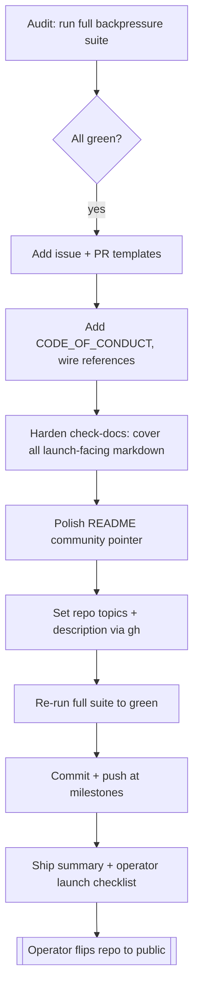

# 2026-06-12 — Public-launch audit & readiness

Status: in progress · Owner: wgm audit loop · Scope: community-health files, docs backpressure, repo
metadata, release handoff.

## Problem

`wgm` is being prepared to flip from a private repo to a public one. The skill content is strong and
every deterministic check already passes, but a public launch is judged on more than green tests:
contributors arrive through issue/PR templates, a code of conduct, and a security policy, and the
project's own "never let the checks go red" discipline should cover every launch-facing document —
not just `docs/` and `README.md`.

## Audit baseline (what already passes)

- `shellcheck scripts/*.sh` and `bash -n` — clean.
- `skills-ref validate wgm` — Valid skill.
- `scripts/check-docs.sh` — GREEN (12 files, 20 mermaid diagrams).
- `scripts/test-install.sh` — 9 / 9.
- `scripts/test-install.ps1` — 5 / 5.
- No secrets, PII, stray absolute paths, or unresolved internal links (69 internal, 6 external).
- `SKILL.md` is 197 lines (well under the ~500 target); `loop.sh` / `install.sh` flags match the
  README exactly; LICENSE is MIT matching the frontmatter.

## Gaps to close

1. `CONTRIBUTING.md` points contributors at issue templates and a PR template that do not exist.
2. No `CODE_OF_CONDUCT.md` — a community standard for a public project.
3. `scripts/check-docs.sh` link-checks only `docs/` + `README.md`; it skips `SKILL.md`,
   `CONTRIBUTING.md`, `SECURITY.md`, and `references/`, so a broken link there ships silently.
4. The repo is private, has no topics, and a terse description ("Wiggum Loop").
5. Launch-prep edits (governance files, CI, `.gitignore`, preflight README fix) are uncommitted.

## Non-goals (this pass)

- Flipping repository visibility to public — left to the operator (see the launch checklist).
- Changing the skill protocol, the lifecycle, or any installer behavior.
- Cutting a tagged release — optional follow-up, noted in the checklist.

## Flow



## Tasks (shared state)

| Task | Objective | Validation | Status |
|---|---|---|---|
| issue-templates | `.github/ISSUE_TEMPLATE/` bug + feature forms + config | YAML parses; files exist | done |
| pr-template | `.github/PULL_REQUEST_TEMPLATE.md` | file exists; CONTRIBUTING link resolves | done |
| code-of-conduct | Contributor Covenant 2.1 + private report channel | link check resolves | done |
| harden-check-docs | broaden link/fence checks to all launch-facing md | `check-docs.sh` GREEN | done |
| readme-polish | community pointer + governance files surfaced | link check green | done |
| repo-metadata | topics + description via `gh` | `gh repo view` reflects them | done |
| full-backpressure | whole suite green after changes | every check exits 0 | done |
| commit-push | grouped commits pushed to `origin/main` | pushed at milestones | done |
| launch-checklist | Ship summary + operator launch checklist | this doc + handoff | done |

## Validation (backpressure)

Deterministic checks gate "done" — exactly the suite CI runs:

```bash
shellcheck scripts/*.sh
for s in scripts/*.sh; do bash -n "$s"; done
( cd .. && skills-ref validate wgm )
bash scripts/check-docs.sh
bash scripts/test-install.sh
pwsh -File scripts/test-install.ps1
```

## Operator launch checklist (left to a human)

1. Review the diff and the new community-health files.
2. Confirm CI is green on `main` after push.
3. Flip visibility: `gh repo edit agent-frontier/wgm --visibility public --accept-visibility-change-consequences`.
4. Verify the install one-liners fetch over `raw.githubusercontent.com` once public.
5. Optional: cut a `v0.2.0` tag/release to match the `SKILL.md` frontmatter version.
6. Optional: enable GitHub Discussions and turn on private vulnerability reporting in Settings.

## Links

- Contributing guide: [../../CONTRIBUTING.md](../../CONTRIBUTING.md)
- Security policy: [../../SECURITY.md](../../SECURITY.md)
- CI workflow: [../../.github/workflows/ci.yml](../../.github/workflows/ci.yml)
- Bash installer: [../../scripts/install.sh](../../scripts/install.sh)
