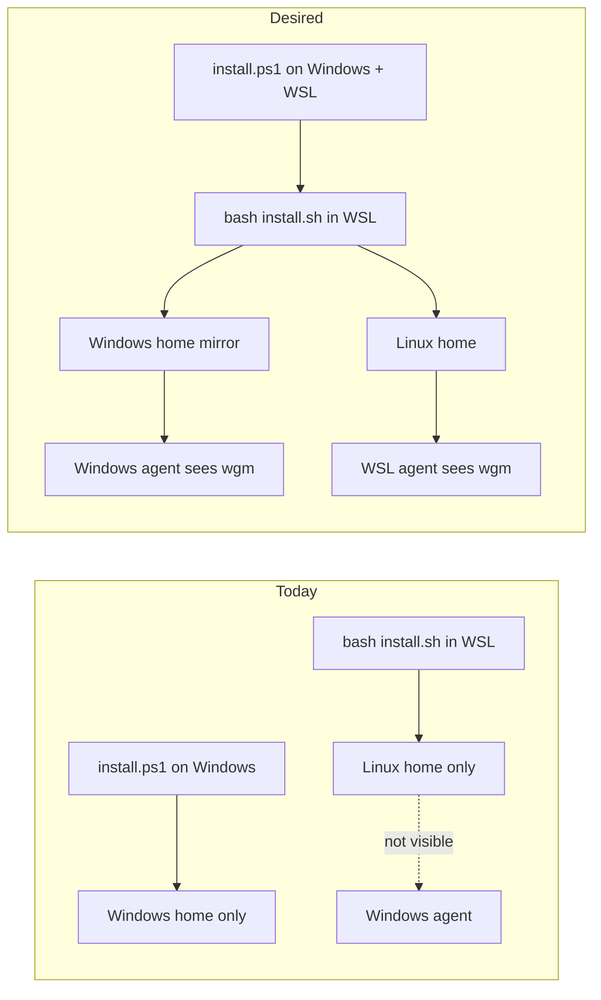
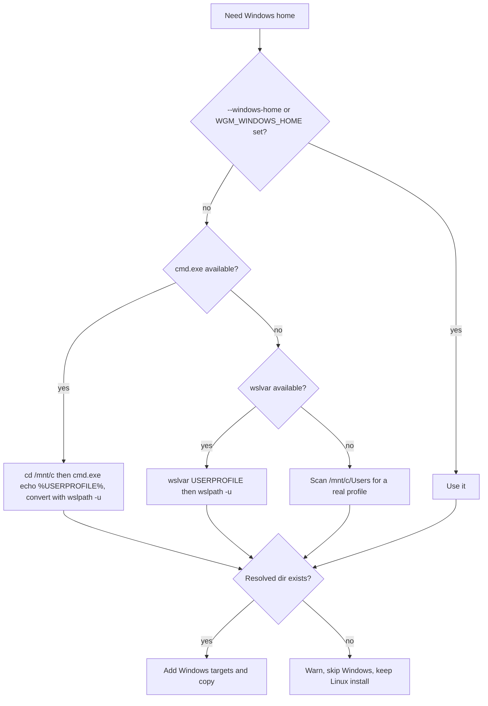
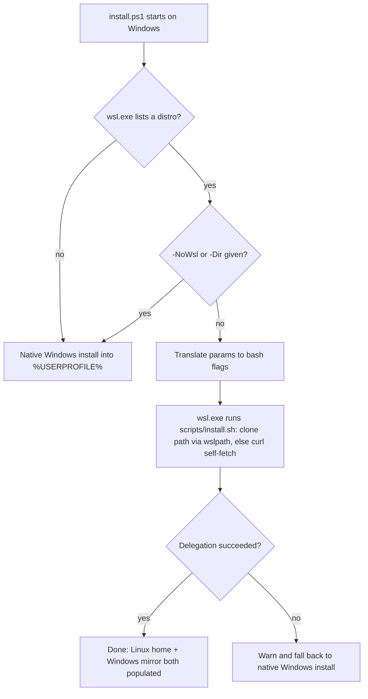

# 2026-06-12 — WSL ⇄ Windows install bridge

Status: done · Owner: wgm build loop · Scope: `scripts/install.sh`, `scripts/install.ps1`, docs.

## Problem

wgm installs into a *skills directory* that an agent scans. Today the installers treat WSL and
Windows as fully separate worlds: the bash installer (run in WSL) installs only into the Linux home,
and the docs tell you to run the PowerShell installer *separately* on Windows. A developer who lives
in WSL but runs an agent on the Windows side (VS Code, Copilot CLI) has to install twice and
remember which side they did.

## Goals

1. **One WSL install, reachable from Windows.** Running the bash installer inside WSL also places the
   skill where native-Windows agents look (`%USERPROFILE%\.agents\skills\wgm`), reachable from WSL at
   `/mnt/c/Users/you/.agents/skills/wgm`.
2. **Smooth upgrade.** Re-running the installer upgrades a pre-feature install in place and adds the
   Windows mirror — no `--force` required for a directory we recognize as our own.
3. **PowerShell redirects to the linux-y way.** On native Windows, if a WSL distro exists,
   `install.ps1` delegates the install to the bash installer inside WSL so both homes are covered no
   matter which installer the user launched.

## Non-goals (this pass)

- A Windows→WSL mirror beyond the PowerShell delegation hand-off (the bridge is WSL→Windows).
- Changing the cross-client layout (`.agents`, `.claude`, `.copilot`) or the self-fetch mechanism.
- macOS / non-WSL Linux behavior — unchanged.

## Current vs desired

## Design

### 1. Bash installer — mirror into the Windows home (WSL only, user scope)

When `IS_WSL` is set and the scope is user and `--no-windows` was not passed, resolve the Windows
home and add its skills dirs to the target set. Windows targets are **always copied** (never
symlinked across the `/mnt` boundary). The whole thing is **best-effort**: if the Windows home cannot
be resolved, warn and continue with the Linux install.

Resolution order for the Windows home (first hit wins):

Client selection on the Windows side mirrors the existing logic but is evaluated against the Windows
home: always include `.agents`; for `auto`, add `.claude` / `.copilot` when those exist under the
Windows home; for an explicit `--client`, use that list. The same Windows targets are used by
`--uninstall`, so removing an install cleans both homes.

New flags: `--no-windows` (opt out of the mirror) and `--windows-home PATH` (override detection; also
the test seam). Env override: `WGM_WINDOWS_HOME`.

### 2. Idempotent self-refresh on re-run

`install_one` currently skips an existing target unless `--force`. New rule: if the existing target
is **recognizably a prior wgm install** — its `SKILL.md` frontmatter line reads `name: wgm` — refresh
it in place without `--force`, printing `updating existing wgm install`. A target that exists but is
**not** recognizably wgm still skips unless `--force`, so unrelated content is never clobbered. This
makes "update an existing WSL install to the new way" a no-op: just re-run, and the Windows mirror is
added because that target does not exist yet. The same self-refresh is mirrored into `install.ps1`
for parity.

### 3. PowerShell delegates to WSL when a distro exists

Detection uses `wsl.exe -l -q` (handling its UTF-16/NUL output) and requires at least one installed
distro. PowerShell parameters map to bash flags (`-User`→`--user`, `-Client`→`--client`,
`-Method`→`--method`, `-DryRun`→`--dry-run`, `-Uninstall`→`--uninstall`, `-Force`→`--force`,
`-Ref`→`--ref`). New switches: `-NoWsl` (force the native path) and `-WslDistro NAME` (target a
specific distro; default distro otherwise). Delegation is **best-effort**: any failure warns and
falls back to the native-Windows install.

## Files touched

| File | Change |
|---|---|
| `scripts/install.sh` | `--no-windows` / `--windows-home`; `resolve_win_home`; Windows mirror targets for install + uninstall; idempotent self-refresh; per-target copy method; header/usage update. |
| `scripts/install.ps1` | WSL detection + delegation; `-NoWsl` / `-WslDistro`; param→flag translation; idempotent self-refresh; header update. |
| `scripts/test-install.sh` | New deterministic backpressure harness (fake-WSL, dry-run + real-copy assertions). |
| `docs/operator/installation.md` | Rewrite the WSL section into the dual-install model + Mermaid + new flags + upgrade story. |
| `docs/operator/troubleshooting.md` | Refresh the WSL entries; add "Windows side missing" and "how to update". |
| `README.md` | Update the WSL note and the supported-OS line. |

## Validation (backpressure)

Deterministic checks gate "done":

- `bash -n scripts/install.sh` and `shellcheck scripts/install.sh` are clean.
- `scripts/test-install.sh` exits 0: forced-WSL dry-run shows Windows targets; `--no-windows` hides
  them; non-WSL shows none; a real install lands `SKILL.md` in BOTH homes; a re-run prints the
  idempotent-update line without `--force`; an uninstall clears both homes.
- `pwsh` syntax check of `install.ps1` when `pwsh` is present (skipped otherwise).
- `skills-ref validate wgm` stays valid; `scripts/check-docs.sh` stays green.

Holdout acceptance journeys are kept out of the repo (in the session workspace) and judged in
Validate/Review, tiered 1–3, covering: WSL install reaches Windows, re-run upgrade, PowerShell
delegation, and opt-out / best-effort / uninstall.

## Upgrade & rollback

- **Upgrade:** re-run the same one-liner inside WSL (or `install.ps1` on Windows). Recognized installs
  refresh in place; the Windows mirror is added.
- **Rollback:** `--uninstall` / `-Uninstall` removes both homes. The change is additive and
  backward-compatible — non-WSL installs behave exactly as before.

## Links

- Operator install guide: [../operator/installation.md](../operator/installation.md)
- Operator troubleshooting: [../operator/troubleshooting.md](../operator/troubleshooting.md)
- Bash installer: [../../scripts/install.sh](../../scripts/install.sh)
- PowerShell installer: [../../scripts/install.ps1](../../scripts/install.ps1)
