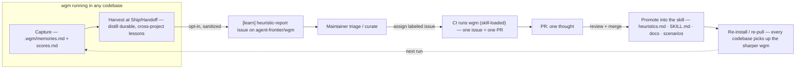
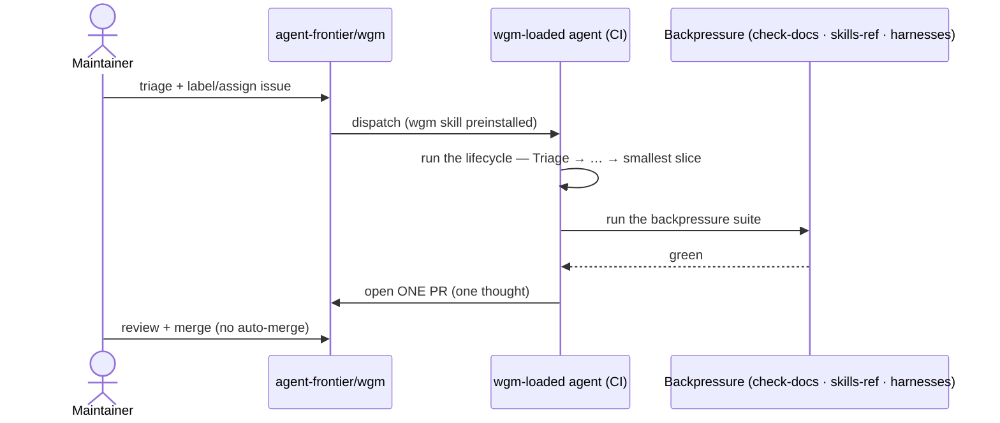

# wgm growth flywheel — how the skill learns from every codebase

**Date:** 2026-06-16 · **Status:** design + Phase-1 spine shipping; the auto-dispatch CI is an
**opt-in** Phase 2 (the operator's cost/security decision).

## Executive overview

wgm already *captures* lessons while it works — every build appends gotchas, stall fixes, and
patterns to a token-budgeted `.wgm/memories.md`. But that file is **local and git-ignored**: the
"juice" a run distills in someone else's codebase dies with the session. This doc designs the loop
that lets wgm **report those lessons back** to [`agent-frontier/wgm`](https://github.com/agent-frontier/wgm),
**retain** the durable ones in the shared skill, and **re-optimize itself** — so wgm gets sharper
every time it runs anywhere.

The shape is a flywheel: **capture → harvest → report → curate → self-optimize → promote →
re-install → (spin again)**. Each turn is human-gated at the merge, so growth compounds without
auto-merging anything.



## What already exists vs. what this adds

| Stage | Today | This design adds |
|---|---|---|
| **Capture** | `.wgm/memories.md` + `.wgm/scores.md` (per-build, lean) | unchanged — it is the source of juice |
| **Harvest** | nothing — lessons stay local | a **Ship/Handoff harvest step** in `SKILL.md` |
| **Report** | `heuristic_report.yml` issue template exists | the protocol path + sanitization/opt-in/de-dup rules (`references/self-improvement.md`) |
| **Curate** | maintainer reads issues | a labeled queue (`learning`) the CI can pick up |
| **Self-optimize** | manual PRs | **CI runs wgm against an issue → one PR** (`copilot-setup-steps.yml`) |
| **Promote / retain** | ad-hoc edits | a curated **juice ledger** `references/heuristics.md` + a promotion lifecycle |

## The three new mechanisms

### 1. Harvest & report (outbound — "how wgm reports back")
At **Ship/Handoff**, after the build is green, wgm distills any **durable, cross-project** lesson from
`.wgm/memories.md` — a gotcha, a stall's root-cause + fix, a heuristic worth reusing elsewhere — and,
**when the project has opted in**, files it as a sanitized `[learn]` report via the existing
[heuristic-report template](../../.github/ISSUE_TEMPLATE/heuristic_report.yml) (`gh issue create`).

Guardrails (full detail in [`references/self-improvement.md`](../../references/self-improvement.md)):
- **Sanitize**: the report is about *wgm's behavior*, never the host's code, secrets, or URLs.
- **Opt-in**: off by default; wgm reports upstream only on an explicit instruction, a dogfood run, or
  a project that enables it. It never surprises a client repo by filing issues.
- **De-dup**: search open issues first — duplicating work is the same failure the loop guards against.

### 2. Self-optimize via CI (inbound — "run wgm against issues → PRs")
A curated issue (a `[learn]` report, a `[feat]`, or a triaged gotcha) becomes a **one-thought PR**:



**Substrate — two options (the operator picks):**
- **A · GitHub Copilot coding agent (recommended).** Assign the labeled issue to Copilot; it boots
  with wgm preinstalled by [`.github/workflows/copilot-setup-steps.yml`](../../.github/workflows/copilot-setup-steps.yml)
  and opens a wgm-disciplined PR. Lowest infra; native "issue → PR"; human assigns, so nothing fires
  unprompted.
- **B · Self-hosted workflow.** A job invokes a headless agent (`copilot -p`) on the issue body. More
  control, but it needs model credits + a token and widens the cost/security surface — gate it behind
  a label and `workflow_dispatch`.

Either way the **meta-loop eats its own dog food**: a self-improvement PR must pass the same
backpressure suite (`check-docs`, `skills-ref`, the harnesses) before it can merge.

### 3. Promote & retain the juice (the ledger)
Durable lessons graduate from the ephemeral local log into a curated, version-controlled ledger —
[`references/heuristics.md`](../../references/heuristics.md) — and from there into the protocol,
docs, or a holdout scenario. The lifecycle:

```text
.wgm/memories.md  (ephemeral, local, lean)
      │  durable + cross-project + sanitized
      ▼
[learn] issue  →  reviewed PR  →  references/heuristics.md  →  SKILL.md / docs / scenarios
```

**Strategic forgetting:** local memory stays within its ~2000-token budget and is pruned; only
lessons that prove durable across projects earn a place in the ledger. The ledger is the retained
"juice"; everything else is allowed to fade.

## Guardrails & risks

- **Privacy** — sanitization is mandatory and consent is built into the issue template; wgm reports
  its own behavior, not the client's code.
- **Cost** — autonomous agents in CI consume credits; the auto-dispatch substrate is opt-in and
  label-gated, defaulting to human-assigned runs.
- **Safety** — no auto-merge, ever; every turn of the flywheel is a human-reviewed PR.
- **Quality** — the same deterministic backpressure that gates a build gates a self-improvement PR;
  growth that can't pass the checks doesn't land.

## Rollout

| Phase | Deliverable | Risk |
|---|---|---|
| **P1 (this PR)** | Harvest hook in `SKILL.md`, `references/self-improvement.md`, the `references/heuristics.md` ledger, and `copilot-setup-steps.yml` (cloud-agent enablement) | low — docs + opt-in enablement only |
| **P2 (opt-in)** | Label-triggered auto-dispatch workflow + a `wgm.yml` `report_upstream` switch | medium — credits + permissions |
| **P3 (data-driven)** | Track which heuristics land and which recur; a small dashboard of "lessons promoted / regressions caught" to prioritize where wgm should grow next | low |

## Cross-links
[`references/self-improvement.md`](../../references/self-improvement.md) (mechanics) ·
[`references/heuristics.md`](../../references/heuristics.md) (the ledger) ·
[`references/ralph-loop.md`](../../references/ralph-loop.md) (memory) ·
[`2026-06-16_RALPH_LANDSCAPE.md`](2026-06-16_RALPH_LANDSCAPE.md) (the watchlist this closes:
"compaction-surviving memory promotion flow").
