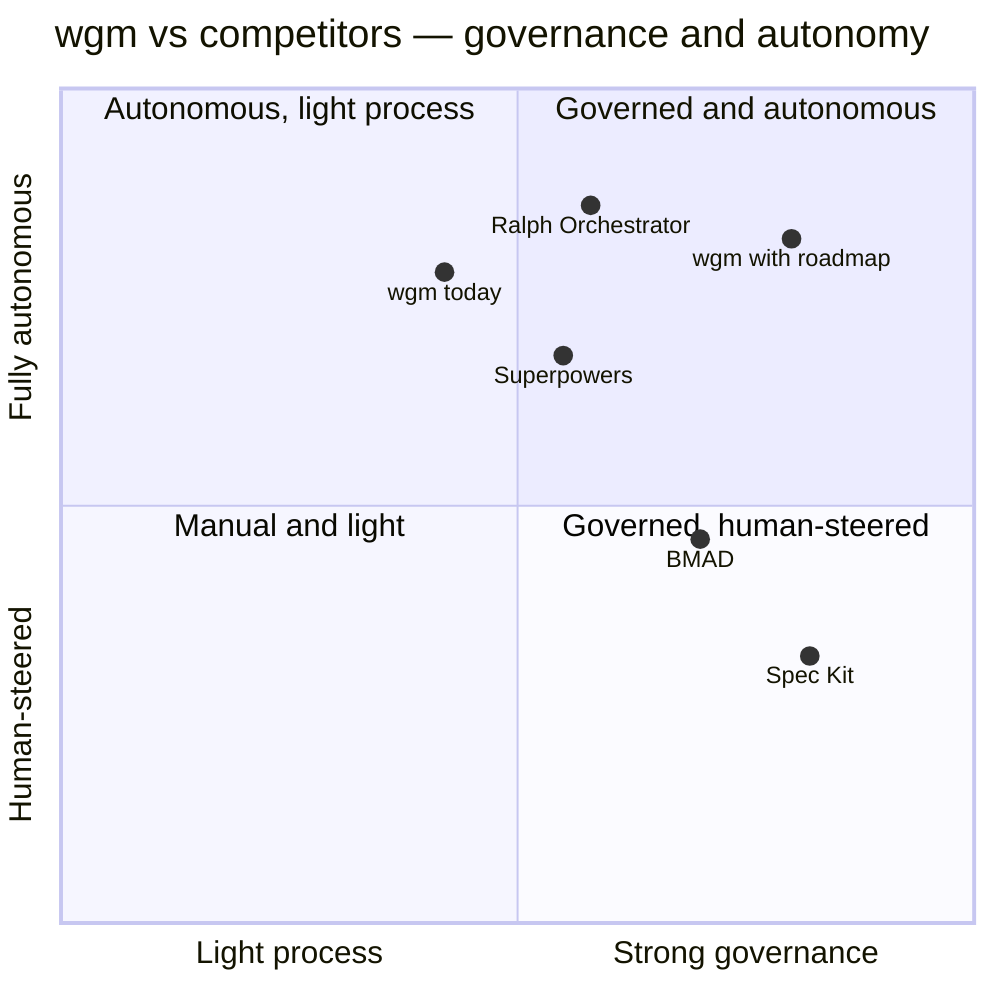

# wgm improvement plan — competitive analysis & roadmap

**Date:** 2026-06-16 · **Status:** **Tier 1** + **Tier 2 #6 (memories) & #7 (loop limits)** shipped
to `main` (SKILL.md v0.3); remaining Tier 2 (#5, #8) and Tier 3 (#9, #10) are follow-up PRs.

> The first pass shipped **documentation only** — operator executive overviews, an
> [operator landing page](../operator/README.md), and this analysis. **Tier 1 and Tier 2 items
> #6–#7 are now implemented** (constitution, consistency gate, no-placeholder discipline, loop
> guardrails, loop operational limits, cross-iteration memories). The rest stays a proposed roadmap,
> each landing as its own branch and PR.

## Executive overview

- **Where wgm leads:** three mechanisms no competitor combines — a **holdout-scenario LLM judge**
  (blind, 0–100, stratified by tier), a **preflight readiness gate** before any code, and
  **wonder/reflect + model escalation** for stalls — all in a single portable `SKILL.md` with a
  host-agnostic Ralph loop and OCI/Podman validation.
- **Where the field is ahead:** **governance** (a project-wide principles layer), **consistency**
  (a cross-artifact check before coding), and **operational ergonomics** (hard loop limits,
  persistent memories, config-level quality gates).
- **The thesis:** keep wgm's judging/convergence edge, and adopt the best governance and ergonomics
  ideas from Spec Kit, Superpowers, and the Ralph orchestrators — without bloating the one-file
  skill.

## Competitive landscape

| Tool | What it is | wgm already does better | The gap wgm could close |
|---|---|---|---|
| [GitHub Spec Kit](https://github.com/github/spec-kit) | Specify → Plan → Tasks → Implement via slash commands | Holdout judge; preflight gate; autonomous loop | **Constitution** principles doc; **analyze** cross-artifact consistency gate; **clarify** for underspecified areas; `[P]` parallel task markers |
| [BMAD-METHOD](https://github.com/bmad-code-org/BMAD-METHOD) | Agentic agile; persona agents; sharded PRDs and stories | Automated build loop; far simpler setup | **Scale-adaptive tracks** (quick/standard/full); epic→story hierarchy; machine-readable `sprint-status.yaml`; correct-course replanning |
| [Superpowers](https://github.com/obra/Superpowers) | Anthropic-listed Claude skills (brainstorm → plan → subagent dev) | External fresh-context loop; holdout judge | **Per-task subagent dispatch** with two-stage review; typed implementer status; **no-placeholder** plan discipline; per-task model selection |
| [Ralph Orchestrator](https://github.com/mikeyobrien/ralph-orchestrator) | Multi-backend Ralph runner; hat system; web dashboard | Holdout judge; preflight; gene transfusion; pure-bash portability | **Declarative `wgm.yml` gates**; **memories** with token budget; **hard limits** (runtime/idle/checkpoint); confidence protocol; lifecycle hooks |
| [agent-os](https://github.com/buildermethods/agent-os) | Standards discovery + injection layer | Full lifecycle; exemplar gene transfusion | **Standards discovery from the current repo**; two-tier metadata index for context-budget-aware loading |
| [mattpocock/skills](https://github.com/mattpocock/skills) | Composable skills; the grill-with-docs origin | Full pipeline; holdout judge | **CONTEXT.md** living glossary during grilling; **ADR** discipline (3-criterion gate) |

## Where wgm sits

## Roadmap (Tier 1 + Tier 2 #6–#7 shipped; the rest proposed)

Most impactful first. Tiers reflect risk and size, not a schedule.

### Tier 1 — protocol-only, high impact, low risk — shipped (SKILL.md v0.3)
1. **Constitution doc** *(Spec Kit)* — add `specs/CONSTITUTION.md`, written once in Triage/Plan,
   capturing project-wide principles (quality, testing, security, non-negotiables); the Plan-exit
   gate verifies every spec and task conforms or intentionally deviates. Kills spec drift across a
   multi-iteration build.
2. **Cross-artifact consistency gate** *(Spec Kit analyze)* — formalize the already-named `analyze`
   mode as a Plan→Preflight gate that checks specs against each other and against
   `IMPLEMENTATION_PLAN.md` for contradictions and requirement↔task coverage gaps.
3. **No-placeholder plan discipline + self-check** *(Superpowers)* — a Plan-exit self-audit that
   rejects any task carrying placeholder markers (to-be-decided, implement-later) or missing its
   validation command, and requires exact file paths.
4. **Standing loop guardrails** *(ghuntley/Ralph)* — inject two per-iteration rules: "search the
   codebase before implementing — don't assume a feature is missing," and "document why each test
   exists." Prevents duplicate work and orphan-test deletion across fresh contexts.

### Tier 2 — loop.sh + config ergonomics — #6, #7 shipped
5. **Declarative `wgm.yml` gates** *(Ralph Orchestrator)* — an optional config with named
   project-wide gates (typecheck, test, lint) injected as mandatory backpressure every iteration —
   a quality floor independent of each task's own check.
6. **Memories with a token budget** *(Ralph Orchestrator)* — **shipped:** an append-only
   `.wgm/memories.md` of stall patterns and gotchas, recalled within a ~2000-token budget in Analyze
   and appended in Record, with `assets/memories.template.md` and the `.wgm/scores.md` trajectory log.
7. **Hard operational limits** *(Ralph Orchestrator)* — **shipped:** `--max-runtime-seconds`,
   `--idle-timeout`, an always-on `--checkpoint-interval` (auto-commit), and a `--notify` lifecycle
   hook in `loop.sh`, with a `scripts/test-loop.sh` harness wired into CI.
8. **Scale-adaptive tracks** *(BMAD-METHOD)* — Triage auto-classifies Quick / Standard / Full and
   right-sizes the ceremony (a one-file fix skips scenarios and preflight; a greenfield app gets the
   full rig).

### Tier 3 — structural / larger
9. **Per-task subagent dispatch with two-stage review** *(Superpowers)* — dispatch implementer,
   spec-compliance reviewer, and quality reviewer subagents per task, each with curated context and
   a typed status protocol (done / done-with-concerns / needs-context / blocked); pick the model by
   task complexity.
10. **CONTEXT.md domain glossary** *(mattpocock)* — a living terminology glossary maintained during
    Grill, kept separate from specs and referenced each iteration to enforce naming consistency and
    cut token cost.

**Also-ran candidates:** machine-readable `sprint-status.yaml`; correct-course replanning; ADR
discipline (3-criterion gate); standards discovery from the current repo; HARD-GATE tag syntax and
`REQUIRED SKILL` artifact headers; and a trigger-eval set (≈20 should/should-not queries) for the
SKILL description.

**From 2026 loop-runner research (item 7 follow-ups):** API spend/cost ceilings with real-time
tracking, and parallel worktree loops — both candidates for `loop.sh` once a host-agnostic signal
exists. The idle-timeout shipped in item 7 already provides the circuit-breaker pattern those
runners standardized on.

## How this was built

- Competitive scan via web research across the tools above (workflow, artifacts, standout features,
  and the specific mechanisms wgm lacks).
- Shipped alongside this doc: operator executive overviews and the
  [operator landing page](../operator/README.md). See the [documentation index](../README.md).
- Protocol reference: [`SKILL.md`](../../SKILL.md); judging and scenarios live in
  [`references/`](../../references/).
