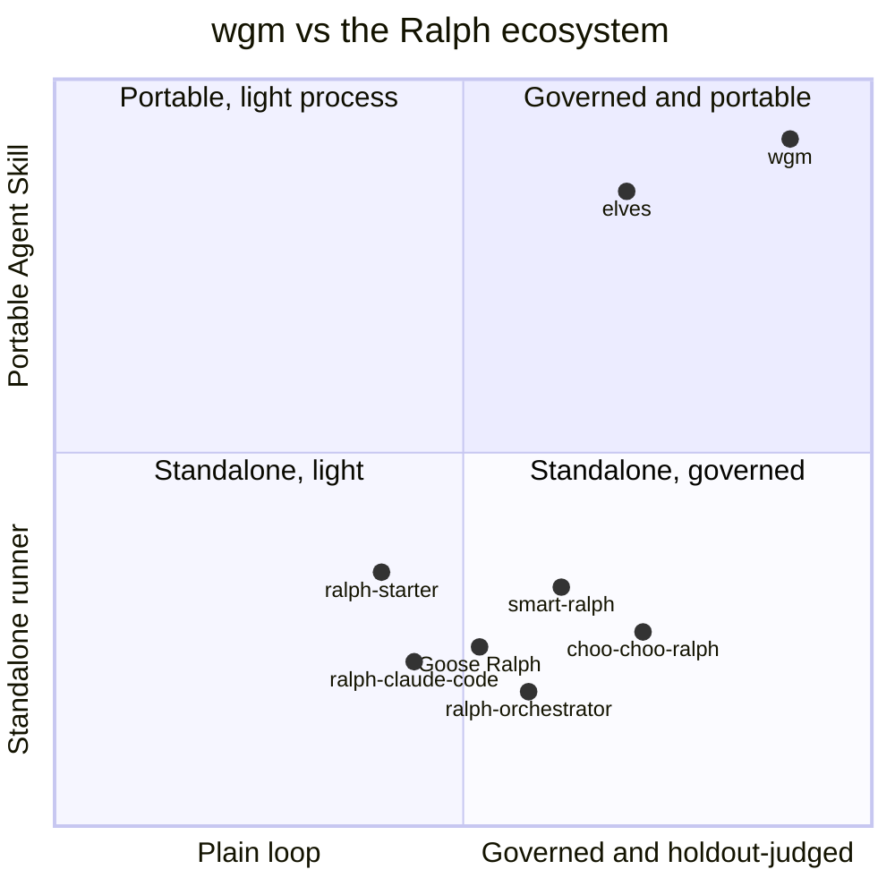

# wgm vs the Ralph ecosystem — competitive landscape

**Date:** 2026-06-16 · **Sources:** [awesome-ralph](https://github.com/snwfdhmp/awesome-ralph) (curated list) · [github.com/topics/ralph-loop](https://github.com/topics/ralph-loop) (live topic feed)

> A companion to [the roadmap](2026-06-16_PLAN.md). That doc compared wgm to the spec-driven crowd
> (Spec Kit, BMAD, Superpowers…); this one tracks wgm against **the Ralph ecosystem itself** — the
> loop runners, orchestrators, and tool-specific implementations catalogued in `awesome-ralph`.
> "wgm vs the world." Re-run the survey periodically and refresh the table + watchlist.

## The one-line difference

Almost everything in `awesome-ralph` is a **loop runner** — a script or binary that re-invokes an
agent until a spec is met (`while :; do cat PROMPT.md | agent ; done`). **wgm is not (only) a
runner — it is a portable [Agent Skill](https://agentskills.io)**: a `SKILL.md` protocol any
compatible agent loads, *plus* an optional host-agnostic runner (`scripts/loop.sh`). So wgm competes
on **discipline** (grill → governed plan → holdout-judged loop), not on being one more loop.

## The ecosystem at a glance

**Methodology / playbooks**
- [how-to-ralph-wiggum](https://github.com/ghuntley/how-to-ralph-wiggum) — Huntley's official playbook (the source).
- [ralph-playbook](https://github.com/ClaytonFarr/ralph-playbook) — methodology, diagrams, "signs and gates".

**Orchestrators and standalone runners**
- [ralph-orchestrator](https://github.com/mikeyobrien/ralph-orchestrator) — Rust; 7 backends; Hat-System personas; TUI.
- [ralph-claude-code](https://github.com/frankbria/ralph-claude-code) — exit detection, rate limiting, circuit breaker.
- [choo-choo-ralph](https://github.com/mj-meyer/choo-choo-ralph) — Beads-powered 5-phase workflow; compounding knowledge.
- [smart-ralph](https://github.com/tzachbon/smart-ralph) — spec-driven (research / requirements / design / tasks).
- [ralph-starter](https://github.com/rubenmarcus/ralph-starter) — GitHub/Linear/Notion integrations; presets; **cost tracking**.
- [snarktank/ralph](https://github.com/snarktank/ralph) — PRD-driven; auto-branching; flowchart visualization.
- [iannuttall/ralph](https://github.com/iannuttall/ralph) — minimal file-based loop (codex/claude/droid/opencode).
- [nitodeco/ralph](https://github.com/nitodeco/ralph), [oh-my-ralph](https://github.com/vivganes/oh-my-ralph), [ralph-wiggum-bdd](https://github.com/marcindulak/ralph-wiggum-bdd) (BDD), [ml-ralph](https://github.com/pentoai/ml-ralph) (ML experiments).

**Tool-specific and multi-agent**
- [ralph-wiggum-cursor](https://github.com/agrimsingh/ralph-wiggum-cursor) — Cursor; token tracking; **context rotation at 80k**.
- [opencode-ralph-wiggum](https://github.com/Th0rgal/opencode-ralph-wiggum) — OpenCode; mid-loop context injection; **struggle detection**.
- [ralph for Copilot](https://github.com/aymenfurter/ralph) — VS Code extension; visual Control Panel; Progress Timeline.
- [ralph-tui](https://github.com/subsy/ralph-tui) — TUI orchestrator; task-tracker integration; interactive PRD.
- [Goose Ralph Loop](https://block.github.io/goose/docs/tutorials/ralph-loop/) — Block's Goose; **cross-model review**; recipes.
- [ralph-loop-agent](https://github.com/vercel-labs/ralph-loop-agent) — Vercel TS SDK; verification callbacks; **context summarization**.
- [multi-agent-ralph-loop](https://github.com/alfredolopez80/multi-agent-ralph-loop) — **parallel multi-agent** work streams.

## wgm vs representative projects

| Project | What it is | wgm's edge | What wgm could borrow |
|---|---|---|---|
| ralph-orchestrator | Rust runner; 7 backends; Hat personas; TUI | Portable `SKILL.md` (no binary); holdout judge; grill | A TUI / dashboard; richer per-persona dispatch |
| ralph-claude-code | Claude loop: exit detection, rate-limit, circuit breaker | Host-agnostic; **retry+backoff & a consecutive-failure circuit breaker now in `loop.sh`** | Semantic exit/response analysis (vs exit-code only) |
| choo-choo-ralph | Beads 5-phase; compounding knowledge | Holdout judging; one-file portability | **Beads-style** structured knowledge (vs flat `memories.md`) |
| ralph-starter | CLI; GitHub/Linear/Notion; presets; cost tracking | Skill + judge; **per-iteration metrics ledger + pluggable cost hook** | Task-tracker integrations (Linear / Notion) |
| ralph-wiggum-cursor | Cursor; token tracking; context rotation at 80k | Runs on any agent; **context rotation + summarize-forward now in-protocol** | Token-budget *enforcement* baked into `loop.sh` |
| opencode-ralph-wiggum | OpenCode; mid-loop injection; struggle detection | Holdout judge; **named struggle signals auto-trip recovery** | A mid-loop context *injection* hook |
| Goose Ralph Loop | Cross-model review; recipes | Two-stage subagent review already shipped | Cross-**model** (not just role) review |
| multi-agent-ralph-loop | Parallel multi-agent streams | Sequenced subagent roles + backpressure | **Parallel worktree** loops |

## Where wgm sits

## The nearest rival: elves

[elves](https://github.com/aigorahub/elves) (Aigora) is the one entrant that, like wgm, is a
**portable Agent Skill** rather than a loop runner — so it shares wgm's top-right quadrant. It wraps
a standard Ralph harness in heavy narrative and a persona layer (Cobbler / Council), but three ideas
are genuinely worth tracking:

- **Compaction-surviving layered memory:** Plan · Survival Guide · Learnings · Execution Log ·
  `.ai-docs/`, with a promotion flow (log → learnings → durable docs) and "strategic forgetting"
  (archive old entries, keep the brief lean) — richer than wgm's flat `.wgm/memories.md`.
- **Dissent preservation:** its review synthesis always surfaces the *strongest dissent*, not just a
  verdict — a useful upgrade to wgm's two-stage subagent review.
- **Morning-after run report** generated from the durable docs + live PR/CI state (not agent memory).

**wgm's edge over elves:** holdout-scenario judging + deterministic backpressure as the hard gate,
the grill interview, and a leaner one-file protocol (no persona layer). **elves' edge:** the
layered/compaction-surviving memory and the dissent-preserving review.

## Read-out

- **Where wgm is alone:** the only entrant that is a **portable Agent Skill** (loads into Copilot,
  Claude, Codex, Cursor…) rather than a standalone runner, and the only one pairing deterministic
  backpressure with **holdout-scenario LLM judging** (anti-reward-hacking). Its **grill** interview
  and **governance stack** (constitution · consistency gate · no-placeholder · scale-adaptive
  tracks · two-stage subagent review) run deeper than the ecosystem norm.
- **Where wgm already matches the field:** fresh-context loop, signs and gates, `wgm.yml`
  backpressure gates, loop limits (runtime / idle / checkpoint), **retry + backoff & a
  consecutive-failure circuit breaker**, a **per-iteration metrics ledger** (with a pluggable cost
  hook), memories with an **upstream promotion flow**, **context rotation / summarize-forward** at a
  token budget, **named struggle signals**, model escalation, and a host-agnostic `loop.sh`.
- **Shipped recently:** a per-iteration metrics ledger + pluggable cost hook (this cycle) · retry +
  backoff & a consecutive-failure circuit breaker · context rotation / summarize-forward + named
  struggle signals · the memory **promotion flow** (the growth flywheel) · scale-adaptive tracks ·
  two-stage subagent review · the six-role swarm.
- **Watchlist (borrow next):** semantic exit /
  response analysis (ralph-claude-code) · task-tracker integrations
  (Linear / Notion / GitHub) · a TUI / dashboard · Beads-style structured knowledge
  (choo-choo-ralph) · parallel multi-agent worktrees (multi-agent-ralph-loop) ·
  dissent-preserving review (elves).

## How this was tracked
Surveyed on 2026-06-16 (re-run the same day to refresh the gap analysis against the latest field),
against two complementary sources:
- [awesome-ralph](https://github.com/snwfdhmp/awesome-ralph) — a hand-curated list (the projects above).
- [github.com/topics/ralph-loop](https://github.com/topics/ralph-loop) — the **live GitHub topic
  feed**; new repos tagged `ralph-loop` surface here first (e.g. Claude-Code orchestration frameworks
  with MemPalace-style layered memory and parallel agent teams). Scan it when refreshing the table
  and watchlist.

The positioning is qualitative (a read of each project's README), meant to be refreshed as the
ecosystem moves — not a precise score.
