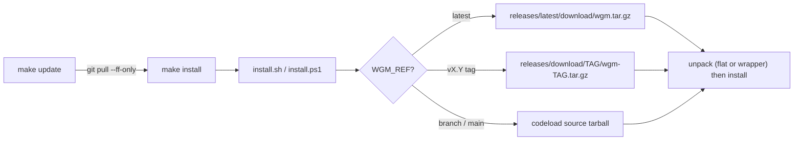

# wgm dev ergonomics — `make update` + release-asset install

**Date:** 2026-06-17 · **Status:** branch `feat/dx-update-and-release-install` → PR to `main`.

## Problem

The [`Makefile`](../../Makefile), the [release workflow](../../.github/workflows/release.yml), and the
one-line [`install.sh`](../../scripts/install.sh) already existed on `main`. Two seams remained:

- **`make update` did not update.** It was an alias for `install`, reinstalling from the current
  working tree without pulling — so "updating our variant" never fetched anything.
- **The release asset was never consumed.** The release CI published `wgm-vX.Y.Z.tar.gz`, but the
  installers always fetched the codeload *source* tarball, so the published asset was dead weight and
  there was no "install the latest release" path.

## What shipped

- **`make update`** now runs `git pull --ff-only` when invoked in a checkout (guarded so the
  no-`.git` installed copy degrades gracefully), then reinstalls.
- **Release CI** publishes a stable-named `wgm.tar.gz` alongside the versioned asset, so
  `releases/latest/download/wgm.tar.gz` always resolves.
- **Both installers** gained a source-URL resolver: `WGM_REF=latest` and `vX.Y` tags pull the
  published release tarball (with a codeload fallback); any other ref keeps the codeload source
  archive, so the default `main` one-liner is unchanged. The unpack step handles both the flat
  release layout and the codeload wrapper directory.

## Decisions

- The documented `curl … | bash` default stays `main` (bleeding edge); release-asset install is the
  opt-in `WGM_REF=latest` / tag path.
- `WGM_REF=latest` only resolves once the first `v*` release is published; until then the installer
  fails with a clear message pointing at `WGM_REF=main`.

## Validation

`make validate` (shellcheck + `bash -n`, [`check-docs.sh`](../../scripts/check-docs.sh), and the
install / loop / swarm harnesses), `actionlint` on the release workflow, `skills-ref validate wgm`,
and a PowerShell parse + run of [`test-install.ps1`](../../scripts/test-install.ps1) — all green. New
coverage: bash `T10`/`T11` and PowerShell `E` assert the resolver URLs and a flat-tarball install.
