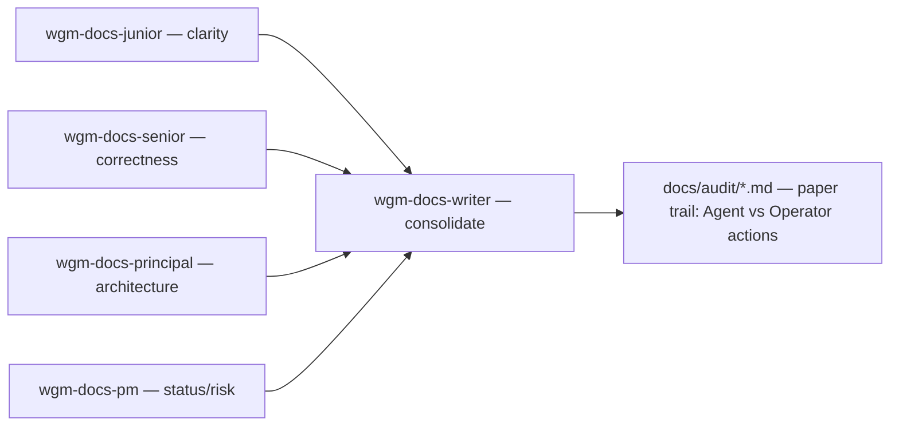

# wgm core docs-audit + operator SOP

**Date:** 2026-07-04 · **Status:** shipping via PR to `main`.

## Problem

wgm had strong **structural** docs backpressure (`scripts/check-docs.sh`: required files, balanced
fences, mermaid presence, broken links, placeholders, "Executive overview" sections) but nothing that
audited doc **content quality**, and nothing that left a durable, automatic **paper trail** of that
audit — an operator had to remember to ask for a docs review, and even then nothing recorded that it
happened. A disk-wide review of real wgm usage (WSL + Windows, ~10+ downstream projects: atomic-shell,
tropical_prototype, scouter, sofaking, byte_stomper, dukenukem3d, and others) confirmed the gap:
documentation work only ever showed up as ad hoc one-off tasks, and a real drift case was found in the
wild (`scouter` carries both a root `AGENTS.md` pointer and a `docs/AGENTS.md` canonical doc — exactly
the kind of thing a recurring audit should catch). Even wgm's own repo left no automatic paper trail:
its `.gitignore` treats `/IMPLEMENTATION_PLAN.md`, `/specs/`, `/scenarios/`, `/.wgm/` as ephemeral
dogfood scratch, so its own past dogfood runs vanished without a trace.

## What shipped

- **`references/docs-audit.md`** — the core procedure: four persona lenses (junior/senior/principal
  dev, PM), cadence tied to the existing Quick/Standard/Full tracks (Quick skips it; Standard runs it
  once at Ship/Handoff; Full adds a Plan-exit baseline pass plus opportunistic passes on doc-touching
  diffs), the technical-writer consolidation algorithm (dedupe → preserve dissent → classify
  **Agent action** vs **Operator action** strictly by kind of action, never by persona → structure the
  report using the project's own README index), artifact placement, and a GREEN/AMBER/RED severity
  taxonomy.
- **Five new subagents** in `.github/agents/`: `wgm-docs-junior`, `wgm-docs-senior`,
  `wgm-docs-principal`, `wgm-docs-pm` (read-only persona reviewers), and `wgm-docs-writer` (the
  consolidator — the only one of the five that writes a file). One role per file, matching the
  existing `wgm-spec-reviewer` / `wgm-quality-reviewer` convention.
- **`docs/operator/playbook.md`** — the operator SOP/checklist: a Day-1 setup checklist, a per-build
  checklist (with a Mermaid flow), a per-gate PASS/FAIL cheat-sheet, how to read a docs-audit paper
  trail, and escalation pointers.
- **The paper trail itself**: one timestamped file per run under `docs/audit/` (e.g.
  `docs/audit/2026-07-04T1912Z_docs-audit-core.md`) plus a `docs/audit/README.md`
  index, never gitignored by default downstream (wgm's own tool repo is the one documented
  exception, and only for its own dogfood scratch).
- **Wiring:** `SKILL.md` (Plan-exit gate item, mandatory Ship/Handoff step, Triage track note),
  `references/subagents.md` (roles table + a new "Docs-audit swarm" mermaid + dispatch section),
  `references/artifacts.md` (the new artifact's placement rule), `scripts/check-docs.sh` (a new
  check 7 — every `.github/agents/*.agent.md` file has required frontmatter + sections — plus the
  playbook wired into the required-files and executive-overview checks), and both `README.md` /
  `docs/README.md` updated so the whole capability is discoverable purely by following the existing
  README index chain.

## Decisions

- **5 separate agent files, not 2 or 0** — confirmed with the operator; matches the existing
  one-role-per-file precedent (`wgm-spec-reviewer` + `wgm-quality-reviewer` rather than one combined
  reviewer).
- **Cadence reuses the existing Quick/Standard/Full track table** rather than inventing a new
  mechanism — Quick relies on `scripts/check-docs.sh` alone; the qualitative swarm is Standard/Full
  only.
- **The paper trail is never gitignored by default downstream.** This repo's own `.gitignore`
  (`/IMPLEMENTATION_PLAN.md`, `/specs/`, `/scenarios/`, `/.wgm/`) is explicitly called out in three
  places (`references/docs-audit.md`, `references/artifacts.md`, this doc) as a repo-specific
  exception that must never be read as general guidance for a project wgm builds for someone else.
- **Built by dogfooding**, per the operator's explicit request: a local (gitignored)
  `specs/CONSTITUTION.md`, `specs/docs-audit-core.md`, two holdout scenarios, and an
  `IMPLEMENTATION_PLAN.md` drove this build through wgm's own Loop, one task per iteration.

## Validation

`make validate` (shellcheck + `bash -n` + `scripts/check-docs.sh` + install/loop/swarm harnesses),
`skills-ref validate wgm` (from the parent dir), `actionlint` (installed fresh via `go install` for
this run — no prior workflow changes to check), and `pwsh -File scripts/test-install.ps1` — all
green. New coverage: `check-docs.sh` check 7 (11/11 agent files pass), and two holdout scenarios
(`scenarios/docs-audit-core-tier1.yaml`, `scenarios/docs-audit-core-tier2-classification.yaml`).

**Demo validation (the real proof):** the five-persona swarm was actually dispatched against wgm's
own current docs, producing [`docs/audit/2026-07-04T1912Z_docs-audit-core.md`](../audit/2026-07-04T1912Z_docs-audit-core.md).
That first real run found and fixed one genuine defect (a stale "six" vs "eleven" subagent count
left self-contradictory in `README.md` by this very change), fixed one Agent action for real
(`SKILL.md`'s backpressure section now opens with a crisp definition), and preserved one genuine
Dissent (Senior vs. Principal, on whether a dated `docs/plans/` archive should be updated for
accuracy or left as an intentional snapshot) — proving the mechanism works end to end rather than
just existing on paper.
