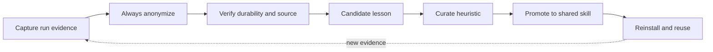

# WGM growth stage: Stage 8+ toward supervised Stage 9

**Date:** 2026-08-20  
**Status:** current maturity record  
**Operator hypothesis:** **Stage 9 at least**  
**Independent assessment:** **Stage 8.5 operational / Stage 9 candidate**  
**Current release line:** `main` at `12fff427` (PR #97)

## Executive summary

wgm has crossed the Stage 8 boundary: it is no longer only a prompt or a collection of agent
scripts. It is an orchestrator with a lifecycle state machine, persistent work state, parallel
worktrees, health checks, escalation, merge gates, telemetry, and a self-improvement flywheel.

The operator's hypothesis is **Stage 9 at least** because WGM can improve its own orchestration
control plane from field evidence. My stricter assessment is **Stage 8.5 operational / Stage 9
candidate**:

- **Stage 9 mechanisms exist:** wgm can capture lessons from real runs, swarm streams, issues, and
  external research; anonymize them; adjudicate them; promote durable heuristics; and reinstall the
  improved skill.
- **Stage 9 autonomy is not demonstrated yet:** a human or host still initiates goals, grants consent,
  chooses or approves significant changes, reviews remote merges, and resolves policy questions.
  WGM's self-improvement loop is closed enough to learn, but not yet autonomous enough to decide,
  validate, roll out, and revert its own evolution end to end.

The practical description is therefore:

> **WGM is an operational Stage 8.5 orchestrator with Stage 9 self-improvement mechanisms emerging
> under human and host supervision.**

## Reference model and terminology

The primary reference chain for this record is the
[Gas Town repository](https://github.com/gastownhall/gastown) and Steve Yegge's
[Welcome to Gas Town](https://steve-yegge.medium.com/welcome-to-gas-town-4f25ee16dd04). The
Gas Town [Eight Stages of AI Coding guide](https://docs.gt.villamarket.ai/docs/guides/eight-stages)
is a useful explicit rendering of the same progression: Stage 8 is **building your own
orchestrator**, with formal agent hierarchy, automated work distribution, persistent state, health
monitoring, recovery, escalation, and resource management. Gas Town's architecture makes that
concrete through Towns, Rigs, workers, persistent hooks, monitoring roles, and a merge queue.

[Geoff Huntley's Loom](https://github.com/ghuntley/loom) is recorded as a related experimental
agent-system reference. Loom is explicitly a research project, so it is evidence of the direction
of travel rather than an authority for a numeric maturity score.

**Stage 9 is an operational extrapolation, not a settled external standard.** The Gas Town article
itself describes Stage 8 and emphasizes that the human remains an Overseer keeping the system
running; this record does not silently turn that human-gated model into a claim of full autonomy. In
this document,
Stage 9 means that the orchestrator begins improving the orchestration system itself from evidence:
it selects lessons, tests proposed changes against held-out behavior, safely promotes improvements,
and can recover from a bad evolution without requiring the human to hand-author every step.

## WGM evidence at the Stage 8 boundary

| Stage 8 capability | WGM evidence |
|---|---|
| Formal lifecycle and supervision | `Triage -> Grill -> Plan -> Preflight -> Loop -> Ship/Handoff` with phase gates in [`SKILL.md`](../../SKILL.md) and [`docs/agent/lifecycle.md`](../agent/lifecycle.md). |
| Work distribution | One-task Ralph iterations, task-scoped plans, role-specialized agents, and parallel worktree streams in [`scripts/swarm.sh`](../../scripts/swarm.sh). |
| Persistent state | `IMPLEMENTATION_PLAN.md`, specs, holdout scenarios, `.wgm/memories.md`, metrics ledgers, audit reports, and Git history. |
| Health monitoring and recovery | Capability probes, no-progress stalls, retries, circuit breakers, STOP sentinels, wonder/reflect recovery, and frugal-to-main escalation in [`scripts/loop.sh`](../../scripts/loop.sh). |
| Merge and quality coordination | Manifest-scoped commit ownership, zero-commit lane failure, independent spec/quality review, docs-audit personas, and deterministic repository gates. |
| Resource management | Cost hooks, cost ceilings, runtime/idle controls, telemetry clocks, concurrency guidance, and container/devcontainer paths. |
| Cross-project distribution | Portable installation across Copilot, Claude, `.agents`, Linux, macOS, Windows, and WSL, plus the `teach-me` and `quiz-me` companions. |

The latest hardening pass closed the ten-issue wave #87-#96 through PR #97. Those changes are the
most direct evidence that the system is operating as an orchestrator rather than merely describing
one: the orchestrator now verifies its own agent artifacts, lane artifacts, review evidence, and
commit boundaries.

## WGM evidence at the emerging Stage 9 boundary

### 1. The system learns from more than one run

The [self-improvement flywheel](../../references/self-improvement.md) has four inbound sources:

1. local `.wgm/memories.md` and satisfaction trajectories;
2. memories consolidated from parallel swarm streams;
3. the host project's GitHub Issues as backlog and recurring-friction context;
4. cross-pollinated external research.

The funnel is:

### 2. The system can improve its own control plane

The latest growth wave did not add a product feature for one host project. It changed the
orchestrator's control plane:

- #87 added intermediary-rule checks to Analyze and docs audit.
- #88 added corpus-wide fact-sweep and evidence-regeneration rules.
- #89 added measured rewrite budgets.
- #90 added complete-table backpressure.
- #91 added executable-journey requirements.
- #92 added swarm artifact verification.
- #93 added docs-finding adjudication and rejected-finding evidence.
- #94 added capability and no-progress guards.
- #95 added exclusive commit ownership.
- #96 separated independent adversarial review from self-critique.

That is self-improvement in the meaningful sense: field observations became changes to the shared
orchestration protocol, its gates, its tests, and its operator documentation.

### 3. The system preserves learning provenance

The growth record now has several evidence surfaces rather than one optimistic status line:

- [`references/heuristics.md`](../../references/heuristics.md) records each promoted rule and its
  provenance;
- [`docs/audit/`](../audit/README.md) records independent review, dissent, and rejected findings;
- GitHub Issues preserve the raw learning reports;
- PR history preserves the implementation and merge evidence;
- `make validate` and CI provide deterministic backpressure.

## Constructive self-critique of the Stage 9 claim

The strongest reasons **not** to certify WGM as fully Stage 9 today are:

1. **The role swarm is partly a protocol contract, not a continuously running supervisor.** WGM
   ships role briefs and dispatch rules, but the core `loop.sh` runner still invokes one configured
   agent per iteration; host-level reviewer identity and dispatch are not owned by the runner.
2. **Parallel work is available, not self-scheduled.** `swarm.sh` provides isolated worktrees, but
   an operator still partitions tasks, supplies the agent command, resolves integration policy, and
   initiates the merge path.
3. **Self-improvement is evidence-producing, not self-authoring.** The Hive Growth Loop captures,
   anonymizes, and routes lessons, but promotion still requires source verification, review, a
   commit, a PR, and a merge. WGM does not yet autonomously choose its next experiment, run a
   multi-run comparison, or quarantine a bad protocol change.
4. **There is no always-on town-level control plane.** WGM is portable and cross-project aware, but
   it does not maintain Gas Town-style persistent identities, patrol daemons, a cross-repository queue,
   or autonomous merge/refinery supervision.
5. **The latest audit is AMBER.** The ten-issue hardening slice is verified, while pre-existing
   documentation and host-integration contracts remain to be aligned.

The strongest reasons **not** to rate WGM as merely Stage 7 are its formal lifecycle, persistent
artifacts, deterministic gates, parallel worktree orchestration, health/recovery controls, evidence
audits, and the fact that its own field lessons have already changed the orchestrator's control
plane. That is why **Stage 8.5 / Stage 9 candidate** is the honest middle call.

## What prevents a full autonomous Stage 9 claim

WGM is intentionally not claiming a fully autonomous dark factory. The remaining gates are
architectural, not cosmetic:

| Missing Stage 9 property | Current WGM boundary |
|---|---|
| Autonomous goal selection | A human or host still starts `/wgm` and supplies the goal or approves backlog selection. |
| Autonomous policy consent | Hive reporting requires a project consent decision in `.github/wgm-hive.yml`. |
| Autonomous reviewer dispatch | Reviewer roles exist, but host-level dispatch and reviewer identity are not fully owned by `loop.sh`. |
| Autonomous experiment selection | Harvest produces candidates; it does not independently choose a sequence of protocol experiments to run. |
| Autonomous promotion | A heuristic still needs source verification, review, commit, PR, and merge before becoming shared behavior. |
| Autonomous rollback | Deterministic gates catch regressions, but WGM does not yet autonomously revert a bad self-modification across all host surfaces. |
| Autonomous multi-repo operation | The skill is portable and cross-project aware, but a persistent town-level supervisor is not part of the core runner. |

The latest focused audit is **AMBER**, not because the ten-issue hardening failed, but because
pre-existing documentation and host-integration contracts still need alignment. See the
[baseline report](../audit/2026-08-20T0718Z_capability-hardening-baseline.md) and
[focused final report](../audit/2026-08-20T0744Z_capability-hardening-final.md).

## The next transition: supervised Stage 9 to fuller Stage 9

The next growth loop should make the self-improvement pipeline more autonomous without removing its
evidence gates:

1. **Candidate selection:** rank recurring lessons by cross-project frequency, severity, and
   confidence instead of relying only on the newest memory entry.
2. **Held-out replay:** automatically replay the candidate protocol change against trigger fixtures,
   output-quality evals, and regression scenarios before proposing promotion.
3. **Safe proposal generation:** create a bounded branch/PR with the evidence bundle, rejected
   alternatives, and rollback path.
4. **Promotion policy:** let a configured maintainer or host approve low-risk changes while keeping
   high-impact policy, consent, and security changes human-gated.
5. **Rollback and quarantine:** automatically quarantine a change that lowers held-out performance or
   breaks deterministic gates, without rewriting shared history.
6. **Town-level supervision:** add persistent cross-repository health, identity, queue, and recovery
   state only if the portable skill remains understandable and safe to install.

The Stage 9 completion test is not “more agents” or “more PRs.” It is:

> WGM can observe a recurring failure, generate a bounded improvement, prove that improvement against
> held-out behavior, safely propose and promote it under policy, and recover from a bad promotion
> without a human manually reconstructing the loop.

## Rating rubric for future updates

| Rating | Meaning | WGM status |
|---|---|---|
| **Stage 8** | A durable orchestrator coordinates agents, state, health, work distribution, and integration. | **Met.** |
| **Stage 8.5** | The orchestrator improves its own control plane from field evidence, but humans/hosts still select, approve, and promote the changes. | **Current independent assessment.** |
| **Stage 9 candidate** | The self-improvement pipeline can repeatedly generate and validate bounded changes with little manual reconstruction. | **Mechanisms exist; repeatable autonomy is not yet proven.** |
| **Full Stage 9** | The system autonomously selects, evaluates, promotes, rolls back, and supervises its evolution across projects under explicit policy. | **Not met.** |

## Growth record

The surrounding provenance is preserved in:

- [`docs/plans/2026-06-16_PLAN.md`](2026-06-16_PLAN.md) - the original competitive roadmap;
- [`docs/plans/2026-06-16_GROWTH_LOOP.md`](2026-06-16_GROWTH_LOOP.md) - the first growth flywheel;
- [`docs/plans/2026-07-06_HIVE_GROWTH_LOOP.md`](2026-07-06_HIVE_GROWTH_LOOP.md) - consented,
  anonymized continuous reporting;
- [`docs/audit/README.md`](../audit/README.md) - the review and evidence paper trail;
- [`README.md`](../../README.md) - the user-facing capability map.
