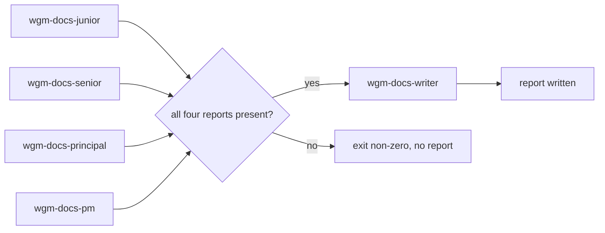

# wgm CLI reference: audit.sh

`scripts/audit.sh` runs the **docs audit** — four independent persona reviews plus one consolidating
technical writer — through **any** opaque headless agent command. It is the portable fallback for
hosts that have no subagent mechanism of their own.

**Note:** This is an *orchestrator*, not a reviewer. It invokes your agent five times with a fresh
prompt each time, enforces the ordering and the read-only rule, and files the resulting paper trail.
The judgement stays with the agent; the discipline stays here. The audit's rules live in
[docs-audit](../../references/docs-audit.md); the role briefs live in `.github/agents/`.

## Syntax

```bash
WGM_SKILL_ROOT="${WGM_SKILL_ROOT:-$HOME/.agents/skills/wgm}"
"$WGM_SKILL_ROOT/scripts/audit.sh" --scope "TEXT" [FLAGS] -- AGENT_ARGV...
"$WGM_SKILL_ROOT/scripts/audit.sh" --scope "TEXT" [FLAGS] --agent "CMD"
```

Run it from the target project's root. A checkout-local `./scripts/audit.sh` also works when you are
developing wgm itself.

## Before you begin

- Configure an agent exactly as you do for [loop.sh](cli-loop.md): `$WGM_AGENT`, `--agent "CMD"`, or
  argv after `--`. Set `WGM_PROMPT_STDIN=1` if your agent reads its prompt from stdin.
- Decide the scope. All four personas receive the *same* bounded scope; widening it per persona is
  what makes an audit unreproducible.
- The agent needs read access to the docs under audit. It does **not** need write access to your
  tree: the dispatcher writes every artifact.

## Flags

| Flag | Default | Description |
|---|---|---|
| `--scope "TEXT"` | The project's own doc set | The identical bounded scope handed to all four personas and the writer. `--request` is an alias. |
| `--agent "CMD"` | `$WGM_AGENT` | Agent command, shell-evaluated. The prompt is passed to it as `"$1"`, never spliced into the command string. |
| `--out DIR` | auto (see below) | Where the consolidated report lands. |
| `--slug NAME` | `docs-audit` | Report slug. Must match `^[a-z0-9][a-z0-9._-]*$` — a filename, not a path. |
| `--timeout-seconds N` | `0` | Bounded per-role wall clock, when GNU `timeout`/`gtimeout` is available. `0` disables it. |
| `--retries N` | `0` | Retry a failed role up to N times. |
| `--retry-delay N` | `5` | Seconds between retries. |
| `--keep` | off | Keep the run's working directory, which holds the four persona reports. |
| `--dry-run` | off | Print the roles, order, commands, and output paths. Invoke nothing, create nothing. |
| `-h`, `--help` | — | Show usage. |

Everything after `--` is the agent argv, executed directly and never through a shell.

## Order of operations



The four persona passes are independent: identical scope, no shared state, and none of them is told
where another's report lives. The writer runs **last**, and only when all four reports exist and are
non-empty.

## Report placement

The default follows the artifact rule in [artifacts](artifacts.md), so wgm never writes into docs a
project already maintains:

| Project shape | Output directory | Meaning |
|---|---|---|
| Greenfield (no `AGENTS.md`, `IMPLEMENTATION_PLAN.md`, or `specs/`) | `docs/audit/` | The **committed paper trail** — evidence of work done, never gitignored by default. |
| Existing project (any of those present) | `.wgm/docs/audit/` | wgm's own local path, so an existing `docs/` tree stays the project's. |

Either way the file is `<UTC-timestamp>_<SLUG>.md`, and an existing file is never overwritten. Pass
`--out DIR` to decide for yourself. Add the newest-first index row in the directory's `README.md`
afterwards — the dispatcher prints the reminder and leaves the wording to the writer.

## What it refuses to do

| Refusal | Why |
|---|---|
| Run the writer when any persona failed, timed out, or returned nothing | Consolidating three of four reports produces a report that *looks* complete while a whole lens is missing. |
| Write a report when the writer fails or returns nothing | A failed audit must not leave a success-shaped artifact in the paper trail. |
| Let a role modify the working tree | Roles report; the dispatcher writes. The tree is snapshotted around every role and a mutation fails the run. |
| Read or name the holdout scenarios | `scenarios/` belongs to `wgm-validator`. An audit that read it would contaminate the holdout. |
| Accept `--slug ../../elsewhere` | The slug is a filename. Traversal is rejected before anything runs. |
| Share a scratch directory between runs | Each run gets its own `mktemp -d` working directory under `.wgm/`, so two concurrent audits cannot race. |

## The report contract

Each role is invoked with `$WGM_AUDIT_ROLE`, `$WGM_AUDIT_SCOPE`, and `$WGM_AUDIT_REPORT_FILE`
exported. A role satisfies the contract either way:

- write the report to `$WGM_AUDIT_REPORT_FILE`, or
- print it to **stdout**, which the dispatcher captures.

Producing neither fails that role. This is what makes the script host-agnostic: an agent that cannot
write files is still a usable reviewer.

## Exit codes

| Code | Meaning |
|---|---|
| `0` | Four persona passes were consolidated and the report was written. |
| `1` | A role failed, timed out, edited the tree, or produced no report. No report was written. |
| `2` | Misconfiguration: unknown flag, missing flag value, invalid slug, or no agent configured. |

## Examples

```bash
# Preview the plan — nothing is invoked, nothing is created.
./scripts/audit.sh --scope "docs/ and README.md" --dry-run -- claude -p

# A Ship/Handoff pass, with a bounded per-role clock and one retry.
./scripts/audit.sh --scope "docs/operator/ and docs/get-started/" --slug ship-handoff \
  --timeout-seconds 600 --retries 1 -- claude -p

# Keep the four persona reports for inspection alongside the consolidated one.
WGM_AGENT='copilot -p --allow-all-tools' ./scripts/audit.sh --scope "docs/" --keep
```

## Host boundary (read this before claiming the audit ran)

This script does not make a host capable of subagents. It runs the **same agent** five times with
five different briefs, which buys independence of context and lens — not independence of model or
tooling. On a host that *does* dispatch role-specialized subagents, prefer that path. If neither is
available, record the limitation instead of recording a passing audit; see
[docs-audit](../../references/docs-audit.md) and
[harness portability](../../references/harness-portability.md).

## What to do next

- [docs-audit discipline](../../references/docs-audit.md) — cadence, severity taxonomy, and what the report must contain.
- [Subagents](../../references/subagents.md) — the five roles, dissent preservation, and the ownership boundary.
- [Gates](gates.md) — where `test-audit.sh` sits in the backpressure suite.
- [loop.sh reference](cli-loop.md) — the same agent-configuration conventions, for the build loop.
