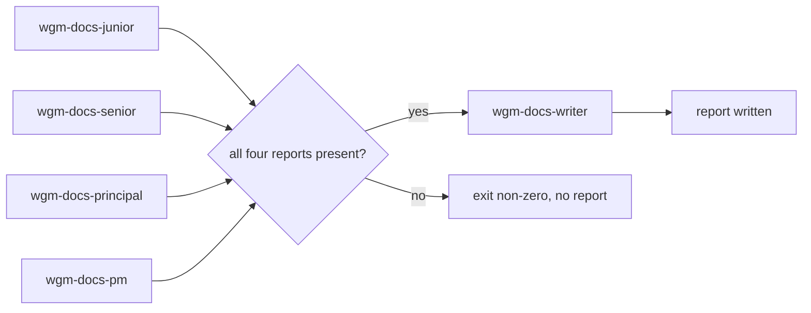

# wgm CLI reference: audit.sh

`scripts/audit.sh` runs the **docs audit** — four independent persona reviews plus one consolidating
technical writer — through **any** opaque headless agent command. It is the portable fallback for
hosts that have no subagent mechanism of their own.

**Note:** This is an *orchestrator*, not a reviewer. It invokes your agent five times with a fresh
prompt each time, enforces the ordering and the read-only rule, and files the resulting paper trail.
The judgement stays with the agent; the discipline stays here. The audit's rules live in
[docs-audit](../../references/docs-audit.md); the role briefs live in `.github/agents/`.

## Syntax

```bash
WGM_SKILL_ROOT="${WGM_SKILL_ROOT:-$HOME/.agents/skills/wgm}"
"$WGM_SKILL_ROOT/scripts/audit.sh" --scope "TEXT" [FLAGS] -- AGENT_ARGV...
"$WGM_SKILL_ROOT/scripts/audit.sh" --scope "TEXT" [FLAGS] --agent "CMD"
```

Run it from the target project's root. A checkout-local `./scripts/audit.sh` also works when you are
developing wgm itself.

## Before you begin

- Configure an agent exactly as you do for [loop.sh](cli-loop.md): `$WGM_AGENT`, `--agent "CMD"`, or
  argv after `--`. Set `WGM_PROMPT_STDIN=1` if your agent reads its prompt from stdin.
- Decide the scope. All four personas receive the *same* bounded scope; widening it per persona is
  what makes an audit unreproducible.
- The agent needs read access to the docs under audit. It does **not** need write access to your
  tree: the dispatcher writes every artifact.

## Flags

| Flag | Default | Description |
|---|---|---|
| `--scope "TEXT"` | The project's own doc set | The identical bounded scope handed to all four personas and the writer. `--request` is an alias. |
| `--agent "CMD"` | `$WGM_AGENT` | Agent command, shell-evaluated. The prompt is passed to it as `"$1"`, never spliced into the command string. |
| `--out DIR` | auto (see below) | Where the consolidated report lands. |
| `--slug NAME` | `docs-audit` | Report slug. Must match `^[a-z0-9][a-z0-9._-]*$` — a filename, not a path. |
| `--timeout-seconds N` | `0` | Bounded per-role wall clock, when GNU `timeout`/`gtimeout` is available. `0` disables it. |
| `--retries N` | `0` | Retry a failed role up to N times. |
| `--retry-delay N` | `5` | Seconds between retries. |
| `--keep` | off | Keep the run's working directory, which holds the four persona reports. |
| `--allow-unguarded` | off | Run against a target that is **not** a git working tree. Without one there is no read-only guard, so the default is a refusal, not a silent downgrade. |
| `--dry-run` | off | Print the roles, order, commands, and output paths. Invoke nothing, create nothing. |
| `-h`, `--help` | — | Show usage. |

Everything after `--` is the agent argv, executed directly and never through a shell.

## Order of operations



The four persona passes are independent: identical scope, no shared state, and none of them is told
where another's report lives. The writer runs **last**, and only when all four reports exist and are
non-empty.

## Report placement

The default follows the artifact rule in [artifacts](artifacts.md), so wgm never writes into docs a
project already maintains:

| Project shape | Output directory | Meaning |
|---|---|---|
| Greenfield (no `AGENTS.md`, `IMPLEMENTATION_PLAN.md`, or `specs/`) | `docs/audit/` | The **committed paper trail** — evidence of work done, never gitignored by default. |
| Existing project (any of those present) | `.wgm/docs/audit/` | wgm's own local path, so an existing `docs/` tree stays the project's. |

Either way the file is `<UTC-timestamp>_<SLUG>.md`, and an existing file is never overwritten. Pass
`--out DIR` to decide for yourself. Add the newest-first index row in the directory's `README.md`
afterwards — the dispatcher prints the reminder and leaves the wording to the writer.

## What it refuses to do

| Refusal | Why |
|---|---|
| Run the writer when any persona failed, timed out, or returned nothing | Consolidating three of four reports produces a report that *looks* complete while a whole lens is missing. |
| Write a report when the writer fails or returns nothing | A failed audit must not leave a success-shaped artifact in the paper trail. |
| Accept an exit-0 banner as a report | `Ready.` or `I could not read that path.` passes any "did it succeed and is the file non-empty?" check. Content is checked against the contract the prompt demanded. |
| Let a role change the repository | Roles report; the dispatcher writes. Every attempt is compared against one run baseline, and a change is **terminal**: no retry, no re-baseline, and it is left in place for you to inspect. |
| Audit a non-git tree by default | With no git tree there is no read-only guard at all. Pass `--allow-unguarded` to accept that explicitly; the run then says out loud that the guard is off. |
| Run two audits in one tree at once | They would interleave their read-only guards and could file two reports for one moment. An atomic `.wgm/audit.lock` (created with `mkdir`) refuses the second before any role runs. The lock hangs off the **worktree root**, so two runs launched from different subdirectories still serialize on the same tree. |
| Read or name the holdout scenarios | `scenarios/` belongs to `wgm-validator`. An audit that read it would contaminate the holdout. |
| Accept `--slug ../../elsewhere` | The slug is a filename. Traversal is rejected before anything runs. |
| Share a scratch directory between runs | Each run gets its own `mktemp -d` working directory under `.wgm/`, so two concurrent audits cannot race. |

## What the read-only guard actually watches

"Is the working tree dirty?" is the wrong question, because the three cheapest ways for an agent to
change a repository all leave `git status` spotless. The baseline therefore covers:

| Watched | Catches |
|---|---|
| `HEAD` and the current branch | A role that **commits** its edit, amends, resets, or switches branch — the tree goes clean and the change moves into history. |
| The stash ref and its depth | A role that **stashes** its edit — the tree goes clean and the work hides in `refs/stash`. |
| Tracked, untracked, **and ignored** paths outside `.wgm/` | A role that creates or deletes a **gitignored** path, which never appears in a default `git status` at all. |
| A **content fingerprint of every ignored regular file** outside `.wgm/` | A role that *overwrites* an ignored file that already existed — `.env`, `.envrc`, a cached build artifact. The path list is identical before and after, so only the content betrays it. |
| A **content fingerprint of every untracked, non-ignored regular file** outside `.wgm/` | The same hole one step to the left: a not-yet-added scratch file, draft, or generated output that git reports as `??` before the overwrite and `??` after. |
| A content hash of the staged and unstaged diffs | An in-place edit to a file that was already modified, where the status line does not change. |

Symlinks are recorded by their **target and never followed**, and FIFOs, sockets, and device nodes
are recorded by name only — an ignored symlink pointing at `/dev/zero` would otherwise hang the
snapshot on every attempt.

Every git command is anchored at the worktree root, so `.wgm/` means the *root* scratch directory no
matter which subdirectory the audit was launched from. That exclusion is deliberate: the lock and the
run's working directory live there.

**It reports the change; it does not name a culprit.** A concurrent editor, formatter, watcher, or
build running in the same checkout produces a delta identical to a role's write, so the message is
`repository state changed during ROLE; origin unknown (role or concurrent process)`, followed by
the **exact delta** as a bounded `diff -u` of the two snapshots. Re-run with nothing else writing to
the tree to tell the two apart. The run stops either way — an audit whose repository moved underneath
it is not trustworthy regardless of who moved it — and nothing is reverted, so the change stays
available for inspection.

**Limitations, stated rather than papered over.**

- A change made and then reverted *exactly* within one role's turn is invisible: this compares two
  states, and closing it needs continuous filesystem observation, which this script does not do.
- The content scan walks **and hashes** both the ignored and the untracked-not-ignored sets on each
  role attempt. On a repository with a large `node_modules/`, `.venv/`, build, or not-yet-added tree
  this is the guard's dominant cost — five roles means five passes. There is deliberately no size cap
  or skip threshold: a cap is exactly the hole an agent writing into such a directory would fall
  through.
- Files git *does* track by content are covered by `HEAD` and the diff hashes, so together with the
  two fingerprint passes a regular file outside `.wgm/` cannot be rewritten in place without moving
  the snapshot. The remaining hole is timing, not coverage: see the exact-revert case above.

## The report contract

Each role is invoked with `$WGM_AUDIT_ROLE`, `$WGM_AUDIT_SCOPE`, and `$WGM_AUDIT_REPORT_FILE`
exported. **Delivery** is the host's choice:

- write the report to `$WGM_AUDIT_REPORT_FILE`, or
- print it to **stdout**, which the dispatcher captures.

Producing neither fails that role. This is what makes the script host-agnostic: an agent that cannot
write files is still a usable reviewer.

**Content is not the host's choice.** Delivery being flexible is exactly why the content is checked —
otherwise a status banner delivered perfectly becomes the paper trail. The minimal contract, checked
on every artifact and re-checked at the writer gate:

| Artifact | Must contain |
|---|---|
| Persona report | A `### wgm-docs-ROLE` heading (the role id, e.g. `### wgm-docs-junior`), **and** the finding-table header row `\| Doc \| Observation \| Severity \| Recommended action \|`. |
| Writer report | A consolidated-report heading (`# Docs Audit Report …` or `## Consolidated report …`), **and** all four of `Dissent`, `Rejected findings`, `Agent action`, `Operator action`. |

The lens tail of a persona heading is free text; the role name and the four columns are not. A report
that misses either is rejected with the exact reason, and the role is retried if `--retries` allows.

## What is retried, and what is not

`--retries` exists for one failure class: a **transient** one. Everything else is a decision, and a
decision is not improved by repeating it.

| Failure | Retried? | Why |
|---|---|---|
| Non-zero exit, timeout, empty output, broken report contract | Yes, up to `--retries` | Transient: a flaky call or a wandering agent may get it right on the next fresh prompt. |
| The repository changed during a role (tree, HEAD, stash, or an ignored path) | **Never** | The baseline is never re-read, so a retry would be measured against the changed repository and pass. The run aborts at once and the change stays visible. |
| The lock is already held | **Never** | Whether to wait for another audit is the operator's call, not the dispatcher's. |

A `--timeout-seconds` bound needs GNU `timeout` or `gtimeout`. Without one the run says so and falls
back to a cooperative timeout it cannot enforce — it never implies a bound it does not have.

## Exit codes

| Code | Meaning |
|---|---|
| `0` | Four persona passes were consolidated and the report was written. |
| `1` | A role failed, timed out, broke its report contract, or the repository changed mid-run. No report was written. |
| `2` | Refused before any role ran: unknown flag, missing flag value, invalid slug, no agent, a non-git target without `--allow-unguarded`, or another audit holding this tree's lock. |

## Examples

```bash
# Preview the plan — nothing is invoked, nothing is created.
./scripts/audit.sh --scope "docs/ and README.md" --dry-run -- claude -p

# A Ship/Handoff pass, with a bounded per-role clock and one retry.
./scripts/audit.sh --scope "docs/operator/ and docs/get-started/" --slug ship-handoff \
  --timeout-seconds 600 --retries 1 -- claude -p

# Keep the four persona reports for inspection alongside the consolidated one.
WGM_AGENT='copilot -p --allow-all-tools' ./scripts/audit.sh --scope "docs/" --keep
```

## Host boundary (read this before claiming the audit ran)

This script does not make a host capable of subagents. It runs the **same agent** five times with
five different briefs, which buys independence of context and lens — not independence of model or
tooling. On a host that *does* dispatch role-specialized subagents, prefer that path. If neither is
available, record the limitation instead of recording a passing audit; see
[docs-audit](../../references/docs-audit.md) and
[harness portability](../../references/harness-portability.md).

## What to do next

- [docs-audit discipline](../../references/docs-audit.md) — cadence, severity taxonomy, and what the report must contain.
- [Subagents](../../references/subagents.md) — the five roles, dissent preservation, and the ownership boundary.
- [Gates](gates.md) — where `test-audit.sh` sits in the backpressure suite.
- [loop.sh reference](cli-loop.md) — the same agent-configuration conventions, for the build loop.
