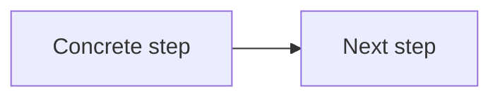
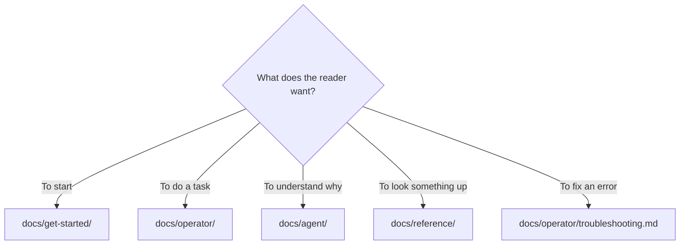

# Documentation style guide

How to write docs in this repository so pages stay consistent and scannable. Parts of this are
enforced by `scripts/check-docs.sh`; the rest is convention.

## Executive overview

- **For:** anyone adding or editing a page under `docs/`.
- **The model:** every page is exactly one of four types — journey, task, concept, or reference.
  Mixing types in one page is the most common defect here.
- **Enforced automatically:** required pages exist, operator pages open with an executive overview,
  links resolve, fences balance, no placeholders, no mojibake, and explicitly marked complete tables
  have no blank cells.
- **Next:** [Contributing](../CONTRIBUTING.md) for the wider contribution flow.

## Page types

Decide the type before writing. If a page needs two, split it.

| Type | Answers | Shape | Lives in |
|---|---|---|---|
| **Journey** | "Where do I start?" | Numbered steps across pages, each linking to the next | `docs/get-started/` |
| **Task** | "How do I do X?" | Before you begin → numbered steps → What to do next | `docs/operator/` |
| **Concept** | "Why does it work this way?" | Prose with diagrams; no step numbering | `docs/agent/` |
| **Reference** | "What exactly does this accept?" | Tables. Complete, alphabetical or grouped, no narrative | `docs/reference/` |

**Note:** Reference pages are for lookup, not reading. Prefer a table to a paragraph every time, and
never make a reader parse prose to find a default value.

## Required structure

### Every operator page starts with an executive overview

`check-docs.sh` enforces this. The block orients a reader in five seconds:

```markdown
## Executive overview

- **For:** who this page is written for.
- **You'll get:** the concrete outcome.
- **Fastest path:** the one command or link that solves the common case.
- **Watch out:** the single most common mistake.
- **Next:** where to go after this page.
```

Use `**Mental model:**` in place of `Fastest path` when the page is conceptual.

### Task pages use the procedure pattern

```markdown
## Before you begin

- A prerequisite, stated as a condition the reader can check.

To do the thing:

1. One action per step, imperative mood.
2. The next action.

**Note:** Anything that qualifies a step goes after it, not inside it.

## What to do next
```

### Every page ends with What to do next

A reader who finishes a page should never have to guess. Link two to five destinations, ideally as a
goal-to-page table.

## Admonitions

Three only. Use the bold-prefix form so they render everywhere.

| Form | Use for |
|---|---|
| `**Note:**` | Information that prevents a wrong assumption. |
| `**Tip:**` | A shortcut or better path that is genuinely optional. |
| `**Caution:**` | Something that causes data loss, a security problem, or a hard-to-undo mistake. |

**Caution:** Do not use `Caution` for emphasis. If everything is a caution, nothing is — and the one
that mattered gets skimmed.

## Voice and mechanics

| Rule | Do | Do not |
|---|---|---|
| Address the reader | "Run the installer." | "The user should run the installer." |
| Present tense | "The gate fails." | "The gate will fail." |
| Active voice | "wgm writes the plan." | "The plan is written." |
| One action per step | "1. Install. 2. Restart." | "1. Install and then restart and verify." |
| Name the outcome | "…so the client re-scans skills." | "…for good measure." |
| Be specific about defaults | "`--threshold` defaults to `95`." | "`--threshold` has a sensible default." |

**Claims need evidence.** Do not write that something is fast, simple, or reliable. Write what it
does and let the reader judge. If a page states a behavior, that behavior must be checkable in the
code or by running a command. If a fact changes, sweep the old and new values across the full corpus,
including copy-paste commands and historical pages.

### Complete reference tables

When every cell in a reference table is required, put this marker immediately before the table:

```markdown
<!-- wgm: complete-table -->
| Option | Required | Default | Constraint |
|---|---|---|---|
| `--threshold` | no | `95` | `0-100` |
```

The docs gate rejects blank cells and placeholder dashes in the marked table. Derive constraints from
the parser or validator, not only from a nearby constant or description string.

## Formatting rules

- **No angle-bracket placeholders in `docs/`.** `check-docs.sh` treats a lowercase word wrapped in
  angle brackets as an unfilled placeholder and fails the page. Use uppercase words instead: `PATH`,
  `REF`, `CMD`, `N`.
- **No unfinished-work markers in `docs/`.** The gate rejects the two conventional all-caps markers
  for incomplete work. Track unfinished work in an issue, not in a published page.
- **Balance every fence.** Each opening triple backtick needs a closing one. Enforced.
- **Relative links resolve from the file containing them.** From `docs/reference/`, the repository
  root is two directory levels up. Enforced.
- **Write UTF-8.** A doubled encoding — a stray capital A-circumflex or A-tilde appearing directly
  before a punctuation character that was already non-ASCII — fails the gate. It usually appears when
  several agents' output is merged.
- **Label the language on every fenced block** (`bash`, `yaml`, `markdown`, `mermaid`).

## Diagrams

Use Mermaid for flow, not decoration. A diagram should answer a question the prose cannot answer
compactly — usually "in what order?" or "what depends on what?".



Keep node labels short. If a diagram needs a legend, it is doing too much.

## Where a page belongs



`references/` at the repository root is different: it holds the terse, load-every-iteration rules the
**agent** reads. Write those for the agent — dense, imperative, no onboarding. Docs link to them
rather than restating them.

## Adding a page

To add a documentation page:

1. Choose its type and directory from the table above.
2. Write it, following the required structure for that type.
3. If it is an operator page, add the executive overview block.
4. Add it to the index of its section README, and to `docs/README.md` if it is a major entry point.
5. If it is a `references/*.md` file, add its name to the repository-layout line in the root
   `README.md` — `check-docs.sh` enforces that one-to-one index.
6. Run the gate:

   ```bash
   bash scripts/check-docs.sh
   ```

7. Run the harness that proves the gate still fails closed:

   ```bash
   bash scripts/test-check-docs.sh
   ```

8. If this is a rewrite fleet, measure line counts before and after and give each lane a floor and
   ceiling. Keep verification points, warnings, security statements, and runnable commands even when
   trimming repeated structure.

9. Execute the primary getting-started path in a clean environment. A prerequisite written as
   "provide" or "ensure" is incomplete until a command or exact link satisfies it.

## What to do next

- [Contributing](../CONTRIBUTING.md) — prerequisites and the contribution flow.
- [Gates reference](reference/gates.md) — every check, and what each proves.
- [Documentation index](README.md) — the full map.
