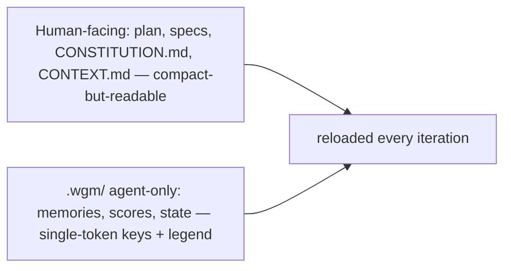

# Artifacts — formats & placement

wgm uses several on-disk artifacts as durable state. They survive context resets and let any agent
continue the work. Fill them from the templates in `assets/`.

## Placement & safety rules
- **Greenfield/empty repo:** write artifacts at the project root (`IMPLEMENTATION_PLAN.md`,
  `specs/`, `scenarios/`, `AGENTS.md`).
- **Existing project** that already has any of `AGENTS.md`, `IMPLEMENTATION_PLAN.md`, or `specs/`:
  write wgm's artifacts under **`.wgm/`** instead — `.wgm/IMPLEMENTATION_PLAN.md`, `.wgm/specs/`,
  `.wgm/scenarios/`, `.wgm/AGENTS.md` — to avoid clobbering the project's files.
- **Never overwrite an existing `AGENTS.md`.** Touch root `AGENTS.md` only with explicit approval.
- Decide root vs `.wgm/` **once, in Triage**, and stay consistent for the whole run.

## `specs/CONSTITUTION.md` — project-wide principles
The governing layer: principles every spec, plan, and task must honor — the code-quality bar, the
testing standard, security/privacy rules, UX consistency, performance budgets, and hard
non-negotiables. Source from `assets/constitution.template.md`.

- **Written once**, early (Triage or first Plan), and revised rarely and deliberately.
- **Loaded first:** if it exists, read it before grilling/planning — it prunes the decision tree.
- **Checked at the Plan-exit gate:** every spec and task conforms, or records an intentional
  deviation (date · principle · why · scope) in the constitution's deviations table.
- **Placement** follows the same root vs `.wgm/` rule as the other artifacts —
  `specs/CONSTITUTION.md` or `.wgm/specs/CONSTITUTION.md`.

## `specs/CONTEXT.md` — domain glossary (ubiquitous language)
The project's vocabulary: each domain term, its precise meaning, and the **one canonical name** to
use everywhere (code, specs, UI, commits). It keeps naming consistent across fresh-context iterations
and cuts tokens — a term defined once here need not be re-derived each loop. Source from
`assets/context.template.md`.

- **Started in Grill, refined in Plan.** Add a term the moment it is ambiguous, overloaded, or easy
  to confuse with a near-synonym. Skip the file for trivial builds with no special vocabulary.
- **Consulted in the loop's Analyze step** (token-budgeted, like memories) so each iteration uses the
  canonical term instead of inventing a synonym.
- **Vocabulary only** — not the constitution (principles) and not a spec (behavior); keep those out
  of it. Budget it lean (about 1500 tokens) and prune dead terms.
- **Placement** follows the same root vs `.wgm/` rule as the other artifacts —
  `specs/CONTEXT.md` or `.wgm/specs/CONTEXT.md`.

## `specs/*.md` — what to build and why
One spec per coherent slice of work. Source from `assets/spec.template.md`. Must capture:
- **JTBD** — the job, and who it's for.
- **User-visible success criteria** — observable "done."
- **Magic moment** — the one thing that should impress; the demo path; the smallest end-to-end
  slice that proves value.
- **Acceptance criteria → backpressure** — each criterion paired with the command/check that
  verifies it. Write the criterion in **EARS** (Easy Approach to Requirements Syntax) so it is
  unambiguous and testable — one of five shapes:
  - *Ubiquitous:* "The [system] shall [response]."
  - *Event-driven:* "When [trigger], the [system] shall [response]."
  - *State-driven:* "While [state], the [system] shall [response]."
  - *Optional:* "Where [feature], the [system] shall [response]."
  - *Unwanted:* "If [undesired condition], then the [system] shall [response]."
- **Assumptions & out-of-scope** — recommended assumptions made during grilling, and explicit
  non-goals for this pass.

Let the format flex per project, but keep these sections present.

## `scenarios/*.yaml` — the holdout acceptance set
User-journey acceptance specs used as a **holdout set**: the Implement step never reads them; only
Validate/Review (the judge) does. This prevents teaching-to-the-test. Source from
`assets/scenario.template.yaml`. Authored during Grill/Plan, independent of the implementation. Each
carries a difficulty **tier** (1–3) for stratified validation. Full discipline + schema in
`references/scenarios.md`; scoring in `references/scoring.md`.

## `IMPLEMENTATION_PLAN.md` — the shared state
A prioritized task list — the memory of the loop. Source from
`assets/IMPLEMENTATION_PLAN.template.md`. Every task has:
- **objective** — one sentence.
- **files/areas** — where the change likely lives.
- **validation command** — the backpressure that proves it (e.g. `npm test -- auth`, `pytest -k x`).
- **acceptance criteria** — what "done" means for this task.
- **status** — `pending | in_progress | done | blocked` (+ a note for blocked).

Rules:
- Order by priority; the agent always takes the most important `pending` task.
- The first task is small enough for one iteration. If no validation signal exists yet, the first
  task is "create a validation signal."
- Update it **every** iteration so a fresh agent could resume from this file alone.
- **No placeholders.** Every task names exact files/areas and a runnable validation command. Reject a
  task that carries a `to-be-decided` / `implement-later` / `fill-in` marker, says "similar to T1", or
  has no validation command — that is a planning failure, not a task.

## `AGENTS.md` — lean operational guide
How to build, run, and validate this project, plus durable codebase patterns. Source from
`assets/AGENTS.template.md`. Keep it operational and short — **no status/progress notes** (those
go in the plan). A bloated `AGENTS.md` pollutes every future iteration's context. Never clobber an
existing one.

## `.wgm/memories.md` — token-budgeted lessons
The build's working memory: durable lessons that should outlive a single iteration — gotchas, the
cause-and-fix of a stall, patterns that work in this repo, and dead ends not to retry. Source from
`assets/memories.template.md`.

- **Append-only, token-budgeted.** Keep it within ~2000 tokens; trim the oldest entries when it
  grows past budget. It is a working log, not an essay.
- **Read in Analyze, written in Record.** The agent recalls it before picking a task and appends to
  it after — especially after a wonder/reflect stall recovery.
- **Distinct from the other artifacts.** `IMPLEMENTATION_PLAN.md` holds task *state*, `AGENTS.md` the
  curated *how-to*, `.wgm/scores.md` the *numeric* trajectory; memories hold the raw *lessons*.
- **Placement:** always under `.wgm/` — it is per-build scratch, not a deliverable.

## Token economy — keep reloaded state cheap
`IMPLEMENTATION_PLAN.md` and `.wgm/memories.md` are reloaded **every iteration**, so they are a token
hotspot that grows over a long build. Two registers, two rules:

- **Declare keys once (the structural win).** For a long task list, a compact tabular block — one
  header row of field names, then a row of values per item — costs far fewer tokens than repeating
  verbose keys on every item. Applies to both registers.
- **Human-facing artifacts → compact-but-readable.** The plan, specs, the constitution, and
  `CONTEXT.md` are read by people; use short field names and tables, never cryptic keys.
- **Agent-only artifacts → single-token keys.** Files only wgm reads — `.wgm/memories.md`,
  `.wgm/scores.md`, and any agent-only planning/state — can min-max context by choosing keys and
  status markers your **model's tokenizer encodes as exactly one token**, serialized as TOON
  (`assets/state.template.toon`). The idea is *one token per key* — whatever character achieves it,
  not a specific alphabet. Smith's kanji keys (`題`=title, `態`=status, `優`=priority, `常`=standing)
  are the maximal form **when the tokenizer charges one token per glyph**.
  - **Verify — single-token-ness is model-specific.** A glyph that is one token for one model can be
    two or three for another. Measured: every kanji above is **1 token in OpenAI o200k** (GPT-4o /
    o-series), but in **cl100k** (GPT-4 / 3.5) `題`=2, `態`=3, `優`=3 tokens. Short common ASCII
    tokens (`id`, `s`, `t`, `ok`, `todo`, `done`) are 1 token in **both** and are the portable
    default; reach for kanji only on a vocabulary (e.g. o200k) that renders them single-token.
  - **Always embed a one-line legend** mapping each key to its long form so a cold, fresh-context
    agent can decode the file — compaction must never cost recoverability. Reuse `CONTEXT.md`'s
    canonical names for the long forms.
- **Prune, don't accumulate.** Archive or promote stale entries (see *Memory* in
  `references/ralph-loop.md`) rather than letting any reloaded file grow unbounded.

Deterministic backpressure stays the hard gate either way — this is only about not paying to re-read
bloat on every loop.

## Consistency check (analyze)
Between Plan and Preflight, treat the artifact set as one system and cross-check it — the
spec-driven equivalent of "unit tests for the plan." Verify:
- **No contradictions** across any spec, the plan, the scenarios, and `specs/CONSTITUTION.md`.
- **Coverage both ways:** every requirement maps to at least one task, and every task traces back to
  a spec requirement (no orphan work).
- **Demo path is scenario-backed:** the spec's demo path has a tier-1 holdout scenario.
- **No ambiguity** in acceptance criteria that a backpressure command or the judge couldn't settle.

Fix or explicitly record each finding before scoring readiness. `/wgm analyze` runs this check when a
plan already exists — distinct from `/wgm analyze` on a bare repo, which explores code + requirements.
