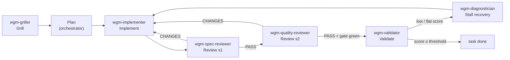

# Subagents — role-specialized dispatch (the swarm)

wgm runs solo by default, but its phases map cleanly onto **role-specialized subagents**. Dispatching
them is "swarm" mode: the orchestrator is the **sheepdog**, each subagent a focused dog with a curated
brief. This is wgm's take on per-task subagent dispatch with two-stage review.

## The roles
wgm ships these archetypes in `.github/agents/` (Copilot custom-agent format; portable to any host
that supports custom agents):

| Archetype | Phase | Job |
|---|---|---|
| `wgm-griller` | Grill | Interview to alignment — one question at a time with a recommended answer; self-answer from code; seed `specs/CONTEXT.md`. |
| `wgm-implementer` | Implement | Advance one task to a green check — smallest vertical slice. |
| `wgm-spec-reviewer` | Review (stage 1) | Diff vs spec/acceptance + constitution → PASS / CHANGES-REQUESTED. |
| `wgm-quality-reviewer` | Review (stage 2) | Bugs + weak validation, high signal → PASS / CHANGES-REQUESTED. |
| `wgm-validator` | Validate | Holdout-scenario satisfaction 0–100 (stratified); the deterministic gate stays the hard gate. |
| `wgm-diagnostician` | Stall recovery | wonder→reflect, model escalation, and harnesses for hard-to-test domains. |

The swarm runs the lifecycle end to end — the sheepdog (orchestrator) dispatches each dog to its phase:

## Dispatch points
- **Grill** → dispatch `wgm-griller` to interview the human to alignment and seed `specs/CONTEXT.md`.
  It reads the codebase to self-answer; it does not plan or implement.
- **Implement** → dispatch `wgm-implementer` with only what the task needs (its plan entry + spec +
  the files for this one task). The subagent does not read the whole repo or `scenarios/`.
- **Review** → **two independent passes**: `wgm-spec-reviewer` first (did we build the right thing?),
  then `wgm-quality-reviewer` (is it correct, and does the check prove it?). Two sets of eyes catch
  spec drift and quality bugs separately — one reviewer rationalizes its own misses.
- **Validate** → dispatch `wgm-validator` to judge holdout-scenario satisfaction once the gate is
  green. It is the only role that opens `scenarios/`, preserving the holdout.
- **Stall** → dispatch `wgm-diagnostician` (wonder→reflect, escalation, harness building) when
  satisfaction is flat or a check keeps failing.
- A task is recorded `done` only when the deterministic gate exits 0 **and** both reviewers PASS; the
  slice's holdout satisfaction is judged by the validator against the stop-condition threshold.

## Why two stages
A single reviewer conflates "builds the right thing" with "builds it correctly," and tends to bless
its own assumptions. Splitting intent (spec) from correctness (quality) raises the chance a real
defect is named, and keeps each review high-signal — no style nits, only issues that matter.

## Dissent preservation
A binary verdict can hide a real signal: a reviewer that PASSes may still hold a **non-blocking
reservation**, and the two reviewers may **disagree**. Collapsing that into a single PASS is *false
consensus* — the minority concern is rationalized away and never revisited. So:
- Each reviewer emits its verdict **plus any reservations** — concerns that don't block this task.
- The orchestrator **records reservations and any reviewer disagreement** as a durable follow-up — a
  task in `IMPLEMENTATION_PLAN.md` or a note in `.wgm/memories.md` — even when the verdict is PASS.
- The deterministic gate + both PASS verdicts still decide "done"; dissent is **preserved, not
  averaged away**, so a valid concern survives across fresh-context iterations.

## Model selection
Right-size the model per role: the **griller** and **implementer** can run on a frugal model for
interview and mechanical work; the **reviewers**, the **validator**, and the **diagnostician** earn a
more capable model (finding the subtle bug, the gamed score, or the stall's root cause is the
expensive part). This mirrors the loop's frugal↔escalate switching (`references/stall-recovery.md`).

## Curated context (the sheepdog's job)
The orchestrator extracts exactly the text each subagent needs and hands it over — subagents do not
re-read `IMPLEMENTATION_PLAN.md` or wander the tree. Precise briefs keep each dog in its lane and the
swarm's context lean.

## Portability & the external loop
- **In-session:** dispatch via the host's subagent mechanism. Copilot reads `.github/agents/*.agent.md`;
  for other hosts copy them into the agent dir they scan (e.g. `.claude/agents/`).
- **Ralph-full (`scripts/loop.sh`):** today the loop runs one role per iteration. Mapping each role to
  its own agent command (a per-role implementer/reviewer dispatch) is the next step toward a true
  multi-agent swarm; until then the single agent plays each role in sequence per the Loop steps.

## Cross-links
`references/ralph-loop.md` (loop + backpressure) · `references/scoring.md` (what validation must
prove) · `references/stall-recovery.md` (escalation) · the archetype files in `.github/agents/`.
