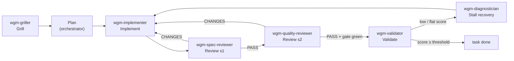
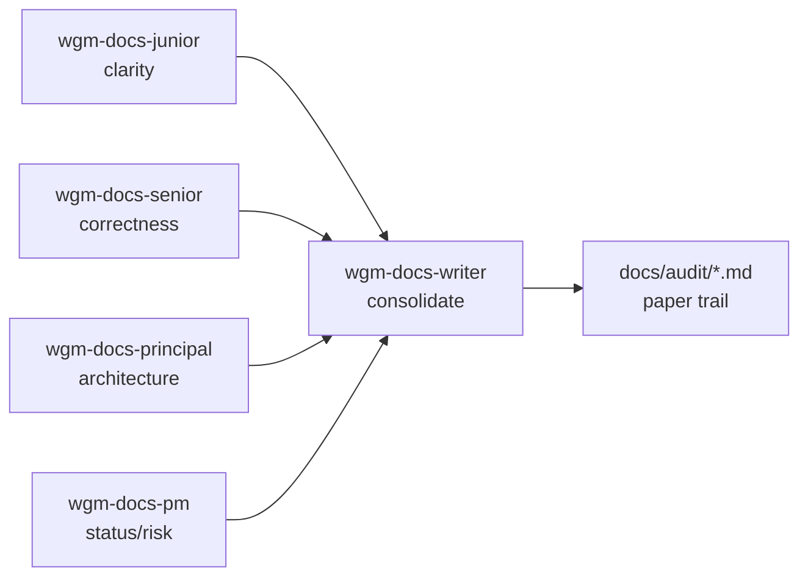

# Subagents — role-specialized dispatch (the swarm)

wgm runs solo by default, but its phases map cleanly onto **role-specialized subagents**. Dispatching
them is "swarm" mode: the orchestrator is the **sheepdog**, each subagent a focused dog with a curated
brief. This is wgm's take on per-task subagent dispatch with two-stage review.

## The roles
wgm ships these archetypes in `.github/agents/` (Copilot custom-agent format; portable to any host
that supports custom agents):

| Archetype | Phase | Job |
|---|---|---|
| `wgm-griller` | Grill | Interview to alignment — one question at a time with a recommended answer; self-answer from code; seed `specs/CONTEXT.md`. |
| `wgm-implementer` | Implement | Advance one task to a green check — smallest vertical slice. |
| `wgm-spec-reviewer` | Review (stage 1) | Diff vs spec/acceptance + constitution → PASS / CHANGES-REQUESTED. |
| `wgm-quality-reviewer` | Review (stage 2) | Bugs + weak validation, high signal → PASS / CHANGES-REQUESTED. |
| `wgm-validator` | Validate | Holdout-scenario satisfaction 0–100 (stratified); the deterministic gate stays the hard gate. |
| `wgm-diagnostician` | Stall recovery | wonder→reflect, model escalation, and harnesses for hard-to-test domains. |
| `wgm-docs-junior` | Docs audit | Reviews docs for onboarding/clarity from a newcomer's seat — read-only. |
| `wgm-docs-senior` | Docs audit | Reviews docs for correctness, completeness, maintainability — read-only. |
| `wgm-docs-principal` | Docs audit | Reviews docs for constitution conformance, architecture fit, cross-doc consistency — read-only. |
| `wgm-docs-pm` | Docs audit | Reviews docs for status accuracy, risk visibility, traceability — read-only. |
| `wgm-docs-writer` | Docs audit | Consolidates the four persona reports into one paper-trail report; classifies every item Agent vs Operator action; preserves dissent. |

The swarm runs the lifecycle end to end — the sheepdog (orchestrator) dispatches each dog to its phase:

```mermaid
flowchart LR
  G["wgm-griller<br/>Grill"] --> PL["Plan<br/>(orchestrator)"]
  PL --> IM["wgm-implementer<br/>Implement"]
  IM --> SR["wgm-spec-reviewer<br/>Review s1"]
  SR -->|PASS| QR["wgm-quality-reviewer<br/>Review s2"]
  QR -->|PASS + gate green| VA["wgm-validator<br/>Validate"]
  SR -->|CHANGES| IM
  QR -->|CHANGES| IM
  VA -->|low / flat score| DX["wgm-diagnostician<br/>Stall recovery"]
  DX --> IM
  VA -->|score ≥ threshold| DONE["task done"]
```

## Dispatch points
- **Grill** → dispatch `wgm-griller` to interview the human to alignment and seed `specs/CONTEXT.md`.
  It reads the codebase to self-answer; it does not plan or implement.
- **Implement** → dispatch `wgm-implementer` with only what the task needs (its plan entry + spec +
  the files for this one task). The subagent does not read the whole repo or `scenarios/`.
- **Review** → **two independent passes**: `wgm-spec-reviewer` first (did we build the right thing?),
  then `wgm-quality-reviewer` (is it correct, and does the check prove it?). Two sets of eyes catch
  spec drift and quality bugs separately — one reviewer rationalizes its own misses.
- **Validate** → dispatch `wgm-validator` to judge holdout-scenario satisfaction once the gate is
  green. It is the only role that opens `scenarios/`, preserving the holdout.
- **Stall** → dispatch `wgm-diagnostician` (wonder→reflect, escalation, harness building) when
  satisfaction is flat or a check keeps failing.
- A task is recorded `done` only when the deterministic gate exits 0 **and** both reviewers PASS; the
  slice's holdout satisfaction is judged by the validator against the stop-condition threshold.

## Why two stages
A single reviewer conflates "builds the right thing" with "builds it correctly," and tends to bless
its own assumptions. Splitting intent (spec) from correctness (quality) raises the chance a real
defect is named, and keeps each review high-signal — no style nits, only issues that matter.

## Dissent preservation
A binary verdict can hide a real signal: a reviewer that PASSes may still hold a **non-blocking
reservation**, and the two reviewers may **disagree**. Collapsing that into a single PASS is *false
consensus* — the minority concern is rationalized away and never revisited. So:
- Each reviewer emits its verdict **plus any reservations** — concerns that don't block this task.
- A PASS with zero findings is a **claim, not a default** — before either reviewer emits a clean
  PASS with no reservations, it states in one sentence what it examined and why it found nothing; an
  unexplained zero-findings PASS is treated as an incomplete review and returned. Adapted from
  [`BMAD-METHOD`](https://github.com/bmad-code-org/BMAD-METHOD)'s
  `docs/explanation/adversarial-review.md`; wgm adopts only the "justify a clean pass" discipline,
  not BMAD's tolerance for false positives.
- A credible issue that clearly **pre-dates** the current diff gets a third lane:
  **pre-existing / deferred**, not CHANGES-REQUESTED and not a vague reservation. Record it with
  the date and originating task in `.wgm/deferred-work.md`, then let the current task's PASS stand
  if the diff itself is clean. Adapted from `BMAD-METHOD`'s code-review triage/presentation steps
  (`src/bmm-skills/4-implementation/bmad-code-review/steps/step-03-triage.md` and
  `step-04-present.md`).
- The orchestrator **records reservations and any reviewer disagreement** as a durable follow-up — a
  task in `IMPLEMENTATION_PLAN.md` or a note in `.wgm/memories.md` — even when the verdict is PASS.
- The deterministic gate + both PASS verdicts still decide "done"; dissent is **preserved, not
  averaged away**, so a valid concern survives across fresh-context iterations.

## Docs-audit swarm (four personas + a writer)
Documentation gets the same swarm treatment as code review, just wider: four independent,
order-agnostic persona passes — `wgm-docs-junior`, `wgm-docs-senior`, `wgm-docs-principal`,
`wgm-docs-pm` — each report read-only findings through one lens, then `wgm-docs-writer` consolidates
all four into the single paper-trail artifact an operator reads. Full discipline (cadence, severity
taxonomy, artifact placement) in `references/docs-audit.md`; report shape in
`assets/docs-audit-report.template.md`.

```mermaid
flowchart LR
  J["wgm-docs-junior<br/>clarity"] --> W["wgm-docs-writer<br/>consolidate"]
  S["wgm-docs-senior<br/>correctness"] --> W
  P["wgm-docs-principal<br/>architecture"] --> W
  M["wgm-docs-pm<br/>status/risk"] --> W
  W --> REPORT["docs/audit/*.md<br/>paper trail"]
```

- **Dispatch:** the four persona passes have no ordering dependency and may run in parallel; the
  writer always runs last, after all four have reported.
- **Dissent applies here too:** when personas disagree, the writer preserves it explicitly (a
  `Dissent` section) rather than averaging it away — the same discipline described above for the
  two-stage code review, extended from two voices to four.
- **The one new discipline:** the writer classifies every finding as **Agent action** or **Operator
  action** by the *kind of action*, never by which persona raised it — a mechanical fix stays an
  Agent action even if a PM raised it; a policy question stays an Operator action even if a junior
  dev raised it.
- **Trigger points** (not every iteration): Ship/Handoff (mandatory, Standard/Full) and, on the Full
  track, a Plan-exit baseline pass plus opportunistic passes on doc-touching diffs. Quick skips the
  swarm entirely and relies on `scripts/check-docs.sh`.

## Model selection
Right-size the model per role: the **griller** and **implementer** can run on a frugal model for
interview and mechanical work; the **reviewers**, the **validator**, and the **diagnostician** earn a
more capable model (finding the subtle bug, the gamed score, or the stall's root cause is the
expensive part). This mirrors the loop's frugal↔escalate switching (`references/stall-recovery.md`).
Cline makes the same split explicit with `planModeApiModelId` / `actModeApiModelId`, which
strengthens the case for naming per-phase model choice as a first-class recommendation instead of
leaving it as loose advice.
The same split applies to the docs-audit swarm: the four **persona reviewers** are frugal-model work
(one bounded, single-lens read), while **`wgm-docs-writer`** earns a more capable model — correct
dissent-preservation and Agent-vs-Operator classification is the part easy to get subtly wrong.

## Tool-restriction schema (per agent)
Today the `.github/agents/*.agent.md` files describe tool access in prose ("Primary tools: ...").
For clearer contracts — and future hosts that can enforce them — each agent can also declare a Roo
Code-style `groups:` array (`RooCodeInc/Roo-Code`, `packages/types/src/mode.ts`):
- `read` — view/grep/glob/search only; no writes or shell.
- `edit` — write/create, optionally scoped with `fileRegex`.
- `command` — terminal / run-command access.
- `mcp` — host integrations beyond repo-local read/write.

Example mappings:
- `wgm-griller` → `groups: [read, ["edit", {fileRegex: "^specs/CONTEXT\\.md$"}]]`
- `wgm-spec-reviewer` / `wgm-quality-reviewer` / `wgm-validator` → `groups: [read]`
- `wgm-implementer` / `wgm-diagnostician` → `groups: [read, edit, command]`

This is documentation clarity first, not a false claim of enforcement: wgm is a prompt-defined
skill, not the host runtime, so it cannot impose these restrictions by itself. But a host that
honors machine-readable tool groups can make the role contract real, and Roo Code's zero-tool
Orchestrator (`groups: []`) is the clean precedent for a pure-delegation sheepdog.

## Curated context (the sheepdog's job)
The orchestrator extracts exactly the text each subagent needs and hands it over — subagents do not
re-read `IMPLEMENTATION_PLAN.md` or wander the tree. Precise briefs keep each dog in its lane and the
swarm's context lean.

## Portability & the external loop
- **In-session:** dispatch via the host's subagent mechanism. Copilot reads `.github/agents/*.agent.md`;
  for other hosts copy them into the agent dir they scan (e.g. `.claude/agents/`).
- **Ralph-full (`scripts/loop.sh`):** today the loop runs one role per iteration. Mapping each role to
  its own agent command (a per-role implementer/reviewer dispatch) is the next step toward a true
  multi-agent swarm; until then the single agent plays each role in sequence per the Loop steps.

## Cross-links
`references/ralph-loop.md` (loop + backpressure) · `references/scoring.md` (what validation must
prove) · `references/stall-recovery.md` (escalation) · `references/docs-audit.md` (the docs-audit
swarm's own discipline) · the archetype files in `.github/agents/`.
