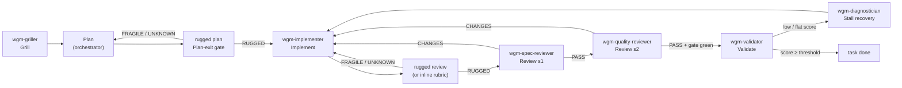
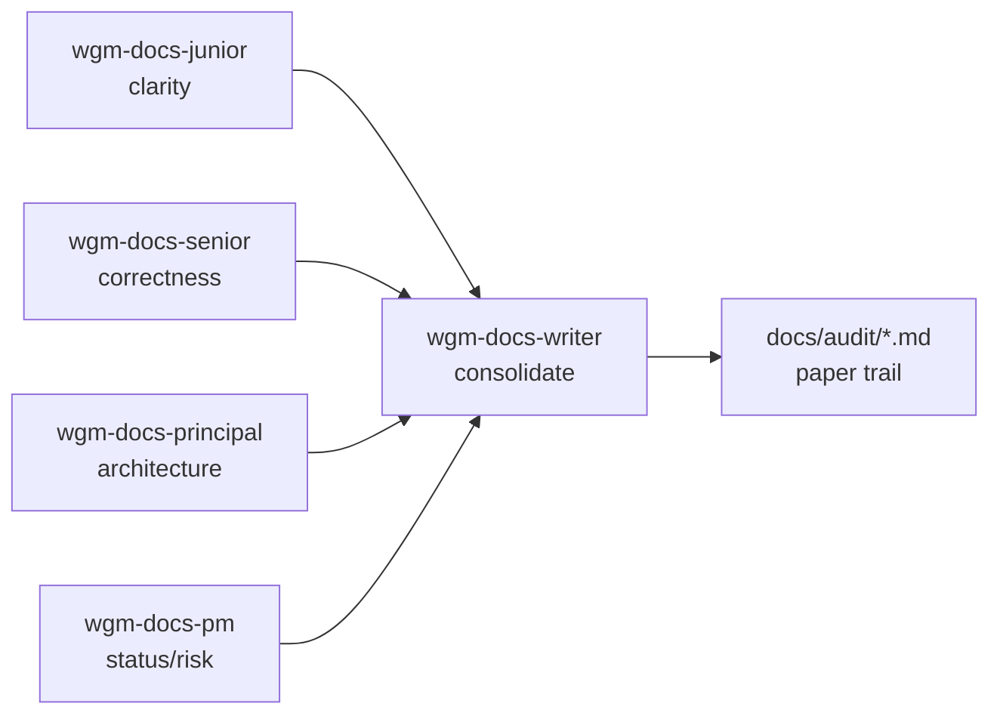

# Subagents — role-specialized dispatch (the swarm)

wgm runs solo by default, but its phases map cleanly onto **role-specialized subagents**. Dispatching
them is "swarm" mode: the orchestrator is the **sheepdog**, each subagent a focused dog with a curated
brief. This is wgm's take on per-task subagent dispatch with two-stage review.

## The roles
wgm ships these archetypes in `.github/agents/` (Copilot custom-agent format; portable to any host
that supports custom agents):

| Archetype | Phase | Job |
|---|---|---|
| `wgm-griller` | Grill | Interview to alignment — one question at a time with a recommended answer; self-answer from code; seed `specs/CONTEXT.md`. |
| `wgm-implementer` | Implement | Advance one task to a green check — smallest vertical slice. |
| `wgm-spec-reviewer` | Review (stage 1) | Diff vs spec/acceptance + constitution, **and the recorded ruggedness verdict** → PASS / CHANGES-REQUESTED. |
| `wgm-quality-reviewer` | Review (stage 2) | Bugs + weak validation, high signal, **and the recorded ruggedness verdict** → PASS / CHANGES-REQUESTED. |
| `wgm-validator` | Validate | Holdout-scenario satisfaction 0–100 (stratified); the deterministic gate stays the hard gate. |
| `wgm-diagnostician` | Stall recovery | wonder→reflect, model escalation, and harnesses for hard-to-test domains. |
| `wgm-docs-junior` | Docs audit | Reviews docs for onboarding/clarity from a newcomer's seat — read-only. |
| `wgm-docs-senior` | Docs audit | Reviews docs for correctness, completeness, maintainability — read-only. |
| `wgm-docs-principal` | Docs audit | Reviews docs for constitution conformance, architecture fit, cross-doc consistency — read-only. |
| `wgm-docs-pm` | Docs audit | Reviews docs for status accuracy, risk visibility, traceability — read-only. |
| `wgm-docs-writer` | Docs audit | Consolidates the four persona reports into one paper-trail report; classifies every item Agent vs Operator action; preserves dissent. |
| `wgm-hermes` | Ship/Handoff + standing after every swarm | Aggregates lessons from every Hive Growth Loop source, anonymizes them, checks `.github/wgm-hive.yml` consent, and publishes upstream when consented. |

The swarm runs the lifecycle end to end — the sheepdog (orchestrator) dispatches each dog to its phase:

```mermaid
flowchart LR
  G["wgm-griller<br/>Grill"] --> PL["Plan<br/>(orchestrator)"]
  PL --> RP["rugged plan<br/>Plan-exit gate"]
  RP -->|"FRAGILE / UNKNOWN"| PL
  RP -->|RUGGED| IM["wgm-implementer<br/>Implement"]
  IM --> RV["rugged review<br/>(or inline rubric)"]
  RV -->|"FRAGILE / UNKNOWN"| IM
  RV -->|RUGGED| SR["wgm-spec-reviewer<br/>Review s1"]
  SR -->|PASS| QR["wgm-quality-reviewer<br/>Review s2"]
  QR -->|PASS + gate green| VA["wgm-validator<br/>Validate"]
  SR -->|CHANGES| IM
  QR -->|CHANGES| IM
  VA -->|low / flat score| DX["wgm-diagnostician<br/>Stall recovery"]
  DX --> IM
  VA -->|score ≥ threshold| DONE["task done"]
```

## Dispatch points
- **Grill** → dispatch `wgm-griller` to interview the human to alignment and seed `specs/CONTEXT.md`.
  It reads the codebase to self-answer; it does not plan or implement.
- **Implement** → dispatch `wgm-implementer` with only what the task needs (its plan entry + spec +
  the files for this one task). The subagent does not read the whole repo or `scenarios/`.
- **Review** → **two independent passes**: `wgm-spec-reviewer` first (did we build the right thing?),
  then `wgm-quality-reviewer` (is it correct, and does the check prove it?). Two sets of eyes catch
  spec drift and quality bugs separately — one reviewer rationalizes its own misses. **Neither may
  emit PASS without the iteration's ruggedness verdict in hand** (below).
- **Validate** → dispatch `wgm-validator` to judge holdout-scenario satisfaction once the gate is
  green. It is the only role that opens `scenarios/`, preserving the holdout.
- **Stall** → dispatch `wgm-diagnostician` (wonder→reflect, escalation, harness building) when
  satisfaction is flat or a check keeps failing.
- A task is recorded `done` only when the deterministic gate exits 0 **and** both reviewers PASS
  **and** the diff carries exactly one recorded ruggedness verdict of RUGGED; the slice's holdout
  satisfaction is judged by the validator against the stop-condition threshold.

## The ruggedness gate (and hosts with no subagents)
The ruggedness gate is wgm protocol, not a subagent archetype: there is **no `wgm-rugged` file in
`.github/agents/`**, because the check is owned by the `rugged` companion *skill* when it is
discoverable and by the embedded inline rubric when it is not (`SKILL.md`, "The ruggedness gate").
That is deliberate — it means the gate survives on hosts that cannot dispatch subagents at all.

- **Reviewers check the verdict; they do not replace it.** Before `wgm-spec-reviewer` or
  `wgm-quality-reviewer` emits PASS, it confirms the diff carries **exactly one** recorded verdict
  and that it is **RUGGED**. A missing, hedged, or duplicated verdict is CHANGES-REQUESTED —
  never a PASS with a reservation, because a reservation does not block and this does.
- **FRAGILE / UNKNOWN are blocking, with different follow-ups.** FRAGILE → a remediation task in
  `IMPLEMENTATION_PLAN.md`; UNKNOWN → a validation-signal task that creates the missing deterministic
  field/stress evidence. Both keep the task out of `done`.
- **Serial hosts run the identical rubric.** With no subagent mechanism, the single agent runs
  `/rugged review` when the companion is discoverable, or the inline five-step rubric when it is
  not, in sequence before its two review passes — the same five steps, one-verdict rule, and
  blocking semantics. Independence is weaker in that arrangement, so name it: record that the
  verdict was produced serially by the implementing agent, exactly as a fallback run records the
  missing companion. Weaker independence is a recorded limitation, not a reason to skip the gate.
- **Dispatch when the companion exists:** the orchestrator invokes `/rugged plan <scope>` at
  Plan-exit and `/rugged review <scope>` on the diff at Review, then hands the resulting verdict —
  not the whole review transcript — to the implementer for any prescribed follow-up and to both
  reviewers as part of their curated brief.

## Why two stages
A single reviewer conflates "builds the right thing" with "builds it correctly," and tends to bless
its own assumptions. Splitting intent (spec) from correctness (quality) raises the chance a real
defect is named, and keeps each review high-signal — no style nits, only issues that matter.

## Dissent preservation
A binary verdict can hide a real signal: a reviewer that PASSes may still hold a **non-blocking
reservation**, and the two reviewers may **disagree**. Collapsing that into a single PASS is *false
consensus* — the minority concern is rationalized away and never revisited. So:
- Each reviewer emits its verdict **plus any reservations** — concerns that don't block this task.
- The two reviewers must be independent of the artifact author. A self-review may honestly cover
  process, cost, scope, and missing measurements, but must not be labeled or counted as an
  adversarial correctness review. The independent reviewer should test named, load-bearing claims
  against source rather than re-running the author's confidence.
- A PASS with zero findings is a **claim, not a default** — before either reviewer emits a clean
  PASS with no reservations, it states in one sentence what it examined and why it found nothing; an
  unexplained zero-findings PASS is treated as an incomplete review and returned. Adapted from
  [`BMAD-METHOD`](https://github.com/bmad-code-org/BMAD-METHOD)'s
  `docs/explanation/adversarial-review.md`; wgm adopts only the "justify a clean pass" discipline,
  not BMAD's tolerance for false positives.
- A credible issue that clearly **pre-dates** the current diff gets a third lane:
  **pre-existing / deferred**, not CHANGES-REQUESTED and not a vague reservation. Record it with
  the date and originating task in `.wgm/deferred-work.md`, then let the current task's PASS stand
  if the diff itself is clean. Adapted from `BMAD-METHOD`'s code-review triage/presentation steps
  (`src/bmm-skills/4-implementation/bmad-code-review/steps/step-03-triage.md` and
  `step-04-present.md`).
- The orchestrator **records reservations and any reviewer disagreement** as a durable follow-up — a
  task in `IMPLEMENTATION_PLAN.md` or a note in `.wgm/memories.md` — even when the verdict is PASS.
- The deterministic gate + both PASS verdicts still decide "done"; dissent is **preserved, not
  averaged away**, so a valid concern survives across fresh-context iterations.

## Docs-audit swarm (four personas + a writer)
Documentation gets the same swarm treatment as code review, just wider: four independent,
order-agnostic persona passes — `wgm-docs-junior`, `wgm-docs-senior`, `wgm-docs-principal`,
`wgm-docs-pm` — each report read-only findings through one lens, then `wgm-docs-writer` consolidates
all four into the single paper-trail artifact an operator reads. Full discipline (cadence, severity
taxonomy, artifact placement) in `references/docs-audit.md`; report shape in
`assets/docs-audit-report.template.md`.

```mermaid
flowchart LR
  J["wgm-docs-junior<br/>clarity"] --> W["wgm-docs-writer<br/>consolidate"]
  S["wgm-docs-senior<br/>correctness"] --> W
  P["wgm-docs-principal<br/>architecture"] --> W
  M["wgm-docs-pm<br/>status/risk"] --> W
  W --> REPORT["docs/audit/*.md<br/>paper trail"]
```

- **Dispatch:** the four persona passes have no ordering dependency and may run in parallel; the
  writer always runs last, after all four have reported.
- **Dissent applies here too:** when personas disagree, the writer preserves it explicitly (a
  `Dissent` section) rather than averaging it away — the same discipline described above for the
  two-stage code review, extended from two voices to four.
- **The one new discipline:** the writer classifies every finding as **Agent action** or **Operator
  action** by the *kind of action*, never by which persona raised it — a mechanical fix stays an
  Agent action even if a PM raised it; a policy question stays an Operator action even if a junior
  dev raised it.
- **Verification is mandatory before promotion:** persona severity and observations are hypotheses.
  The writer verifies each finding against the real artifact and its source of truth before putting it
  in an Agent-action table. Weight verification toward RED/AMBER findings because a false high-severity
  action is more damaging than a missed nit, and record rejected findings with the evidence that
  disproved them.
- **Trigger points** (not every iteration): Ship/Handoff (mandatory, Standard/Full) and, on the Full
  track, a Plan-exit baseline pass plus opportunistic passes on doc-touching diffs. Quick skips the
  swarm entirely and relies on `scripts/check-docs.sh`.

### Portable dispatch when the host has no subagents (`scripts/audit.sh`)
The five roles above are archetypes, not a host feature. `scripts/audit.sh` runs them through **one
opaque headless agent command** — the same agent invoked five times with five briefs — so the swarm
survives on a host with no subagent primitive at all, exactly as the ruggedness gate does. It is
configured like `scripts/loop.sh` (`$WGM_AGENT`, `--agent "CMD"`, a `--` argv passthrough invoked
without eval, `WGM_PROMPT_STDIN=1`), and it assumes no marketplace, agent registry, or vendor
subagent API exists. Flags: [`docs/reference/cli-audit.md`](../docs/reference/cli-audit.md).

Ownership boundaries the dispatcher makes deterministic rather than merely asking for:

| Boundary | Enforcement |
|---|---|
| Personas report; they never edit | The git working tree is snapshotted around every role; a mutation fails the run. |
| Four independent lenses, one scope | Every persona gets the identical bounded scope, and none is told where a sibling's report lives. |
| The writer runs last, on four real reports | A persona that fails, times out, or returns nothing blocks the writer and fails the audit. |
| The writer consolidates; it does not review | Its brief carries the four report paths plus the dedupe/dissent/verify/label rules, and nothing else. |
| A failed audit leaves no artifact | No report file is written unless the writer produced a real one — never a success-shaped stub. |
| The holdout stays the validator's | `scenarios/` is never read, named, or modified by the dispatcher. |

**Say what it is.** Five briefs against one agent buys independence of context and lens, not of model
or tooling — the same recorded-limitation discipline the serial ruggedness fallback uses above. Prefer
a real subagent dispatch where the host offers one, and record the weaker independence where it does
not.

## Hive courier (`wgm-hermes`)
The Hive Growth Loop's messenger role: it aggregates lessons from every source
(`references/self-improvement.md`'s Capture section), **always anonymizes** them, reads
`.github/wgm-hive.yml` for consent, and — only when consented — publishes upstream to
`agent-frontier/wgm` (`scripts/harvest-hive.sh`). Named for the messenger-god framing of this
courier role, translated into this file's existing subagent-dispatch idiom rather than a new
mechanism. Design rationale:
[`docs/plans/2026-07-06_HIVE_GROWTH_LOOP.md`](../docs/plans/2026-07-06_HIVE_GROWTH_LOOP.md).

- **Two dispatch points, not one:** standing, after every `scripts/swarm.sh` run (so stream
  lessons reach the hive without waiting for Ship/Handoff); and at Ship/Handoff for ordinary
  single-stream builds, alongside the docs-audit swarm.
- **Read-only about consent, not free to grant it.** `wgm-hermes` reads `.github/wgm-hive.yml`; it
  does not decide policy. The one-time consent question is normally asked by Triage (`SKILL.md`
  Phase 0), before any subagent runs. In its standing/headless dispatch, an absent file is never
  treated as license to answer on a human's behalf — it declines for that run only, unwritten
  (`references/self-improvement.md`'s Consent & continuous mode).
- **Anonymize is not negotiable.** Unlike the docs-audit personas (which only read), `wgm-hermes` can
  cause a real external side effect — filing a public issue — so its one hard constraint is that the
  scrub always runs first, on every lesson, regardless of consent state. It is a first-pass
  deterministic scrub, not a redaction guarantee — which is why it also **fails closed**: it
  forwards exactly one lesson (never the source ledger), re-scans the scrubbed candidate for
  residual host identifiers and a size ceiling, and refuses to publish when it cannot show the
  candidate is both minimal and clean (`references/self-improvement.md`, [learn] issue #79).
- **No merge authority.** `wgm-hermes` can file or update an issue; it never opens or merges a PR —
  that boundary belongs to the ordinary human-reviewed Implement/Review path.

## Model selection
Right-size the model per role: the **griller** and **implementer** can run on a frugal model for
interview and mechanical work; the **reviewers**, the **validator**, and the **diagnostician** earn a
more capable model (finding the subtle bug, the gamed score, or the stall's root cause is the
expensive part). This mirrors the loop's frugal↔escalate switching (`references/stall-recovery.md`).
Cline makes the same split explicit with `planModeApiModelId` / `actModeApiModelId`, which
strengthens the case for naming per-phase model choice as a first-class recommendation instead of
leaving it as loose advice.
The same split applies to the docs-audit swarm: the four **persona reviewers** are frugal-model work
(one bounded, single-lens read), while **`wgm-docs-writer`** earns a more capable model — correct
dissent-preservation and Agent-vs-Operator classification is the part easy to get subtly wrong.
**`wgm-hermes`** earns a more capable model too, for the same reason as the writer: anonymization is
a judgment call with a real external side effect (a public issue) if it goes subtly wrong, not
mechanical aggregation alone.

For the complementary axis — right-sizing *context*, not cost, when the host is a genuinely small-
context local model — see `references/local-models.md`'s frugal/main flag guidance.

## Tool-restriction schema (per agent)
Today the `.github/agents/*.agent.md` files describe tool access in prose ("Primary tools: ...").
For clearer contracts — and future hosts that can enforce them — each agent can also declare a Roo
Code-style `groups:` array ([`RooCodeInc/Roo-Code`](https://github.com/RooCodeInc/Roo-Code)'s
`packages/types/src/tool.ts` `toolGroups` enum, referenced from `mode.ts`):
- `read` — view/grep/glob/search only; no writes or shell.
- `edit` — write/create, optionally scoped with `fileRegex`.
- `command` — terminal / run-command access.
- `mcp` — host integrations beyond repo-local read/write.

Roo Code's real enum has a 5th group, `modes` (governs `switch_mode`/`new_task` — sub-orchestration
permission), not presented above as exhaustive: it's omitted from the four subagent-facing groups
because it describes the *sheepdog's* own dispatch permission, not a dog's — the group most directly
relevant to wgm's own orchestrator/sheepdog role, not to any of the archetypes in the table above.
Add it if wgm ever wants to formalize the orchestrator's own permission set too.

Example mappings — cross-checked against each archetype's own `.github/agents/*.agent.md` "Tools"
section, the source of truth:
- `wgm-griller` → `groups: [read, ["edit", {fileRegex: "^specs/CONTEXT\\.md$"}]]`
- `wgm-spec-reviewer` / `wgm-quality-reviewer` / `wgm-validator` → `groups: [read, command]` — all
  three list `run_command` (re-run tests/probes) alongside view/grep/glob, so `read` alone
  undersells their actual access. `wgm-validator` additionally uses a container runtime (podman) for
  live scenario runs — container-runtime access doesn't map cleanly onto any of these four groups.
- `wgm-implementer` / `wgm-diagnostician` → `groups: [read, edit, command]`

This is documentation clarity first, not a false claim of enforcement: wgm is a prompt-defined
skill, not the host runtime, so it cannot impose these restrictions by itself. But a host that
honors machine-readable tool groups can make the role contract real, and Roo Code's zero-tool
Orchestrator (`groups: []`) is the clean precedent for a pure-delegation sheepdog.

## Curated context (the sheepdog's job)
The orchestrator extracts exactly the text each subagent needs and hands it over — subagents do not
re-read `IMPLEMENTATION_PLAN.md` or wander the tree. Precise briefs keep each dog in its lane and the
swarm's context lean.

## Worktree swarm dispatch (lane hygiene)
Parallel *lanes* (`scripts/swarm.sh`) have their own failure modes, distinct from role dispatch
above. Four rules, each earned from a run that got it wrong:

- **Give lanes a full-shell agent, not a constrained file-writer.** A file-creation tool that cannot
  create intermediate directories does not fail loudly — the agent works around it, flattening
  `docs/roadmap.md` into `docs_roadmap.md`, hiding content inside a bootstrap script that `mkdir`s
  at runtime, or writing `*.staging` files, and then never commits at all. In one ~40-lane
  documentation swarm those lanes finished `ahead=0` while full-shell lanes (able to `mkdir -p` and
  `git commit`) produced nested paths and committed cleanly every time. Reserve the constrained
  writer for flat, single-directory output.
- **Re-pin the worktree on every turn.** A lane's absolute worktree path and expected branch must be
  restated in *every* state-mutating instruction, not just the first — retained context is not a
  guarantee. Prefer `git -C <absolute-worktree>` over an ambient `cd`, and guard before mutating:
  if `rev-parse --show-toplevel` or `branch --show-current` disagrees with the lane assignment,
  stop rather than mutate. In a 32-lane run, four lanes executed git from the parent checkout on a
  second turn and one advanced local `main`. `swarm.sh` now enforces both halves — it injects the
  pin into each lane's request and fails the lane outright if the guard does not match.
  If this does happen, **never repair it by discarding commits**: preserve reachability first (keep
  the accidental commits on the intended branch plus an explicit recovery branch), then restore the
  intended checkout from the remote.
- **Partition lanes onto disjoint file sets.** Non-overlapping deliverables per lane is what makes
  final consolidation an octopus merge with zero conflicts. Overlapping lanes also create a nastier
  hazard than a conflict: one lane silently reverting a sibling's edits.
- **Size the swarm to the host's concurrency cap and backfill.** Hosts cap concurrent background
  agents (32 in one observed case; the 33rd is refused). Idle agents free a slot, so treat queued
  lanes as backfill that starts as running lanes go idle — do not assume N lanes launch N agents.

**Then verify what the lanes claim.** A lane's own `done` is an *unverified assertion*, and plan
files full of plausible completions are the swarm's most expensive failure mode: in one Full-track
run, **four of five** tasks marked done carried a false claim — a test file that existed nowhere, a
"row sizes to content" claim over source that still pinned a fixed height, a gating function that
never referenced the state it supposedly checked. Every claim read plausibly; only a symbol-level
grep exposed them. So before integrating:

1. Run a **post-swarm "does the tree even compile / does the suite even run?"** gate first — it
   catches a half-reverted state from overlapping lanes before any per-claim work.
2. For each acceptance bullet, **check the artifact, don't skim the prose**: does the named file
   exist, does the claimed symbol/constant/branch actually appear, does the named command run?
3. Treat a `done` with **no reproducible artifact** — no exact file, symbol, and runnable command —
   as a red flag rather than a completion.
4. Treat `status=ok, commits=0` as a hard lane failure. A successful process with no reachable
   commit, diff, or explicitly documented spike artifact did not complete its assigned work.

## Portability & the external loop
- **In-session:** dispatch via the host's subagent mechanism. Copilot reads `.github/agents/*.agent.md`;
  for other hosts copy them into the agent dir they scan (e.g. `.claude/agents/`).
- **No subagent mechanism at all:** the docs-audit swarm still runs, via `scripts/audit.sh`'s
  opaque-command dispatch (above). That is a fallback with weaker independence, and it says so.
- **Ralph-full (`scripts/loop.sh`):** today the loop runs one role per iteration. Mapping each role to
  its own agent command (a per-role implementer/reviewer dispatch) is the next step toward a true
  multi-agent swarm; until then the single agent plays each role in sequence per the Loop steps.

## Cross-links
`references/ralph-loop.md` (loop + backpressure) · `references/scoring.md` (what validation must
prove) · `references/stall-recovery.md` (escalation) · `references/docs-audit.md` (the docs-audit
swarm's own discipline) · `references/self-improvement.md` (`wgm-hermes`'s Hive Growth Loop) ·
`references/issue-intake.md` (the GitHub-Issues source `wgm-hermes` also draws from) · the archetype
files in `.github/agents/`.
